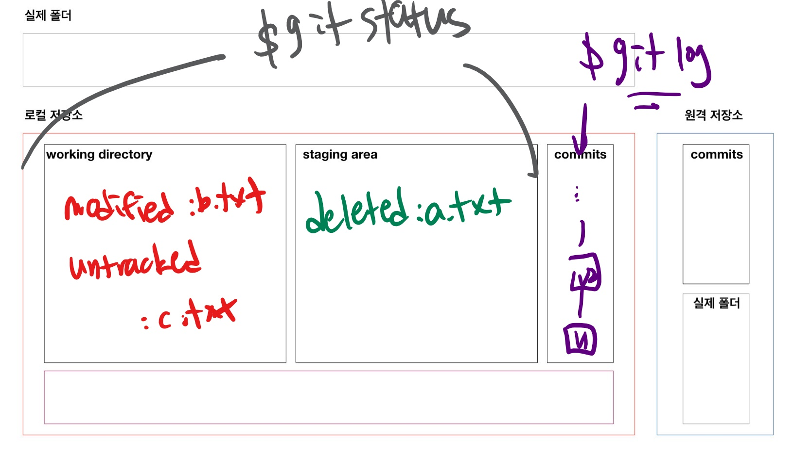

# status

```bash
$ git status
On branch master
# 커밋될 변경사항들..
# SA O
Changes to be committed:
  (use "git restore --staged <file>..." to unstage)
  # a.txt 삭제된...
        deleted:    a.txt

# 변경사항인데 Staging 아닌것
# WD O
Changes not staged for commit:
  (use "git add <file>..." to update what will be committed)
  (use "git restore <file>..." to discard changes in working directory)
  # b.txt가 수정된...
        modified:   b.txt
# Untrack 
# WD O
Untracked files:
  (use "git add <file>..." to include in what will be committed)
  # 새로운 파일..
        c.txt

```

* git 저장소 내의 변경사항을 추적
  * `untracked`
    * 한번도 git으로 관리한 적 X
    * 파일생성 등
  * `tracked` 
    * `modified`
      * `modified` : 수정
      * `deleted` : 삭제
    * `unmodified` : git status에 등장하지 않음





