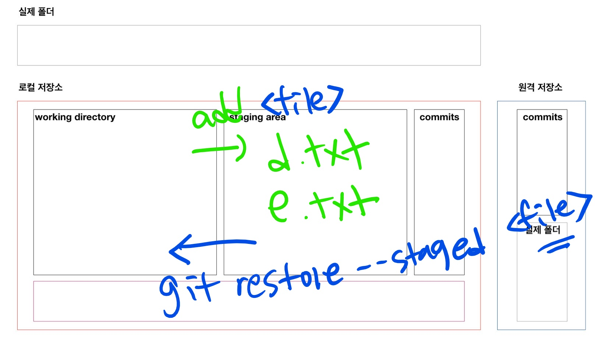

# Undoing

## add 취소

```bash
$ git add .
$ git status
On branch master
Changes to be committed:
# staging area에서 내리기 위해서는..
  (use "git restore --staged <file>..." to unstage)
        new file:   1.txt
```

```bash
$ git restore --staged 1.txt
$ git status
On branch master
Untracked files:
  (use "git add <file>..." to include in what will be committed)
        1.txt

nothing added to commit but untracked files present (use "git add" to track)

```



## WD 작업내용 취소

> 주의! 커밋되지 않은 변경사항을 없애는 것으로 명령어를 실행한 이후 다시 돌이킬 수 없다.

```bash
$ git status
On branch master
Changes not staged for commit:
  (use "git add <file>..." to update what will be committed)
  # 변경사항을 버리기 위해서는..
  # WD 있는..
  (use "git restore <file>..." to discard changes in working directory)
        modified:   d.txt

no changes added to commit (use "git add" and/or "git commit -a")

```

* 해결

  ```bash
  $ git restore d.txt
  $ git status
  On branch master
  nothing to commit, working tree clean
  ```

## Commit 메시지 변경

> 주의! 공개된 저장소에 이미 push가 된 경우 절대 변경을 하지 않는다.

```bash
$ touch f.txt
$ git add .
$ git commit -m 'Add d.txt'
```

```bash
$ git log --oneline
5f5ac68 (HEAD -> master) Add d.txt
d81c176 작업끝
57ad4ef Status
fb4ad8d Add b.txt
ec0574d Add a.txt
$ git commit --amend
# vim 편집기로 수정하고 저장 (esc, :wq)
$ git log --oneline
# 커밋 해시값 변화!
0c330b4 (HEAD -> master) Add f.txt
d81c176 작업끝
57ad4ef Status
fb4ad8d Add b.txt
ec0574d Add a.txt
```

## reset vs revert

### reset

* `--hard` : 모든 작업(변경사항) 내용과 이력을 삭제 (조심!!!)
* `--mixed` : 모든 변경사항을 SA에 보관
* `--soft` : WD 있는 내용까지도 보관

```bash
$ git log --oneline
0c330b4 (HEAD -> master) Add f.txt
d81c176 작업끝
57ad4ef Status
fb4ad8d Add b.txt
ec0574d Add a.txt

$ git reset --hard d81c176
HEAD is now at d81c176 작업끝

$ git log --oneline
d81c176 (HEAD -> master) 작업끝
57ad4ef Status
fb4ad8d Add b.txt
ec0574d Add a.txt
```

### revert 

```bash
$ git log --oneline
0c330b4 (HEAD -> master) Add f.txt
d81c176 작업끝
57ad4ef Status
fb4ad8d Add b.txt
ec0574d Add a.txt

$ git revert 0c330b4
Removing f.txt
[master 56ff1b7] Revert "Add f.txt"
 1 file changed, 0 insertions(+), 0 deletions(-)
 delete mode 100644 f.txt

$ git log --oneline
56ff1b7 (HEAD -> master) Revert "Add f.txt"
0c330b4 Add f.txt
d81c176 작업끝
57ad4ef Status
fb4ad8d Add b.txt
ec0574d Add a.txt

```


