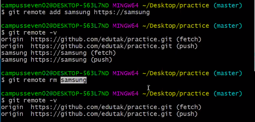

## 원격저장소(remote repository) 활용 기초

> 다양한 원격저장소 서비스 중에 Github을 기준으로 설명

### 준비사항

- GitHub에 비어있는 저장소(repository)를 만든다.

### 기초 명령어

#### 1. 원격저장소 설정

```bash
$ git remote add origin __url__
```

- 깃, 원격 저장소를(remote) 추가해줘(add). origin이라는 이름으로 URL! (외우는 방법)
- 설정된 원격저장소를 확인하기 위해서는 아래의 명령어를 입력한다.

```bash
$ git remote -v
origin  https://github.com/sing2song/practiceGit.git (fetch)
origin  https://github.com/sing2song/practiceGit.git (push)
```

다른이름의 계정 (origin->samsung)으로 시작할때




#### 2. push

```bash
$ git push origin master
```

- origin 원격 저장소의 master 브랜치로 push