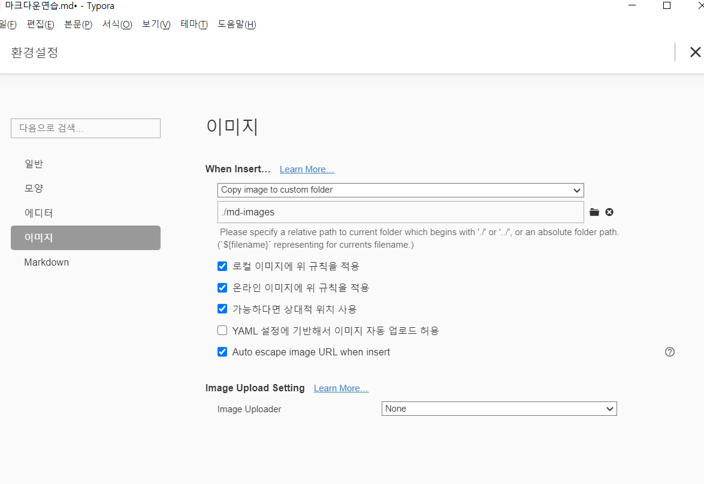

# 마크다운 문법#하고 띄어쓰기

## 제목(heading)##이라고 씀

제목은 '#' 을 통해 표현한다. 제목의 레벨은 h1~h6 까지 표현 가능하다.

### 제목3

#### 제목4

##### 제목5

###### 제목6

## 목록

1. 순서가 있는 목록 엔터

2. 순서가 있는 목록

   1. tab을 누르면 하위 레벨에서 작성
   2. 하위 레벨

3. shift+tab을 누르면 상위 레벨로 올라옴

   

- 순서가 없는 목록
  - tab을 누르면 하위 레벨에서 작성
  - 하위 레벨

- shift+tab을 누르면 상위 레벨로 올라옴

## 코드블록

(`)3개 이후 언어

- 파이썬

```python
print('hi')
# 파이썬 주석
```

- html

```html
print('hi')
<h1>
    hi
</h1>
<!--HTML주석-->
```


## 링크

[구글!](https://google.com)

대괄호 안에 글 + 소괄호안에 링크ex.[ 텍스트 ] ( 링크 )


주석으로 작성하고 싶다면, 아래처럼	

1. 안녕하세요[^우리말로 인사하는 법]
2. 구글[^1]

[^1]:https://google.com


## 표

| 순번 | 이름   | 영어 |
| ---- | ------ | ---- |
| 1    | 홍길동 |      |
| 2    |        |      |
| 3    |        |      |


## 그림


- typroa 설정을 통해 상대 경로로 깨지지 않고 활용가능하다\




## 기타

*기울임(이텔릭)*

**굵게(볼드)**

~~취소선~~

__수평선__

> 인용문

