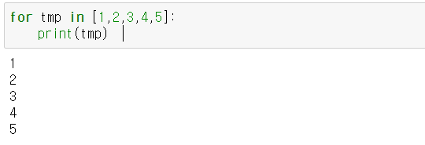

## 📌Python

1. 러닝커브가 얕다
2. 무료/간결
3. 교육용으로 시작하다보니 코드의 가독성이 높다
4. 다양한 분야에서 이용가능(WEB, DB, 데이터 분석, AI쪽)

mobile App을 만들기는 적합X 시스템 프로그래밍도 안됨!


### ☝파이썬의 특징

1. 상대적으로 쉬운 언어
2. 강력한 데이터분석 library, AI관련 library가 많다!
3. open source(무료)
4. 데이터분석을 위한 범용적인 언어 (R: 통계를 위한 프로그래밍 언어)
5. 가장 인기있는 언어 중에 하나.
6. 하위 호환성은 문제! (2.x버전과 3.x버전)
7. 배열이 없다! 리스트의 개념만 알아두자!


### 파이썬 IDE

1. pycham(파이참)

2. jupyter
3. anaconda

`anacond`를 이용해서 파이썬을 이용해보기로 했다! 자세한 설치 및 이용법은 AI(private)에 기술


### 주석

```python
# 1줄 주석
여러줄 주석 ''''''
```


### Python의 Data Type(Built in Data)

```python
#목차
#1. Numeric
- int , float, complex
#2. sequence
- list, tuple, range
#3. Text sequence(문자열)
- str
#4. Mapping
- dict 딕셔너리
#5. Set
- set집합데이터 타입
#6. bool
- bool
```


#### 1. Numeric(숫자형)

```python
#정수(int), 실수(float), 복소수(complex)
a=123		#정수
b=3.141592  #실수
c=1+2j		#복소수
d=0o34		#8진수
e=0xAB		#16진수
```

/md-images/image-20210104170510149.png)

__연산법__

```python
#연산은 무조건 같은 데이터 타입끼리!
a=3+3.14
print(a) # 6.14000000001<<floating point연산의 오류

a=3/4    #0.75
#정수/정수=정수가 나오는 것이 아닌 정말 나눗셈을 한다!!
print(a)

#지수표현
a=3 **4
print(a) #81

#나머지 연산
a=100%3
print(a) #1

#나눗셈의 몫
a=100//3
print(a) #33
```


#### 2. sequence 데이터 타입

- 임의의 데이터를 순서대로 저장하는 집합 자료형
- 파이썬은 배열이 없으며 리스트의 개념만 있다!!
- Java의 ArrayList와 비슷


##### **리스트(list)**

- 대괄호[]를 사용해서 리스트 표현
- 파이썬의 기본 표현이기도함

```python
a=list() #빈 리스트 생성
a=[]	 #빈 리스트 생성
a=[1,2,3,4,5,True]
a=[1,2,[4,5],6]
a=[1,2,['show','me','the','money'],3.14,True] #리스트 안에 리스트
print(a) #[1,2,['show','me','the','money'],3.14,True]
```

> **인덱싱(indexing)**

```python
print(a[1]) #2 <<이와 같은 표현은 인덱싱(indexing)이라고 표현
print(a[2]) #['show','me','the','money']
print(a[-2]) #3.14 다른 언어에서는 오류, 파이썬에서만 가능
print(a[2][2]) #the 2차 배열이 아님 a[2][1]=>me
```

> **슬라이싱(slicing)**

부분 집합을 얻는 것이기 때문에 원본의 데이터 타입을 그대로 계승. [inclusive : exclusive]

```python
print(a[1:4])
print(a[0:1]) #[1] 원본과 결과본이 같아야한다!!! list형태로 나오게 된다!
print(a[3:])  #[3.14,True]
print(a[:2])  #[1,2]
print(a[:])
print(a[:-1])
```

> **연결(concatenation)**

```python
a=[1,2,3]
b=[4,5,6]
print(a+b) #[1,2,3,4,5,6]
print(a*3) #a+a+a =>[1,2,3,1,2,3,1,2,3]

a=[1,2,3]
a[0]=5 #[5,2,3]
#1.
a[0:1]=[7,8,9] # 부분리스트를 이걸로 대체하기
print(a)       #[7,8,9,2,3]
#2.
a[0]=[7,8,9]
print(a)       #[[7,8,9],2,3]
```

> **추가/삭제**

```python
a=[1,2,3]
#1.
a.append(4) 
print(a) # [1,2,3,4]
#2.
a.append([4]) 
print(a) #[1,2,3,[4]]

del a[0]
print(a)
```

> **정렬**

```python
#python의 리스트(list)는 집합자료구조이면서 다양한 기능을 가지고 있다
# 많은 함수를 이용해서 이런 기능들을 우리에게 제공한다.

a=[7,3,1,8,2]
#sort()함수는 리턴이 없다!
result=a.sort()	#None
a.reverse()		#리스트 자체를 역순으로 정렬한다!
print(a)		#[2, 8, 1, 3, 7]
a.sort()
print(a)		#[1, 2, 3, 7, 8]
a.reverse()
print(a)		#[8, 7, 3, 2, 1]
```


##### **튜플(tuple)**

- () 소괄호를 이용해서 표현
- 값 수정이 불가능하다(고정된값, **READ ONLY**)
- 소괄호가 생략가능하다

```python
a=tuple() #tuple
a=() #tuple
a=(1,2,3) #[1,2,3]과 비슷한 의미

a=[1]     # 요소를 1개만 가지고 있는 list
b=(1,)    #()의 의미가 다르다. 요소가 1개짜리 tuple은 ,를 이용해서 표현
print(type(b))#<class 'tuple'>
a=(1,2,3) #tuple
print(type(a)) #<class 'tuple'>

#tuple은 특이하게 소괄호를 생략할 수 있다.
b=4,5,6
print(type(b)) #<class 'tuple'>

#tuple은 값을 수정 할 수 없다!!!
b[0]=100  #Error!!
```


> **인덱싱, 슬라이싱,연결**

```python
# indexing과 slicing방식은 list와 동일.

a=(1,2,3)
b=(4,5,6)
print(a+b) #(1,2,3,4,5,6)

last=[1,2,3] #list

#list를 tuple로 변환시키자!
print("last=",last)	# last= [1, 2, 3]
result=tuple(last)	
print("last=",result)# last= (1, 2, 3)
```


__range__

- 반복문에서 자주 사용됨.

```python
#range(시작,끝,증가치)
a=range(10)	# 0부터 9까지 1씩 증가하는 sequence
b=[0,1,2,3,4,5,6,7,8,9]
print(a)	# range(0,10)
```

> a와 b의 차이

b는 실제 10개의 값이 저장되기때문에 메모리 소모가 크다.
a는 의미가 적용되어있는 것(범위) 적은 양의 데이터를 가지고 진행. 메모리 소모가 작음.

```python
range1=range(1,11,2)	#1,3,5,7,9

print(7 in range1)	#True
print(10 in range1)	#False

print(range1[2])	#5
print(range1[2:])	#range(5,11,2)
print(range1[-2])	#7 / slicing
```


#### 3. Text Sequence Type(문자열 - string)

다른 언어는 ' ' 와 " " 를 구분해서 사용한다.

여러가지 함수들을 갖고있다.

```python
a='this is a'	#sequence(list)
b=' same'
c=' text'

print(a+b+c)	#this is a sample text
print('python'*3)	#pythonpythonpython
```


> 형변환

```python
a=100	#Numeric(int)
b='count : '	#Text sequence(str)

print(b+a)	#Error!!!
print(b+str(a))
```


> 인덱싱(indexing)

 ```python
a='This is a sample text'
print(type(a))	#<class 'str'>
print(a[3])	# 's'

print('Sam' in a)	#False
print('Sam' not in a)	#True
 ```


> 함수

```python
#len(): 길이를 알고싶을때
a='cocacola'
print(len(a))	#8

#count(): 내가 원하는 문자가 몇번 나오는지
print(a.count('c'))	#3
print(a.count(''))	#9 왜 9가 나올까요?

#upper(): 대문자 변형
print(a.upper())

#format(): 문자열 출력관련
apple_count=5
orange_count=10
a='나는 사과를 {}개, 귤은 {}개 가지고 있어요!!'.format(apple_count,orange_count)

#{}안에 순번을 적어도 된다
#ex.나는 사과를 {0}개, 귤은 {1}개 가지고 있어요!!
print(a)
```


#### 4. Mapping Type

- dict(딕셔너리)

- 중괄호{}를 사용

- key와 value의 쌍으로 데이터를 표현

- { key : value } => JSON 형식과 같다.

```python
a={'name':'홍길동', 'age':30}
print(type(a))	#<class 'dict'>
print(a)	#{'name': '홍길동', 'age': 30}

#추가
a['address'] = '서울'		#key값이 존재하지 않으면 데이터를 추가한다
print(a)	#{'name': '홍길동', 'age': 30, 'address': '서울'}

#삭제
del(a['age'])
print(a)	#{'name': '홍길동', 'address': '서울'}

##################################################
a={'name':'홍길동','age':20,300:500,(1,2,3):1000}

#keys():key값을 dict_keys라는 데이터 리스트로 가져오는 함수
print(a.keys())	#dict_keys(['name', 'age', 300, (1, 2, 3)])

#values():모든 키들에 대한 value값을 출력
print(a.values())	#dict_values(['홍길동', 20, 500, 1000])

```

key값이 존재하지 않으면 데이터를 추가한다.

프로그래밍의 유연성측면에서는 좋지만 논리오류에 취약하다.

오타가 나도 그대로 적용되기 때문.

key값은 변하지 않는 고유의 값. **(tuple사용가능)**

dict_keys는 리스트는 아니지만 리스트처럼 사용가능하다. 


##### Python에서의 for문 사용법

block을 표현할 때 {}를 사용하지 않습니다!

대신 indent를 사용한다!

```python
#모든 key에 대한 value값을 출력하기
for key in a.keys():
    print('key : {}, value : {}'.format(key,a[key]))
    
print('name' in a)	#True
#dict에서 in은 key값에서만 작용한다
```


#### 5. Set type

- 중복을 배제.
- 순서가 없는 자료구조.(append를 쓰지 않는다. 대신 add사용)

- 중괄호 {}를 사용한다. 대신 key가 존재하지 않는다.

```python
a={1,2,3}	#=>set
print(a)	#{1,2,3}
a={1,2,3,2,3,1,2,3}
print(a)	#{1,2,3}

a=set([1,2,3,4,5])	#list로 구성되어있으나 set함수로 바꿈
print(a)	#{1,2,3,4,5}
b=set([4,5,6,7,8])

##############################################
#교집합, intersection
result = a&b	
print(result)	#{4,5}

#합집합, union
result = a|b	
print(result)	#{1,2,3,4,5,6,7,8}

#차집합,difference
result = a-b	
print(result)	#{1,2,3}
###############################################

#추가
a=set()
a.add(7)	#요소 1개 추가
print(a)	#7
a.update([1,2,3,4])	#여러개를 추가 할 때는 update
print(a)	#{1,2,3,4,7}

#삭제
a.remove(4)	#1개를 지울때
print(a)	#{1,2,3,7}

#del (a[1]) set은 수정불가! del로는 a자체만 없앨 수 있다.
a.difference_update({2,3})
print(a)	#{1,7}

a.clear()	#내용물 다 지우기
print(a)	#set()
```


#### 6. Bool type

- 논리형(True, False)
- 사용할 수 있는 연산자 and, or, not

```python
print(True or False)	#True
print(True and False)	#False
```


> False인 상황

1. 빈 문자열(' ') 논리 type으로 표현하면 False
2. 빈 리스트( [] ) False로 간주
3. 빈 Tuple( () ) False로 간주
4. 빈 dict( {} ) False로 간주
5. 숫자 0은 False, 나머지 숫자는 True.
6. None 값이 없다. False.


### For문에 대해서 잠깐 체크!



- print()는 default형태로 사용하면 출력 후 줄바꿈을 한다. 

- 만약 내용 출력 후 줄바꿈 대신 다른 처리를 하기 위해선 end속성을 이용하면 된다.

```python
for tmp in [1,2,3,4,5]:
    print(tmp,end=" ")	#1 2 3 4 5
    #"" 또는 '' 사용가능
```

