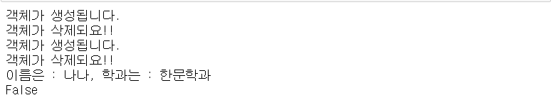

# 함수
> python의 객체 지향

- 함수는 특정 기능을 수행하는 코드 묶음.

- 함수를 만들때 함수명은 가독성을 높이기 위해서 c언어 함수 스타일로 이름을 짓는다.

- 함수명은 소문자+밑줄(_)을 이용해서 함수명 작성 (ex.student_name)

- python에서의 내장함수와 사용자 정의 함수가 존재. ex. print() len()


## 사용자 정의 함수(user define function)

- 함수를 정의 할 때 `def` 키워드 사용
- 함수 선언 다음에 두 줄을 띄운다!(약속!!!)

```python
def my_sum(a,b,c):
    result=a+b+c
    return result


sum_result=my_sum(10,20,30)
print(sum_result)	#60

# 만약 sum이라고 이름을 지으면 존재하는 내장함수를 새로 덮어서 쓰게 되는 것이므로 원래의 고유 sum() 내장함수를 쓸 수 없다.
# 재정의의 유연성을 가지나 위험!
```


### 가변데이터 인자 사용시

- 함수를 정의해서 사용할 때 인자의 개수가 개변적일 때

```python
def my_sum(*tmp):	#tuple로 인자를 받는다!
    result=0
    for t in tmp:
        result+=t
    return result


print('결과값은: {}'.format(my_sum(1,2,3,4)))
#결과값은: 10
#함수내에서 tmp를 출력해보면 tuple로 출력된다.
```


### 여러개의 값을 리턴하는 함수

틀린 표현이지만 이해를 위해 위와 같이 표현.

기본적으로 리턴값은 하나만 가능하다!

**튜플**로 리턴하게 된다.

```python
def multi_return(a,b):
    result1=a+b
    result2=a*b
    return result1,result2	#tuple은  ()를 생략할 수 있다

#실제로는 (result1,result2)를 리턴하는 것이다
data1=multi_return(10,20)
print(type(data1))		#<class 'tuple'>
print(data1)			#(30,200)

data1,data2=multi_return(10,20)
#(data1,data2)상태
print(data1)
print(data2)
```


### default parameter

마지막 인자만 사용가능하다! 중간 인자는 사용불가 Error!

```python
def default_param(a,b,c=False):
    if c:
        result=a+b
    else:
        result=a+b+c
    return result

print(default_param(10,20))   #30
#3개의 인자가 들어가야하지만 넣지 않았으므로 default값인 False가 들어간다.
```


## call-by-value & call-by-reference

> 넘겨준 인자값이 변경되지 않는 경우

call by value =>immutable(파이썬 언어):변수값이 변하지않음,원본변경X

> 넘겨준 인자값이 변경되는 경우

call by reference=>mutable(파이썬 언어):변수값이 변함.

```python
def my_func(tmp_value,tmp_list):
    tmp_value = tmp_value +100
    tmp_list.append(100)
    
    
data_x=10
data_list=[10,20]

my_func(data_x,data_list)
print('data_x:{}'.format(data_x))		#10 => immutable(숫자,문자열,tuple)
print('data_list:{}'.format(data_list))	#[10, 20, 100] => mutable(list,dict)
```


##  local variable과 global variable

범위(scope)에 따라 달라지는 변수사용영역

```python
tmp=100

def my_func(x):
    tmp=tmp+x
    return tmp

print(my_func(20))	#ERROR!! 
#함수 내부에 있는 tmp와 함수 밖의 tmp와 다르기때문!!
```


> 함수 밖에 있는 변수를 사용하는 방법!!

```python
tmp=100

def my_func(x):
    global tmp	#global사용
    tmp=tmp+x
    return tmp

print(my_func(20))	#120

######################################
tmp = 100

def my_func(my_tmp,x):
#     global tmp
    my_tmp = my_tmp + x
    return my_tmp

print(my_func(tmp,20))
```


**BUT** 좋지 않은 방법!!!! 피해야한다!!!!!!

의존성이 높아진다. 독립적이여야할 함수가 연결이 되면서 흔히 말하는 스파게티코드가 될 수 있음!!


## 내장함수

가짓수가 매우 많음!

1. all(x) 함수 : 반복 가능한 자료형 x에 대해서 모든 값이 True이면 True. 만약 하나라도 False이면 False처리를 해주는 함수.

   ``` python
   a=[3.14,100,'Hello',True]
   print(all(a))	#True
   
   a=[3.14,0,'Hello',True]	#0은 논리값으로 False을 가짐
   print(all(a))	#False
   ```

2. any(x) 함수 : 반복가능한 자료형 x에 대해서 하나라도 True이면 True. 모든 데이터가 False이면 False 처리를 해주는 함수.

   ```python
   a=[0,1,'',None]
   print(any(a))	#True
   ```

3. len(x) 함수 : x의 길이를 알려주는 함수

4. int(), float(), list(), tuple(), dict(), str(), set() : 형변환


### 람다함수(lambda) : 대체 표현식

- lambda는 한줄로 함수를 정의하는 방법.

- 함수처럼 사용은 되지만 정확히 따지면 함수는 아니다! 식이다!

- 함수의 이름이 없기때문에 `anonymous function`이라고 하기도 한다.

- 스택 메모리 잡지 않으며 별도의 scope를 갖지않는다.

- 람다는 함수명이 없기때문에 일반적으로 `람다식(lambda expression)`이라고 불린다.

- 변수 = lambda 입력변수1, 입력변수2, ... : **대체표현식**

```python
f=lambda a,b,c : a+b+c

def my_sum(a,b,c):
    return a+b+c

#둘은 다르다!!
#함수는 별도의 스코프를 갖고 return 필요!
#람다식은 return이 없다. 처리된 결과를 돌려주는 것이 아닌 표현만 바꾸는 것.

print(f(10,20,30))	#60 print(10+20+30)과 같은 형태
```


## magic function

magic function의 특징은 일반적으로 우리가 직접 호출하지않는다!

특정 순간이 되면 자동적으로 호출

```python
ex. __init__(), __str__(), __del__(), __lt__(), ...

class Student(object):
    def __init__(self,name,dept,grade):
        print('객체가 생성됩니다.')
        self.name=name
        self.dept=dept
        self.grade=grade
        
    def __del__(self):   #instance가 메모리에서 삭제 될 때 호출
        print('객체가 삭제되요!!')
        #객체가 삭제될 때 이 객체가 사용한 resource를 해제
    
    def __str__(self):
        #이 클래스로부터 파생된 인스턴스 객체를 문자열로 바꿀 때 호출
        return '이름은 : {}, 학과는 : {}'.format(self.name,self.dept)
    
    def __gt__(self,other):
            if self.grade>other.grade:
                return True
            else:
                return False   
            
stu1=Student('나나','한문학과',3.0)
stu2=Student('미미','철학',2.0)
#객체가 생성되면 특정 메모리 주소에 메모리 공간이 할당(0x100)
#두번째 실행에서 객체가 생성되면 특정 메모리 주소에 공간이 할당(0x200)
#이때 0x100는 삭제 되므로 __del__함수가 호출되는 것!

print(stu1)   #메모리 주소값이 나온다. - __gt__()생성전
			  #특성한 문자열을 출력하고 싶은 경우 __str__()를 지정해준다!
#del stu1	


print(stu1<stu2)   #False

```

