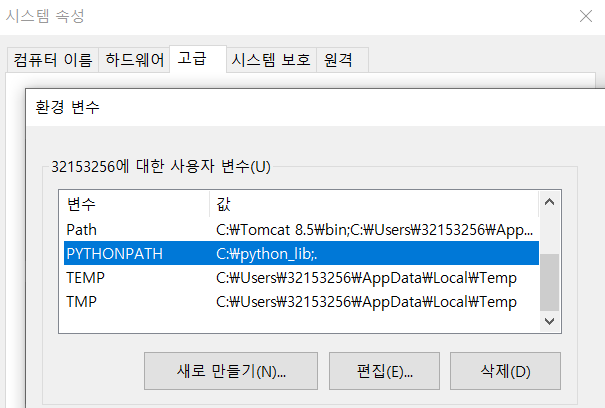
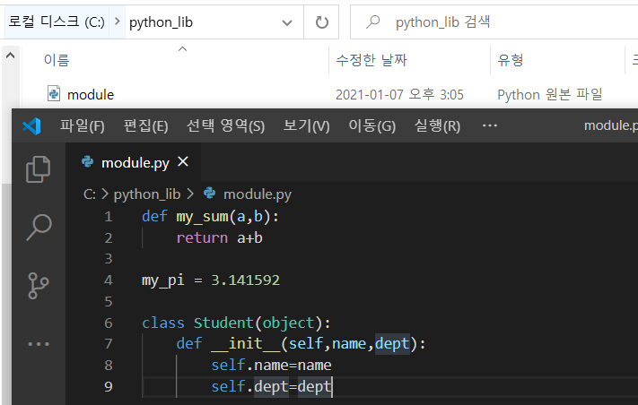
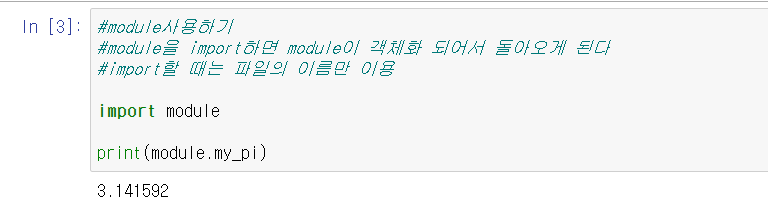
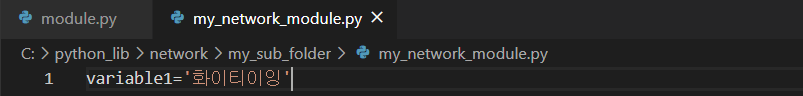

# module

함수나 변수 혹은 클래스를 모아놓은 파일을 지칭.

확장자가 .py로 끝나는 python 소스코드는 무조건 모듈.

현재 우리는 jupyter notebook을 사용하고 있고 확장자가 .ipynb 이 파일은 module이 아니다.

다른 python 파일을 불러와서 우리 코드에서 이용할 수 있도록 해주는 기능.


> module을 사용하는 이유

코드의 재사용성을 높이고 관리를 쉽게 하기 위해!


> module 사용법

import : module을 불러들이는 키워드.

파일을 객체화 시켜서 우리 코드가 사용하는 메모리에 로드.


환경변수 하나를 생성해서 특정 폴더를 지정해서 그 안에 파이썬 파일을 작성>모듈로 사용가능!

1. 내 컴퓨터 우클릭 -> 속성 -> 고급 시스템 설정 -> 고급탭 -> 윗부분 환경변수 생성

2. python_lib폴더 만들어서 확인 눌러서 PYTHONPATH 생성

3. 켜뒀던 conda 터미널을 종료하고 다시 로드해야한다.




4. 생성한 python_lib폴더 안에 파이썬 파일을 만든다




5. jupyter 로 돌아와서 kernel - Restart한다
6. 모듈을 사용해보자!

- import 모듈이름 as 뭐
- from 모듈이름 import 내부 내용



```python
import module as m1			#module을 m1으로 사용
from module import my_pi	#module폴더 안에 있는 my_pi를 가져옴

print(m1.my_pi)	#3.141592
print(my_pi)	#3.141592	
print(m1.my_sum(10,20))	#30
```




```python
#폴더 안에 파일을 사용하고 싶을때
import network.my_sub_folder.my_network_module as m1
from network.my_sub_folder import my_network_module

print(m1.variable1)					#화이티이잉
print(my_network_module.variable1)	#화이티이잉
```


# 예외처리

`try - except` : 프로그램이 강제종료되지 않게 보완해주는 예외처리! 기본적인 구문

`else` : except가 발생하지 않았을 때에 이 뒤의 코드 사용.

`finally` : 예외가 있건 없건 무조건 실행!!

```python
#python의 예외처리
###정상적인 코드 - list를 이용한
def my_func(list_data):
    
    my_sum=0
    try:#문제가 발생하면 예외처리!
        my_sum=list_data[0]+list_data[1]+list_data[2]
    
    except Exception as err:#문제가 발생하면 아래 코드가 실행
        print('실행시 문제가 발생했어요!')
        my_sum=0
    
    else:
        print('실행시 문제가 없어요!!')
    
    finally:
        print('만약 finally가 존재하면 무조건 실행!!')
        
  
    return my_sum

my_list=[1,2]
print(my_func(my_list))


```

