# Numpy(Numerical python)

숫자표현, 행렬 연산을 기반. 

수치처리를 기본으로 하는 라이브러리.

vector, matrix연산에 있어서 상당한 편리성을 제공.


numpy module은 우리에게 기본적인 자료구조를 하나 제공한다.

ndarray(n-dimensional array) - numpy에서 기본적으로 사용하는 것!!!

list랑 유사하게 생겼지만 완전히 다름!!


> numpy사용법

module 다운로드하기. (외부 모듈)

1. anaconda prompt를 실행한다!
2. 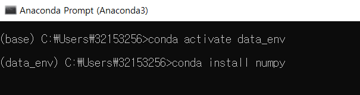

```bash
conda install numpy
```


## Python의 list

```python
#python의 list
a=[1,2,3,4]   #literal(프로그램적 기호를 이용해서 표현) - []를 이용해 list표현
a=list()      	#list라는 class를 이용해서 생성
print(type(a))	#<class 'list'>
print(a)        #[1, 2, 3, 4]


list_a=[1,3.14,True,'Hello']       #가능!
#list는 모든 원소가 같은 데이터 타입을 가지지 않아도 상관없다!

```


## numpy의 ndarray

```python
import numpy as np	#anaconda로 설치한 numpy를 가져온다!

b=np.array([1,2,3,4])  
print(b)				#[1 2 3 4]
print(type(b))         #<class 'numpy.ndarray'>

#ndarray가 가지는 속성 중 dtype - 어떤 데이터들이 들어갔는지
print(b.dtype)         #int32 - 32bit형 정수형
#ndarray는 모든 원소가 같은 데이터 타입을 가져야한다!!(list와 다른점)
#꼭 그러진않아도 되지만 출력시 모든 타입으로 통일된다.

#ex. 
c=np.array([1,2,3.14,'Hello'])
print(c.dtype)			#U32 - unicode

```


### 다차원 ndarray

`dtype`: 어떤 데이터가 들어갔는지 확인하는 속성, 바꿀 수 있다.

```python
import numpy as np	#anaconda로 설치한 numpy를 가져온다!

my_list=[[1,2,3],[4,5,6]]
print(my_list)    #[[1, 2, 3], [4, 5, 6]]

my_array=np.array([[1,2,3],[4,5,6]],dtype=np.float64) #데이터타입 지정
print(my_array) #[[1 2 3]
                #[4 5 6]]

print(my_array[1,1])  #5.0 위에서 float로 제시했으므로!
```


### 속성

`ndim` : 차원의 수

`shape` : 차원에 맞게 개수를 tuple로 표현

```python
import numpy as np	#anaconda로 설치한 numpy를 가져온다!

#1차원
my_list=[1,2,3,4]
arr=np.array(my_list)

print(arr.ndim)   #ndim이라는 속성은 차원의 수를 나타내준다! => 1 (1차원)
print(arr.shape)  #차원과 개수를 tuple로 표현 (4,)=>요소가 1개인 tuple은 이렇게 표현


#2차원
my_list=[[1,2,3],[4,5,6]]
arr=np.array(my_list)
print(arr.ndim)   #2
print(arr.shape)  #(2,3) (행의 갯수,열의 갯수)


#3차원
my_list=[[[1,2,3],[4,5,6]],[[7,8,9],[10,11,12]]]
arr=np.array(my_list)
print(arr)
print(arr.ndim)   #3
print(arr.shape)  #(2,2,3) 2면 2행 3열

'''
[[[ 1  2  3]
  [ 4  5  6]]

 [[ 7  8  9]
  [10 11 12]]]
'''
```


`len` : python함수 차원에 상관없이 1차원에 몇개가 들어있는지 알 수 있다.

`size` : 요소들의 총 갯수

```python
my_list=[1,2,3,4]
arr=np.array(my_list)

print('shape:{}'.format(arr.shape)) #shape:(4,)
print('크기(len):{}'.format(len(arr))) #크기(len):4
print('크기(size):{}'.format(arr.size)) #크기(size):4

my_list=[[1,2,3],[4,5,6]]
arr=np.array(my_list)
print('shape:{}'.format(arr.shape))#shape:(2,3)
print('크기(len):{}'.format(len(arr))) #크기(len):2 
print('크기(size):{}'.format(arr.size)) #크기(size):6 => 요소들의 총 갯수
```


#### shape

튜플로 표현되기는 하나 튜플 고정값은 아니다! 아래의 예시를 보자!

```python
my_list=[1,2,3,4]
arr=np.array(my_list)
print(arr)			#[1 2 3 4]

print(arr.shape)  	#(4,)
arr.shape=(2,2)    	#차원을 바꿔준다. 튜플을 바꾸는 것이 아닌 shape를 바꾸는 것, 다른 튜플로 대체 하는것! 덮어씌우는 것.
print(arr)

arr.shape=(4,1,1)   
print(arr)

arr.shape=(2,1,2)
print(arr)
```

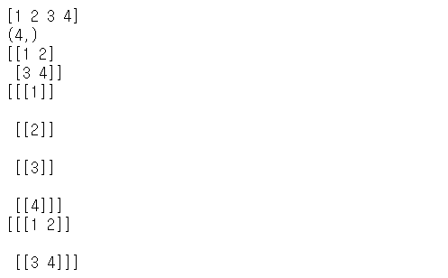

직접적으로 shape속성을 변경하는 것이 아닌 reshape()를 사용할것!!


### 함수

`astype()` : data type을 변경

```python
import numpy as np

arr = np.array([1.2,2.3,3.5,4.1,5.7])
print(arr)

arr=arr.astype(np.int32)
print(arr)    #반올림이 아닌 버림(정수부분만 표현)
```

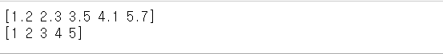


`ravel()` : ndarray가 가지고 있는 모든 요소를 포함하는 1차원의 ndarray로 변경

```python
arr=np.array([[1,2,3],[4,5,6]])
print(arr)

arr1=arr.ravel()  #View
print(arr1)
```

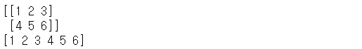


#### matplotlib

- 간단한 그래프 모듈을 이용해서 데이터 분포 살펴보기

- 새로운 모듈인 matplotlib설치

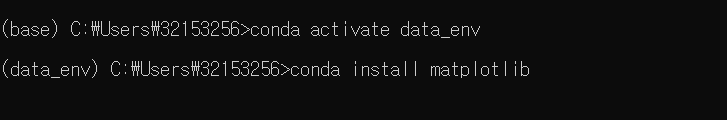


#### ndarray를 만드는 법

`zeros()`: 특정 형태의 ndarray를 만들어서 내용을 0로 채운다. 기본적으로 실수데이터로 채움.

`ones()`: 특정 형태의 ndarray를 1로 채운다.

`empty()`:  쓰레기 값으로 ndarray구성만 만들어줌!

`full()`:내가 원하는 값으로 모두 초기화!

```python
import numpy as np

arr=np.zeros((3,4))  #특정 형태의 ndarray를 만들어서 내용을 0로 채운다. 기본적으로 실수데이터타입
print(arr)

arr=np.zeros((3,4),dtype=np.int32)#int 형태
print(arr)

arr=np.ones((3,4),dtype=np.float64)
print(arr)

arr=np.empty((3,4))
print(arr)          #왜 1이 나오나요? 원래 쓰레기 값이 나옴! 위의 코드영향받아서 1이 나옴

arr=np.full((3,4),7) #내가 원하는 값으로 초기화
print(arr)
```

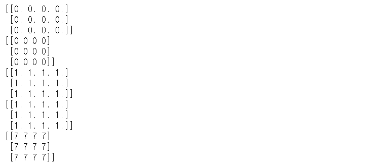


##### arange()

`arange()` : ndarray를 만드는 또 다른 방법

```python
import numpy as np

#python에서 쓰는 법
#a=range(10)
arr=range(0,10,2)
print(arr)      #range(0, 10, 2) => 의미로만 나옴! 값아님!!!

#numpy에서 쓰는 법
arr=np.arange(0,10,1)
print(arr)#numpy arrange가 list로 출력 됨 => 값으로 나옴!
print(arr.reshape(2,5))
```

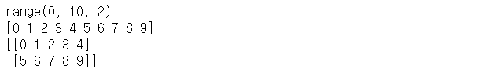


##### random함수 생성 5가지

1. np.random.nomal() : 정규분포에서 실수형태의 난수 추출. 평균과 표준편차를 필요로한다.

```python
my_mean=50 #평균값 통상적으론 avg를 쓰나 수학적으로는 mean을 사용
my_std=2 #표준편차
arr = np.random.normal(my_mean,my_std,(10000,)) #평균,표준편차,shape
print(arr)

plt.hist(arr,bins=100) #최소값과 최대값을 100개의 영역으로 쪼갬 = 히스토그램
plt.show()
```

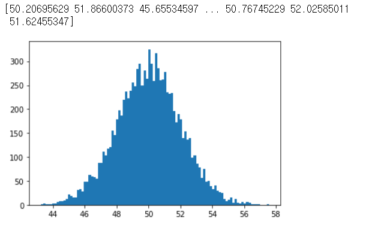

2. np.random.rand() : 0이상 1미만의 실수를 난수로 추출. 균등분포로 난수를 추출

```python
arr=np.random.rand(10000)#10000개 데이터 추출
print(arr)
plt.hist(arr,bins=100)
plt.show()   
```

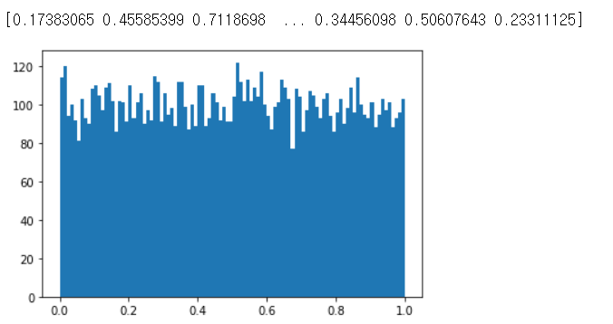

3. np.random.randn() : 표준 정규분포에서 실수형태로 난수를 추출

```python
arr=np.random.randn(10000)#10000개 데이터 추출
print(arr)
plt.hist(arr,bins=100)
plt.show()
```

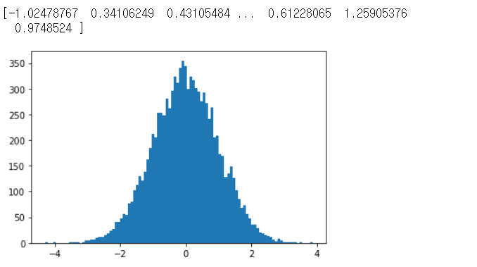

4. np.random.rand(low,high,shape) : 정수형 난수 추출

```python
arr = np.random.randint(10,100,(10000,))
print(arr)
plt.hist(arr,bins=10)
plt.show()
```

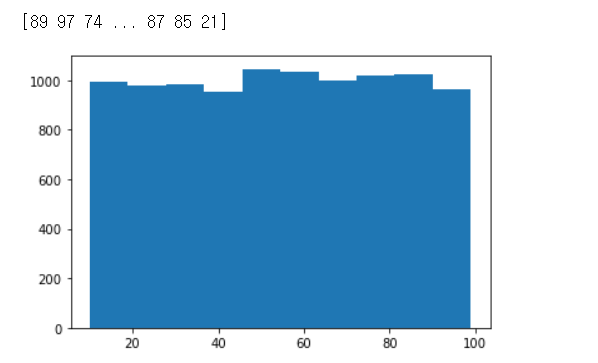

5. np.random.random() : 0이상 1미만의 실수를 난수로 추출. 2번과 같지만 사용방법이 다르다.

```python
arr = np.random.random((10000,))
print(arr)
plt.hist(arr,bins=100)
plt.show()
```

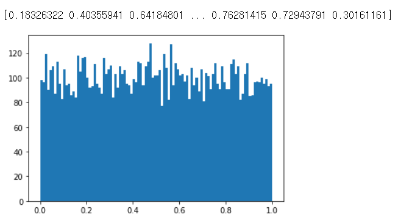


###### random함수에 대한 함수

`seed()`:정수만 안에 사용가능. 실행할 때마다 같은 난수가 추출되도록 설정

`shuffle()`: 만들어진 ndarray의 데이터 순서를 random하게 바꾼다!

```python
np.random.seed(0)  #정수만 사용되고 음수는 사용할 수 없어요!
arr = np.random.randint(0,100,(10,)) #요소 10개짜리 가 0~100사이에서 출력
print(arr)

arr = np.arange(10)
print(arr)

#이미 만들어진 ndarray의 데이터 순서를 random하게 바꾼다! = shuffle하고 싶다!
np.random.shuffle(arr)
print(arr)
```

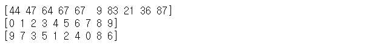


##### ndarray의 형태(shape) 제어법

###### reshape()

- 새로운 ndarray를 만들지 않는다. 

- View를 생성할 뿐 모양만 바꾸고 별개의 데이터가 만들어지는 것이 아니다.
- 그래서 해당 데이터를 바꾸면 원본도 바뀐다!
- reshape()한 것을 볼려면 새로운 것에 담아줘야함 (ex. arr1=arr.reshape(3,4))

```python
import numpy as np

arr = np.arange(12)  #12개의 요소를 가지는 1차원의 ndarray
arr1 = arr.reshape(3,4)
print(arr1)

arr1[0,2]=200   # = arr1[0][2]
print(arr1)
print(arr)   #똑같이 200으로 변해있음

```

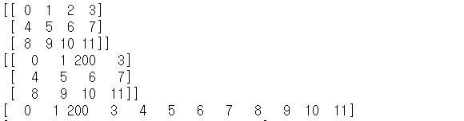


```python
import numpy as np

arr=np.arange(12)  #12개의 요소를 가지는 1차원의 ndarray
print(arr)

arr1=arr.reshape(-1,2) #-1:나중에 결정. 다른거부터 결정후 남은거 넣기
print(arr1)

arr1=arr.reshape(2,3,-1) #-1:나중에 결정. 다른거부터 결정후 남은거 넣기
print(arr1)
```

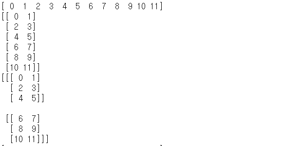


`copy()` : 내용을 복사

```python
arr=np.arange(12)
print(arr)

arr1=arr.reshape(3,4).copy() #내용을 복사해서 새로운 ndarray를 생성
print(arr1)

arr1[0,0]=100
print(arr1)
print(arr)
```

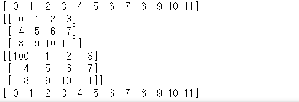


###### resize()

- 모양 변경가능

```python
arr=np.array([[1,2,3],[4,5,6]])
print(arr)

arr1=arr.resize(1,6)   #결과를 리턴하지 않고 원본을 바꾼다
print(arr1)   #[[1 2 3 4 5 6]] 로 출력되지 않음!! None
arr.resize(1,6) #<<원본자체를 바꿔서 사용하기
print(arr)
```

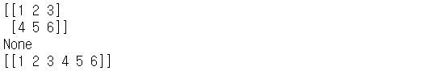

```python
arr1 = np.resize(arr,(2,3))  #np가 가진 resize기능을 사용한다 - 원본은 불변! 복사본이 만들어진다!
print(arr1)
print(arr)
```

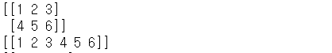


resize()와 reshape copy의 결과는 같다.

```python
arr.resize(3,4) #reshape는 변경 불가능 resize는 가능! 자동으로 0으로 채워짐!
print(arr)

'''
[[1 2 3 4]
 [5 6 0 0]
 [0 0 0 0]]
'''
```

