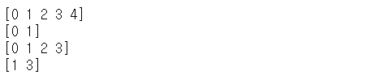
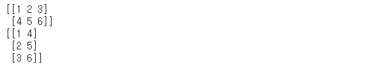

# Indexing

- 기본 Indexing, boolean Indexing, fancy Indexing

`enumerate()`: 인덱스 값을 주는 함수. 반복문 사용시 index값을 추출하기 위해서 사용

```python
import numpy as np

arr = np.arange(10,20,1)

for idx,temp in enumerate(arr):
    print('인덱스 :{}, 값은 : {}'.format(idx,temp))
```


- ndarray의 slicing도 python의 list와 동일한 형태로 사용가능.

```python
arr=np.arange(0,5,1)
print(arr)
print(arr[0:2])
print(arr[0:-1])  # 맨 마지막 요소만 제외하고 슬라이싱
print(arr[1:4:2]) # 2칸씩 움직이기
```




- 2차원 형태의 ndarray의 slicing

```python
arr=np.array([[1,2,3,4],
             [5,6,7,8],
             [9,10,11,12],
             [13,14,15,16]])
print(arr)
print(arr[1][1])  #6
print(arr[1,1])   #6, 일반적인 2차원의 indexing
print(arr[1,:])   #1행의 처음부터 끝까지 [5 6 7 8]
print(arr[1:3,:]) #[[ 5  6  7  8]
                  #[ 9 10 11 12]]
print(arr[0])     #0행의 모든 요소
    
```


## boolean Indexing

boolean mask를 생성해서 Indexing을 하는 과정

mask의 값은 모두 True , False로만 이루어져있음

```python
#Q. 짝수인 수만 구하는 법

np.random.seed(1) #값고정
arr = np.random.randint(1,20,(10,))#1이상 20 미만 1차원 10개
print(arr)	#[ 6 12 13  9 10 12  6 16  1 17]

print(arr%2==0)
#[ True  True False False  True  True  True  True False False]
print(arr[arr%2==0])  
#[ 6 12 10 12  6 16]
```


## Fancy Indexing

ndarray에 index배열을 전달하여 배열요소를 참조하는 방식.

연속적으로 붙어있는걸 출력할 때에는 slicing을 사용하고, 규칙성이 없는 걸 뽑아야한다면 Fancy Indexing을 사용한다.


```python
import numpy as np

#resize보단 reshape을 사용하는 것이 좋음. 에러가 날때 알려줌! resize는 그렇지않음!
arr=np.arange(0,12,1).reshape(3,4).copy()
print(arr)
'''
[[ 0  1  2  3]
 [ 4  5  6  7]
 [ 8  9 10 11]]
'''

print(arr[2,2])   # 10, indexing
print(arr[1:2,2]) # 인덱싱을 한 뒤에 뽑히는 거라 1차원 형태의 [6]이 나온다. 원본을 유지하냐 아니냐의 차이
print(arr[1:3,0:2])#행과 열이 slicing되므로 2차원이 나온다.
```


```python
print(arr[[0,2],2]) # [2 10]
```

> 보충설명

arr[0,2]에서 행의 

[[ 0 1 2 3]
[ 8  9 10 11]] 를 가져온다. 

뒤의 열부분인 ,2를 해결하면 그 위치에 해당하는 2 10이 출력.


```python
print(arr[[0,2],1:3]) #2차원 표현 
[[ 1  2]
 [ 9 10]]
```


```python
print(arr[[0,2],[0,2]])  #[ 0 10]
```

> why?

arr[0,0],arr[2,2]가 나온 것

이런 경우를 위해 numpy가 함수를 제공한다!!


### np.ix_()

각행, 각렬에 있는 것을 인덱싱하는 방법

```python
print(arr[np.ix_([0,2],[0,2])])
#0,2번째 행에서 0,2번째 열 인덱싱

[[ 0  2]
 [ 8 10]]
```


### np.matmul()

행렬곱 연산하는 함수.

행렬곱 연산이 일어날려면 두개의 행렬이 앞쪽 행렬의 열과 뒤쪽 행렬의 행의 수가 일치해야한다

```python
import numpy as np

arr1 = np.array([[1,2,3],
               [4,5,6]])  # 2x3 ndarray
arr2 = np.arange(10,16,1).reshape(2,3).copy() #2x3 ndarray
arr3 = np.arange(10,16,1).reshape(3,2).copy() #3x2 ndarray

#ndarray연산의 기본은 같은 위치에 있는 원소끼리 연산을 수행
#shape가 다르면 연산이 수행되지 않는다!
print(arr1+arr2)
'''
[[11 13 15]
 [17 19 21]]
'''

print(np.matmul(arr1,arr3))
'''
[[ 76  82]
 [184 199]]
'''
```


## broadcasting

다른 shape를 가지는 ndarray를 이용해서 4칙연산이 가능하도록 broadcasting을 지원해준다!

배수로 늘어나는 것이 아닌 한쪽에게 맞춰서 shape가 바뀌는 것이다!!

```python
import numpy as np

arr1= np.array([[1,2,3],[4,5,6]]) #(2x3) ndarray
arr2=np.array([7,8,9]) 

print(arr1+arr2) #error가 아님!!! => broadcasting됨!! arr2가 2행3열이 되면 더하기가 가능하게 됨! shape을 맞추게 된다!
#2x3 과 4x1때는 브로드캐스팅 안됨! 배수로 늘어나는 것이 아닌 한쪽에게 맞춰서 shape가 바뀌는 것이다!!


arr3=np.arange(1,9).reshape(2,4).copy()
print(arr3)
'''
[[1 2 3 4]
 [5 6 7 8]]
'''

arr4=np.array([7,8])
print(arr4)	#[7 8]

scalar=10
#print(arr3+arr4) => Error!!
print(arr3+scalar)
'''
[[11 12 13 14]
 [15 16 17 18]]
'''
```


# 전치행렬

원본행렬의 행은 열로, 열은 행으로 바꾼 matrix를 의미한다!

이렇게 만든 전치 행렬(transpose)는 View 수학적으로 전치행렬을 표현할 때는 위첨자로 `T`를 이용한다

```python
import numpy as np

arr = np.array([[1,2,3],
                [4,5,6]])
print(arr)
print(arr.T)
```




> Q. 1차원 vector에 대해서 전치행렬을 구하면 어떻게 되나요?

A. 1차원 vector에 대해서 전치행렬을 구할 수 없다! (2차원 내에서만 가능)


# Iterator(반복자)

- 1차원의 경우 for문을 쓰는 것이 더욱 효과적

- 2차원의 경우 각 요소를 출력하고 싶을 때 사용하면 다중for문을 사용하지 않아서 효율성있게 사용가능하다!
- `flags` : iteratro가 어떤 형태로 움직이는지 명시
- `c_index` : c언어의 index방식을 따르라. 지시자, 포인터같은 느낌.
- `while not it.finished` : it의 맨끝까지 가서 끝냈는지 체크하는 구문.

```python
import numpy as np

arr = np.array([1,2,3,4,5])

#1차원-for문
for tmp in arr :
     print(tmp, end=' ')
 
#1차원 iterator
it = np.nditer(arr, flags=['c_index'])

while not it.finished:#it가 맨끝까지 가서 끝냈니? True or False로 나옴
    	idx=it.index #0부터시작
    	print(arr[idx],end=' ')
    	it.iternext() #화살표 옮기는 작업
        
        
#2차원-for문
for i in range(arr.shape[0]):     #arr.shape=>(2,3)
   for j in range(arr.shape[1]): #
       print(arr[i,j], end=' ')
        
#2차원 iterator
it = np.nditer(arr,flags=['multi_index'])

while not it.finished:
    idx=it.multi_index  #(0,0)부터 시작
    print(arr[idx],end=' ')
    it.iternext() 
```


# ndarray 비교연산

비교연산도 사칙연산과 유사하게 동장

```python
import numpy as np

np.random.seed(4)
arr1 = np.random.randint(0,10,(2,3))
arr2 = np.random.randint(0,10,(2,3))

print(arr1)
print(arr2)
print(arr1==arr2)  #boolean mask
print(arr1>arr2)   #boolean mask


arr1=np.arange(10)	
arr2=np.arange(10)
#비교 속성이 따로 있다!
print(np.array_equal(arr1,arr2))	#True==>??
```


# 집계함수

- 집계함수 : 합, 평균, 표준편차, 분산, 최대, 최소
- 수학함수 : 최대, 최소, 제곱근, 제곱값, 로그값 등
- `sum()`:합계
- `mean()`:평균
- `max(), min()` : 최대, 최소
- `argmax(), argmin()` : 최대 최소 값의 index출력!
- `std()` : 표준편차
- `sqrt()` : 제곱근

```python
import numpy as np

arr = np.arange(1,7,1).reshape(2,3).copy()
print(arr)
'''
[[1 2 3]
 [4 5 6]]
'''

#합계
print(np.sum(arr))  #21
print(arr.sum())    #21

#평균
print(np.mean(arr)) #3.5
print(arr.mean())   #3.5

#최대최소
print(np.max(arr))  #6
print(np.min(arr))  #1

#index★★★
print(np.argmax(arr)) #5 최대값의 index가 리턴!!!
print(np.argmin(arr)) #0 최소값의 index가 리턴!!!

#표준편차
#standard deviation
print(np.std(arr))    #1.707825127659933

#제곱근
print(np.sqrt(arr))
```


## axis

- Numpy의 모든 집계함수는 기본적으로 axis를 기준으로 계산.

- axis를 지정하지 않으면 axis는 None으로 설정. 즉, 대상범위가 배열 전체로 지정.

- axis는 축을 의미하고 이 축은 결국 숫자로 표현(0,1,2,3,4,5,...)

- 1차원에서 axis값은 0밖에 쓸 수 없다.
- 굳이 집계함수를 이용해서 계산하지 않고 로직을 이용해도 되지만 속도차이가 있다!! 집계함수<로직 , 집계함수를 이용하는 것이 이득!!

- 행은 세로 열은 가로!!!
- **axis=0** => 행, **axis=1** => 열

```python

print(arr.sum(axis=0))
#축을 대상으로 합 - 1차원에서는 0만 가능!!, axis사용의미가 없음


arr = np.array([[1,2,3],
               [4,5,6],
               [7,8,9],
               [10,11,12]])
print(arr.shape)  #(4,3)
print(arr.sum())  #축이 명시가 안됐으므로 sum()의 대상은 전체가 됨 78

#axis는 0과 1을 사용할 수 있다
#0=>행방향, 1=>열방향
#3차원이면 axis는 (0,1,2) 3개 사용가능!!
#0=>면, 1=>행, 2=>열
print(arr.sum(axis=0))  #[22 26 30]
print(arr.sum(axis=1))  #[ 6 15 24 33] 

np.random.seed(1)
arr=np.random.randint(0,12,(4,3))
print(arr)
'''
[[ 5 11  8]
 [ 9 11  5]
 [ 0  0  1]
 [ 7  6  9]]
'''
print(arr.argmax(axis=0)) #[1 0 3] 
#행기준으로 살펴봄 9 11 9가 크므로 그 위치의 인덱스를 출력
print(arr.argmax(axis=1)) #[1 1 2 2]

#굳이 집계함수를 이용해서 계산하지 않고 로직을 이용해도 되지만 속도차이가 있다!!
#집계함수<로직 , 집계함수를 이용하는 것이 이득!!


```


> Q. arr 안에 10보다 큰 수가 몇개가 있는지알아보려면 어떻게 하는가?

```python
arr=np.array([[1,2,3,4],
             [5,6,7,8],
             [9,10,11,12],
             [13,14,15,16]])
#풀이법1
cnt=0

it = np.nditer(arr,flags=['multi_index'])

while not it.finished:
    idx=it.multi_index  #(0,0)부터 시작
    if arr[idx]>10:
        cnt+=1
    it.iternext() 
print(cnt)			#6

#풀이법2
print((arr>10).sum()) #6
#true = 1, False=0으로 인식되기때문에! 이렇게 사용!!
```


# 정렬

`np.sort()` : 인자로 들어가는 원본 ndarray는 변화가 없고 정렬된 복사본이 만들어져서 리턴
`arr.sort()` : 원본 배열을 정렬하고 리턴이 없어!

```python
import numpy as np

arr = np.arange(10)
print(arr)	#[0 1 2 3 4 5 6 7 8 9]
np.random.shuffle(arr)
print(arr)	#[8 3 5 9 0 6 1 7 4 2]

#정렬만 한다!
print(np.sort(arr))	#[0 1 2 3 4 5 6 7 8 9]
print(np.sort(arr)[::-1])#역순으로 1개씩 정렬해서 출력
print(arr)#셔플된 원본출력	#[8 3 5 9 0 6 1 7 4 2]

print(arr.sort())  #None
print(arr)	#[0 1 2 3 4 5 6 7 8 9] 원본에 sort가 저장!
```


