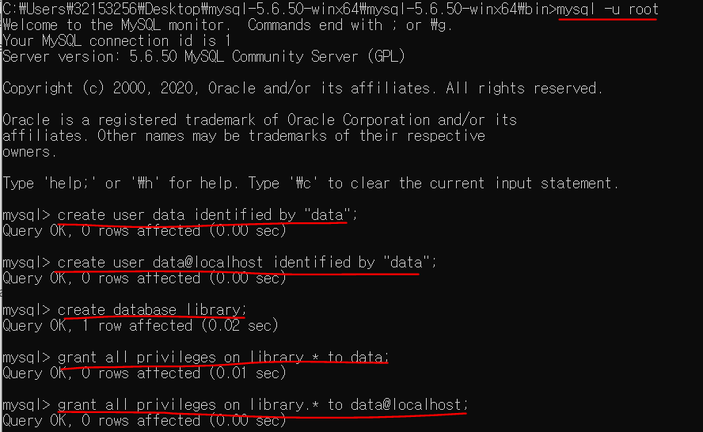
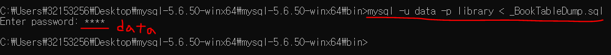

# Pandas

- pandas는 2개의 자료구조를 사용한다.
  (numpy는 자료구조에 가까움)
- 머신러닝, 딥러닝에서 pandas와 numpy가 잘 사용됨

- pandas는 numpy를 기본으로 그 위에 Series와 DataFrame이라는 자료구조를 정의해서 사용한다.
- Series는 DataFrame의 구성요소(pandas에서만 나옴)


1. Series : 동일한 데이터 타입의 복수개의 성분으로 구성 ex numpy.array
2. DataFrame : Table형식으로 데이터 저장하는 자료구조


## 설치법

anaconda 환경이 아니면 python 모듈인 pip 명령어로 설치해도 됨!

현재 우리는 anaconda환경으로 사용하고 있으므로 안전하게 설치를 하기 위해 conda명령어를 사용하는 것이 좋음!


## 실행

```python
import numpy as np
import pandas as pd		#주로 2개를 같이 사용하기 때문에 같이 import한다.
```


## Series

- ndarray + 알파 인 자료구조(1차원인 Series)
- 1차원 자료구조. Vector와 비슷.
- 같은 데이터타입이 들어온다. ex np.array

- 집계함수 사용가능하다!
- 같은 index를 기반으로 사칙연산이 수행된다!

```python
s=pd.Series([7,8,9,10,11],dtype=np.float64)#dtype설정가능
print(s)


print('Series의 값만 가져오고 싶어요 : {}'.format(s.values))
print('Series의 index만 가져오고 싶어요 : {}'.format(s.index))
#index는 RangeIndex라는 특수한 객체 class로 가져오게 된다. start포함, stop비포함,
```


### ndarray 잠깐 설명!

`dtype`  : array 내의 타입 설명

가장 큰 데이터 타입은 `object`

```python
arr = np.array([1,2,3,4,5],dtype=np.float64)
print(arr)

arr = np.array([1, 3.14, True, 'Hello'],dtype=np.object)
#다양한 데이터 타입을 다룰 수 있는 문자열 object로 데이터타입이 잡힌게 된다.
#Hello를 숫자로 표현이 안되기때문에 역으로는 불가능!
print(arr)
print(arr.dtype)
```


### index

`.values` : Series의 값을 가져오는 속성

`.index` : Series의 인덱스를 가져오는 속성(0번부터 시작된다)

인덱스를 바꿔줄 수도 있다!

```python
import numpy as np
import pandas as pd

#index를 바꿔줄수있음
s= pd.Series([1,5,8,10],
            dtype=np.int32,
            index=['a','b','c','d'])
print(s)
'''
a     1
b     5
c     8
d    10
dtype: int32
'''

#5라는 값을 출력하려면?
print(s['b'])    #5
print(s[1])      #5 - index가 변경되도 기본적으로 숫자 index 사용가능!

```


> Q. Index가 서로 같으면 어떻게 되나요?

```python
s=pd.Series([1,5,8,10],
           dtype=np.int32,
           index=['a','b','a','d'])
print(s)

result =s['a']
print(result)   #Series로 생성됨
print(type(result))

result=s['b']
print(result)
print(type(result))
#내부적으로 numpy를 사용하므로 numpy.int32이 찍힌다
```


> 위의 경우에서 Series로 출력된 s['a']와 int 값으로 출력된 s['b']를 더하면?

```python
s=pd.Series([1,5,8,10],
           dtype=np.int32,
           index=['a','b','a','d'])
print(s['a']+s['b'])

#s['a'] : Series 1 8 
#s['b'] : 5 (int-scalra값) 
#broadcasting이 되어서 6과 13으로 각각 떨어지게 된다.
'''
a     6
a    13
dtype: int32
'''
```


> 논리적 사용이 되는가

Series 자체는 조건문에 들어가지 못한다!

예를 들어 if s['a'] +s['b'] <10 : 이 구조는 Error가 난다!!

```python

print(s['a']+s['b']<10) #Series자체는 조건문에 들어가지는 못한다!
#if s['a']+s['b']<10 : <<이 구조는 Error
'''
a     True
a    False
dtype: bool
'''


if (s['a']+s['b']<10)[0]:
    print("True입니다")
else:
    print("False입니다")

(s['a']+s['b']<10)[0] 가 a True
(s['a']+s['b']<10)[1] 가 a False로 나왔기에 답은 True로 출력된다.
```


### slicing

인덱스로 slicing을 하면 뒤의 것까지 포함해서 출력된다!

```python
s=pd.Series([1,5,8,10],
           dtype=np.int32,
           index=['a','b','c','d'])
#Slicing
print(s[0:3])  #결론이 원본과 똑같은 타입! #slicing 그대로 적용이 된다.
'''
a    1
b    5
c    8
dtype: int32
'''

#숫자 인덱스로도 자를 수 있는가?
print(s['a':'c'])
#인덱스로 slicing을 하면 뒤의 것까지 포함해서 출력된다!!!
'''
a    1
b    5
c    8
dtype: int32
'''

```


#### fancy indexing & boolean indexing

fancy indexing : 배열로 배치 (list형태로 내가 사용할 index를 주는 것) index값과 숫자로 출력가능.

boolean indexing : boolean mask를 만들어서 indexing하기

```python
s=pd.Series([1,5,8,10],
           dtype=np.int32,
           index=['a','b','c','d'])


print(s[[0,2]])#fancy indexing-배열로 배치 (list형태로 내가 사용할 index를 주는 것)
'''
a    1
c    8
dtype: int32
'''

print(s[['a','c']])#fancy indexing
'''
a    1
c    8
dtype: int32
'''

print(s[s%2==0])#boolean indexing - boolean mask를 만들어서 짝수 데이터 출력
'''
c     8
d    10
dtype: int32
'''

print(s.sum()) #집계함수 사용가능! #24
```


### Datetime


#### 설치법

conda로 설치해보고 안되면 pip로 설치!

conda환경에 모듈이 없는 경우도 있다! 이 땐 pip로 설치!


#### 실행

> Q. A공장의 2020-01-01부터 10일간 생산량을 Series로 저장
> 생산량은 평균이 50이고 표준편차가 5인 정규분포에서 랜덤하게 생성(정수)
>
> ndex를 날짜로 잡고 값을 생산량으로 둘것.
>
> B공장의 2020-01-01부터 10일간 생산량을 Series로 저장
> 생산량은 평균이 70이고 표준편차가 8인 정규분포에서 랜덤하게 생성(정수)
>
> 날짜별로 모든(A공장, B공장)의 생산량의 합계를 구하기.


index가 같은 것끼리 연산이 수행됨!

인덱스가 없는 것은 아예 연산이 되지 않는다!

고로 `NaN` (: not a numer) 를 출력하게 된다.

`timedelta` : timedelta(days=1):하루 뒤, days를 기준으로 증감 표시. -1:어제. 2:이틀 뒤

```python
import numpy as np
import pandas as pd
from datetime import datetime,timedelta #datetime데이터 안에 있는 datetime사용

start_day=datetime(2020,1,1)
print(start_day)     #2020-01-01 00:00:00 - default시간
#날짜연산은 일반적으로 함수를 이용해서 일단위로 증감, 울, 연 단위로 증감, 주 단위로 증감 가능.

np.random.seed(1)
factory_A= pd.Series([int(x) for x in np.random.normal(50,5,(10,))],#정규분포(평균,표준편차,차원) 
                    dtype=np.int32,
                    index=[start_day + timedelta(days=x) 
                           for x in range(10)])
                    #timedelta(days=1):하루 뒤, days를 기준으로 증감 표시. -1:어제. 2:이틀 뒤
print(factory_A)

factory_B= pd.Series([int(x) for x in np.random.normal(70,8,(10,))],#정규분포(평균,표준편차,차원) 
                    dtype=np.int32,
                    index=[start_day + timedelta(days=x) 
                           for x in range(10)])
print(factory_B)

print(factory_A+factory_B)  #Series의 사칙연산은 같은 index를 기반으로 수행

```


### dict로 Series 만들기

지금까지 우리는 리스트를 이용해서 Series를 만들었다!

```python
s=pd.Series([1,5,8,10],
           dtype=np.int32,
           index=['a','b','c','d'])
```


dict를 이용해서 만들 수 도 있다!! {key:value}

```python
my_dict={'서울' : 1000,'인천':2000, '수원':3000}
s = pd.Series(my_dict)
print(s)

'''
서울    1000
인천    2000
수원    3000
dtype: int64
'''

print("s의 index : {}".format(s.index))#index이기 때문에 list는 아니지만 list와 같이 사용가능. 반복연산이 가능
print("s의 values : {}".format(s.values))
```

>Q. int32와 int64의 차이는? => bit의 차이! 2^32범위 내 정수, 2^64범위 정수 사용가능


`.name` : Series에 이름을 붙이는 속성

`.index.name` : Series의 index에 이름을 붙이는 속성

index는 list는 아니지만 list와 같이 사용이 가능하다! 

```python

s.index=['Seoul','Inchon','Suwon'] #list와 동일하게 사용가능. 바꿀 수 있다!
s.index.name='Region' #Index의 이름
s.name='지역별 가격 데이터'#Series의 이름

print(s)
```


## DataFrame

Series가 여러 개일 때 편하게 이용가능하다!

대신 각 데이터의 사이즈가 같아야만 출력이 가능하다! 비어있는 값이 없어야한다!

python에서는 None을 사용함. 출력할 때에는 NaN으로 표현

`DataFrame`을 `df`로 줄여서 많이 표현한다(변수로 활용) 

print보다는 display를 이용한다!

### 데이터표현방식 3가지

1. CSV(Comma Seperated Values) : 데이터의 크기가 무지막지하고 데이터의 형태가 잘 변하지 않는 경우는 CSV가 가장 잘맞는 형태

   ex. 홍길동,20,서울,김길동,30,인천,최길동,50,제주,신사임당,40,광주,...

장점 : 많은 데이터를 표현하기 적합, 데이터 사이즈를 작게 할 수 있음
단점: 데이터의 구성을 알기 어려움. 구조적 데이터 표현이 힘들다.
사용과 변경이 힘들고 데이터처리를 위해서 따로 프로그램을 만들어야한다.
데이터가 변경되었을때 프로그램도 같이 변경 => 유지보수문제


2. XML(eXtended Markup Language) : 1990년 초중반

   ex.
   <person><name>홍길동</name><age>20</age><address>서울</address></person>
   <person><name>김길동</name><age>30</age><address>인천</address></person>
   <person><name>최길동</name><age>50</age><address>제주</address></person>

장점: 데이터의 구성을 알기 쉽다! 사용하기 편하다!
프로그램적 유지보수가 쉽다
단점: 부가적인 데이터가 많다! 용량차지!!


3. json(JavaScript Object Notation) : 현재 일반적인 데이터 표현방식
   자바스크립트 객체 표현방식을 이용해서 데이터를 표현하는 방식
   Json은 데이터 표현방식이지 특정 프로그래밍 언어와는 상관이 없다!

   ex. {name : '홍길동', age:20, address : '서울'}

장점 : XML의 장점과 같음!
데이터의 구성을 알기 쉽다! 사용하기 편하다!
프로그램적 유지보수가 쉽다! 
XML보다 용량이 작다!!
단점 : CSV에 비해서는 부가적인 데이터가 많다!


### 생성법

#### 1. dict로 생성

```python
import numpy as np
import pandas as pd

my_dict={'name' : '홍길동',
         'year' : 2015,
         'point':3.5}
#이 때는 Series로 사용가능!!
#Series가 여러개일 때는!?

my_dict={'name' : ['홍길동','신사임당','김연아','강감찬'],
         'year' : [2015,2016,2019,2016],
         'point':[3.5,1.4,2.0,4.5]}

df=pd.DataFrame(my_dict)
display(df)   #dataframe을 출력할때에는 print 보다 display를 이용!

```


> 속성

```python
print(df.shape) #(4,3)
print(df.size)  #12 => 이 안에 들어있는 값이 몇개인가
print(df.ndim)  #2 => 몇차원인가?!
print(df.index) #RangeIndex(start=0, stop=4, step=1)
print(df.columns) #Index(['name', 'year', 'point'], dtype='object')
print(df.values)
'''
[['홍길동' 2015 3.5]
 ['신사임당' 2016 1.4]
 ['김연아' 2019 2.0]
 ['강감찬' 2016 4.5]]
'''

#2차원 데이터이므로 numpy.array로 구성되어있음!!

df.index.name='학생번호'
df.columns.name='학생정보'
display(df)
```


#### 2. CSV로 생성

`head()` : 상위 5개 행 가르킴

`tail()` : 하위 5개 행 가르킴

`read_csv()` : (,) 컴마로 데이터 분리해서 읽어들이기.

먼저 강사님이 주신 movies.csv를 C:/python_ML 위치에 저장해 뒀다!

```python
import numpy as np
import pandas as pd

#read_csv : (,)컴마로 데이터 분리해서 읽어들이기
df = pd.read_csv('./movies.csv')#C:/python_ML
#jupyternotebook이 있는 위치와 같은 곳에서 찾기 
display(df.head())   

print(df.shape) #(9742,3) 2차원이고 9742행 3열
```


#### 3. Database로부터 데이터를 읽어서 생성
##### MySQL 설치

MariaDB와 MySQL의 포트번호가 같으므로 하나를 사용하는 것을 추천!

사양 및 설정을 맞추기 위해 강사님 따라서 설치해보자!


https://dev.mysql.com/downloads/

1. 위 링크를 타고 가서 **MySQL Community Server**로 들어가 (현재(21.01.13)기준 최신버전은 8.0.22) 옆에 보면 이전버전을 찾아서 다운이 가능하다.


5.6.50 버전으로 선택해서 


다운로드!!


2. No thanks를 누르면 회원가입 없이도 다운이 가능하다.

   다운 받은 파일은 바탕하면에 두자!!(따라하기 편하게 하기 위할뿐)

3. 다운 받은 폴더 압축풀기 ( setup같은 것이 있는 것이 아님!)


##### MySQL 실행

1. 윈도우 cmd창 띄우기!(win+R키 : cmd입력)


2. cd명령어로 다운받은 폴더 내의 bin폴더 위치로 옮기기

3. 실행하는 법 : cmd창에서 `mysqld` 명령어 실행.

4. 방어벽 허용.

5. 종료하는 법 : 새로운 cmd창을 하나 더 띄우고 cd로 bin폴더로 움직인다음에 `mysqladmin - u root shutdown` 명령어로 종료할 수 있다


> 새로운 사용자 ID/PW 만들기

1. mysql console에 들어가기. (관리자 권한)
2. `mysql -u root` 입력!(**그 전에 다른 cmd에서 mysqld를 명령을 실행해둬야한다! 총 cmd창을 2개 띄우는 것!!!!!!!!!!!!**)
3. console에 들어가면 mysql> 로 시작하는 프롬프트가 보인다.
4. 정상적으로 접속했으면 새로운 사용자를 다음의 명령어로 만든다.

```mysql
create user data identified by "data"; 
#"data"부분은 ID(스스로지정) password부분도 지정해서 넣어주기?
```

5. 외부 접속을 위해 다음의 명령을 한 번 더 실행!

```mysql
create user data@localhost identified by "data";
#@localhost가 없으면 외부접속이 불가능!
```

6. 데이터가 저장될 데이터베이스를 생성해야한다! 우리가 사용하는 mysql은 DBMS(DataBase Management System=데이터베이스 관리도구)

7. 실제 데이터를 저장할 공간. 데이터베이스라는 공간을 만든다. 

``` mysql
   create database library; #database생성
```

   현재 사용자(data)가 따로 있고 database(library)가 따로 있는 상황!

8. 사용자가 데이터베이스를 사용할 수 있도록 권한을 부여할 것.
```mysql
grant all privileges on library.* to data; #data는 사용자 이름
grant all privileges on library.* to data@localhost; #data는 사용자 이름
```




9. 권한 설정에 대한 refresh를 시킨다.

```mysql
flush privileges;	#권한 적용
```


10. 설정을 다 끝냈으므로 console에서 나오기!

```mysql
exit;
```


11. exit해서 나온 도스창(cmd)에서 강사님이 제공한 script file을 이용해서 데이터를 적재하기.

    C:\Users\32153256\Desktop\mysql-5.6.50-winx64\mysql-5.6.50-winx64\bin에 저장했음. (_BookTableDump.sql)

    ```bash
    mysql -u data -p library < _BookTableDump.sql
    ```

    

    #data계정의 권한으로 library 데이터 베이스 안에 데이터를 넣겠다는 뜻.

    pw를 "data"로 넣을 것

    
    
    -p: 나중에 password넣겠다
    
    <: library 데이터베스 안에 넣겠다는 의미




##### Toad 설치

12. `toad for mysql` 다운받기. mysql을 다루는 툴인 toad!!!

https://www.toadworld.com/downloads


MySQL페이지에서 Toad Edge 선택!


Limited freeware선택해서 이메일 적고 window 다운!


default값으로 따로 선택할 거 없이 install한다!


##### Toad 실행


1. connection 눌러서 어제 만든 database로 접속!
2. cmd창에서 명령어`mysqld`로 mysql 켜두기!!