# Pandas

## 3. Database를 이용해 DataFrame생성

MySQL에서 data를 읽어와서 DataFrame으로 만들것

python프로그램이 MySQL DBMS에 접속해야한다!

python은 데이터베이스에 접속할 모듈이 없기 때문에 외부모듈 필요하다!

모듈을 설치하는법?! 구글링!!
pymysql모듈을 이용할 것!


### pymysql설치


anaconda prompt에서 설치.

anaconda가 제공해주는 레파지토리에 있으면 실행되고 없으면 다른 곳에서 설치해야한다!


### 데이터베이스 접속

연결이 성공하면 연결객체가 생성된다! conn으로 받음!

```python
import pymysql.cursors
import numpy as np
import pandas as pd

conn = pymysql.connect(host='localhost',
                       user='data',
                       password='data',
                       db='library',
                       charset='utf8')
print(conn)
#<pymysql.connections.Connection object at 0x0000025E973D07C8>
```

host, user, password, db를 설정해서 연결하기!


> 접속이 성공했으면 데이터를 가져오자!

Q.  책 제목에 특정 키워드('여행')이 들 어있는 책들을 검색해보자!

책 제목에 여행이라는 키워드가 들어가있는 책만 검색

database에서 데이터를 가져오려면 database에서 사용되어지는 언어로 질의를 전달해야 한다!

질의(query)를 전달한다=>SQL(데이터베이스용 프로그래밍 언어)

```python
keyword='여행'

sql = "SELECT bisbn, btitle, bauthor, bprice FROM book WHERE btitle LIKE '%{}%'".format(keyword)

#python의 예외처리를 이용하는게 좋다!
#데이터베이스가 중지되어있으면 당연히 오류가 나기 때문에!
try:
    df=pd.read_sql(sql,con=conn)
    display(df)
except Exception as err:
    print(err)
finally:
    conn.close()   #database연결 종료    
```

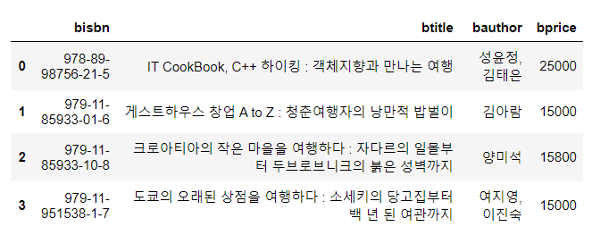


### JSON형태로 DataFrame생성법

**Json형태로 바꾸는 이유!!**

서로 데이터를 사용하기 편하도록하는 약속!

내가 가진 DataFrame의 내용을 다른 컴퓨터나 다른 사용자에게 전달하기 위해서는 이런 표준형태의 데이터 표현방식으로 변환시켜서 전달해야한다.


> 파일오픈 방법

python으로 파일처리를 할려면

1. 파일오픈
2. 파일 처리
3. 파일 close

위 처리를 하려면 코드가 늘어난다! 코드방식을 바꾸면 효율적으로 처리할 수 있음!!


> 원래의 코드

```python
file1 = open('test.txt')
file1.readline()
file1.close()
```


> 효율적 코드

```python
#column명을 json의 key값으로 이용해서 JSON을 생성
with open('./data/books_orient_column.json','w', encoding='utf8') as file1:
    df.to_json(file1, force_ascii=False, orient='columns')
    
    
#json에서 []가 나오면 배열!!
#records는 한 행의 대한 정보가 json으로 만들어져서 여러 개가 들어오게 된다.
with open('./data/books_orient_records.json','w', encoding='utf8') as file2:
    df.to_json(file2, force_ascii=False, orient='records')

```

> 코드해석

`open` : 해당파일을 읽기, 쓰기, 저장 등의 작업을 위해서 `open` 사용.

​			자동으로 파일에 대한 close작업이 일어난다.

​			위 폴더와 파일을 만들어서 open하겠다!!! (직접 폴더 만들고오세용)

여기서 `. ` 은 주피터 노트북의 경로. c:\python_ML이다.

`to.json` : json으로 바꾼다.

`w` : writing하겠다

open된 파일의 이름을 `file1`로 설정, 

`encoding ` : 한글표현을 위해 인코딩정보 넣기

`orient` : 방향, 기본값은 컬럼, records 사용가능


실행하면 각각의 폴더 안에 json파일이 생기는 것을 확인 할 수 있다! Visual code로 확인해보면 column.json, record.json파일을 읽을 수 있다.

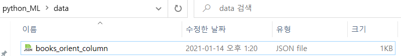


하지만 읽기 불편함...

https://jsonformatter.curiousconcept.com/

Json으로 바뀌어진 데이터를 가시적으로 표현해주는 사이트...

위에서 만들어진 파일 속 데이터를 위 사이트에 복사 붙여넣기 해서 Process하면 어떤 구조로 json이 만들어져있는지 볼 수 있다.

> column.json (dict형태로 가져온다.)

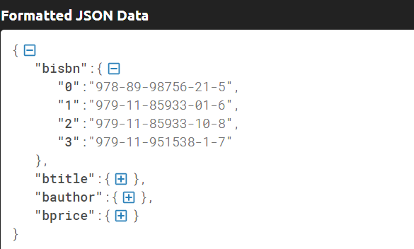


> records.json (list형태로 가져온다.)

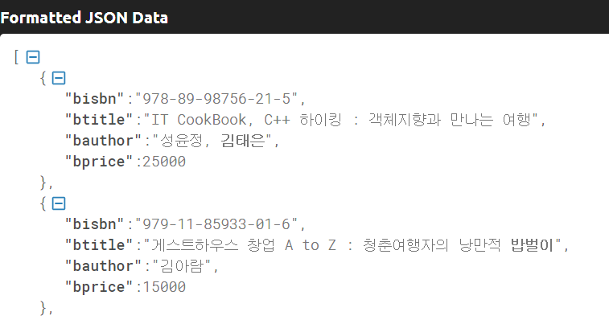


#### JSON 파일 jupyter로 읽어오기

json파일을 가지고 있을 때 파일을 읽어서 pandas의 DataFrame으로 만들어보자!

`json.load(파일)` : 파일을 json으로 읽어서 python의 dict로 변환해서 읽음

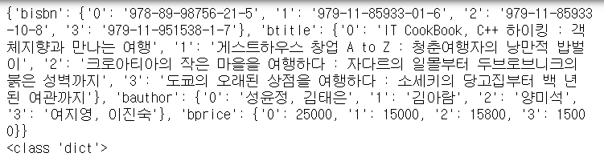

`pd.read_json(파일) ` : json으로 읽은걸 dataframe처리하여 보여줌

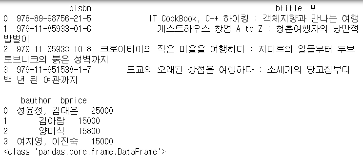

```python
import numpy as np   #외장 모듈이기 때문에 설치 작업이 필요
import pandas as pd  #외장 모듈이기 때문에 설치 작업이 필요
import json          #json은 내장모듈

with open('./data/books_orient_column.json','r', encoding='utf8') as file1:
    dict_book = json.load(file1) #json을 읽어서 python의 dict로 변환
				#pd.read_json(file1)으로 사용가능

print(dict_book)
print(type(dict_book))

#DataFrame은 만드는 법
#1. 일반 dict
#2. csv
#3. database에서 가져와서!

df=pd.DataFrame(dict_book)
display(df)
```


## 4. Open API로 DataFrame생성

Open API를 이용해서 그 결과를가지고 DataFrame으로 만들것

Open API(공개적으로 누구나 사용할 수 있는 웹 프로그램)


> 영화진흥위원회에서 제공하는 
>
> 일일 박스오피스 순위에 대한 
>
> Open API를 이용해보자!


1. 영화진흥위원회 open api검색!!

http://www.kobis.or.kr/kobisopenapi/homepg/apiservice/searchServiceInfo.do

해당 사이트에 들어가서 회원가입 후 키를 발급받고 open api를 이용해보자!


📌요청 URL(일별 박스오피스) : http://www.kobis.or.kr/kobisopenapi/webservice/rest/boxoffice/searchDailyBoxOfficeList.json

**(xml->json)으로 수정!**


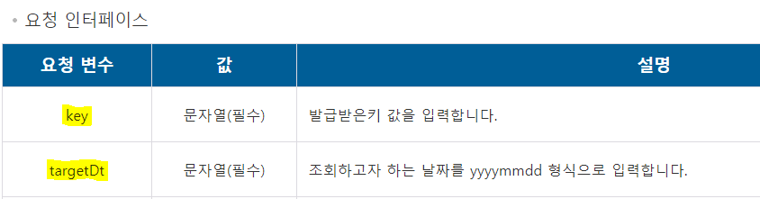

2. 필요한 요청변수!! 확인

   key : 발급받은 키(회원가입, 로그인 필요)

   targetDt : 20210113 (오늘날짜는 안됨! 어제 날짜로 쓰기. 아직 상영중이기때문)

   

3. GET방식으로 호출!!!

   Query String을 이용해서 호출하라! (QueryString은 요청인자를 전달하기 위한 특별한 형식)

   사용형식: ?key=키값&targetDt=20210113

> 호출 API

=> http://www.kobis.or.kr/kobisopenapi/webservice/rest/boxoffice/searchDailyBoxOfficeList.json?key=키값&targetDt=20210113

위 URL을 웹브라우저에 쳐보면 정보가 JSON형태로 전달되는 것을 알 수 있다!


_하지만 보기 어렵다!!_

보기 쉽게하는 방법 2가지!!

1. 위에서 사용한 JSON Formatter 사이트 이용하기
2. 크롬 웹 스토어에 가서 json formatter 확장프로그램 추가

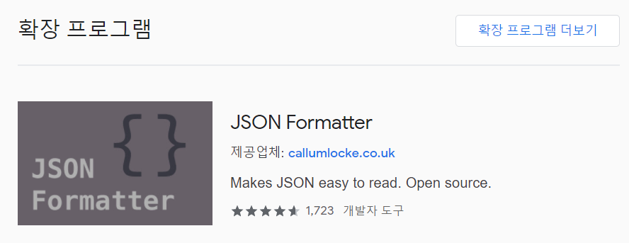

2번을 실행 한 후에 호출 API를 url을 재검색하면 보기 쉽게 출력된다!!

키 값의 의미는 영화진흥위원회open api페이지 응답 구조에서 확인 할 수 있다.

ex) []로 표현된것은 json array, {}는 json

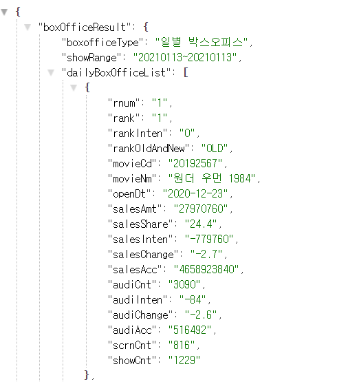


### 생성

Open API를 이용해서 DataFrame을 만들어보아요~

```python
import numpy as np
import pandas as pd
import json
import urllib

open_api='http://www.kobis.or.kr/kobisopenapi/webservice/rest/boxoffice/searchDailyBoxOfficeList.json'
query_string = '?key=e44bc4e4ab8b74158359604fc98cc83b&targetDt=20210114'
open_api_url=open_api+query_string

page_obj = urllib.request.urlopen(open_api_url)#결과물을 주게된다!
print(type(page_obj))
#<class 'http.client.HTTPResponse'> 웹은 request구조. response를 돌려준다.
```

웹은 request구조. response를 돌려준다.

`request` : URL을 이용해서 호출하는 행위
`response` :  request의 결과로 웹서버에서 우리에게 전달하는 행위

response 객체 안에는 우리가 원하는 json이 포함되어있다.

해당 객체에서 json 결과를 가져와야함!


```python
json_page = json.loads(page_obj.read())#json을 얻을 수 있음 dict형태로 가져옴.

#결과 json을 python의 dict로 변환
#원하는 내용을 뽑아서 DataFrame으로 생성!
my_dict = dict()    #{}
rank_list=list()
title_list=list()
sales_list=list()

for tmp_dict in json_page['boxOfficeResult']['dailyBoxOfficeList']:#dict안에 dict를 뽑는 형식
    rank_list.append(tmp_dict['rank'])
    title_list.append(tmp_dict['movieNm'])
    sales_list.append(tmp_dict['salesAmt'])

my_dict['순위']=rank_list
my_dict['제목']=title_list
my_dict['매출액']=sales_list

df=pd.DataFrame(my_dict)
display(df)
```

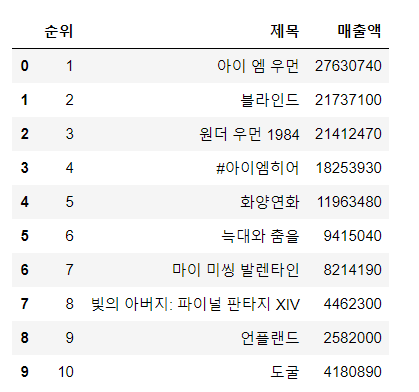


## 복습

### DataFrame 다루기

`NaN` : 값이 없다. 결치. 실수 값으로 해석됨.

```python
data = {'이름':['보라돌이','뚜비','나나','뽀','햇님'],
      '학과':['컴퓨터','철학','수학','경제','영문'],
      '학년':[1, 2, 2, 4, 3],
      '학점':[1.3, 3.5, 2.7, 4.3, 4.5]}

df = pd.DataFrame(data,
                  columns=['학과','이름','학년','학점','주소'],
                  index=['one','two','three','four','five'])

#주소 안에 값이 없으므로 NaN으로 생성된다.
```

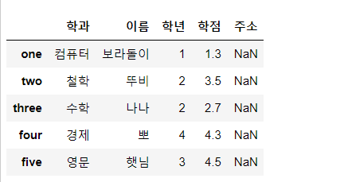


- column값만 뽑으면 Series가 출력된다.

```python
print(df['이름'])
print(type(df['이름']))

'''
one      보라돌이
two        뚜비
three      나나
four        뽀
five       햇님
Name: 이름, dtype: object
<class 'pandas.core.series.Series'>
'''
```


- 특정 컬럼을 뽑으면 View로 나온다. 

> warning 메세지를 끄는 법

warnings.filterwarnings(action='ignore') #warning off
#warnings.filterwarnings(action='default') #warning on

```python
import warnings #내장모듈
warnings.filterwarnings(action='ignore') #warning off
#warnings.filterwarnings(action='default') #warning on


stu_name=df['이름']
#특정컬럼을 뽑으면 View가 나온다
stu_name['three']='을지문덕'#warning 메세지가 나온다!
print(stu_name)
display(df)
```

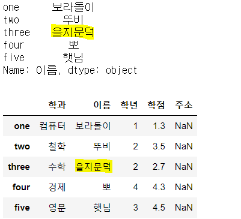


- 별도의 Series를 만들때는 별도의 객체를 만들도록 copy()함수를 사용한다.

- 이와 같이 사용하면 원본은 변하지 않는다!

```python
stu_name=df['이름'].copy() #별도의 객체를 만들도록 copy()함수 사용
stu_name['three']='을지문덕'#warning 메세지가 나온다!
print(stu_name)
display(df)
```


- df[['이름']] 은 DataFrame. fancy indexing을 해서 원본이 나옴.
- df['이름']은 일반 인덱싱을 했기때문에 Series(컬럼을 들고 온것, slicing)


### Column 다루기 
#### fancy indexing

두 개 이상의 column을 가져올때 어떻게 해야하나?

Q. 이름과 학점 column가져오기! 

A. fancy indexing을 사용한다!, slicing은 불가능!!

```python
df는 위에서 사용한것으로 진행!!

result =df[['이름','학점']] #결과는 DataFrame
display(result)

```

```python
print(df['이름'])  #OK. Series로 결과 리턴
#print(df['이름':'학년']) #Error. column은 slicing이 안된다!
display(df[['이름','학년']]) #Ok. Fancy indexing은 허용

```

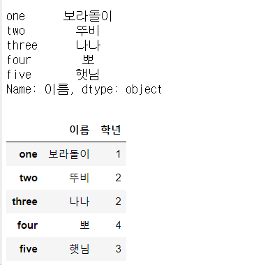


#### boolean indexing

```python
data = {'이름':['보라돌이','뚜비','나나','뽀','햇님'],
      '학과':['컴퓨터','철학','수학','경제','영문'],
      '학년':[1, 2, 2, 4, 3],
      '학점':[1.3, 3.5, 2.7, 4.3, 4.5]}

df = pd.DataFrame(data,
                  columns=['학과','이름','학년','학점'],
                  index=['one','two','three','four','five'])
display(df)

#단순하게 새로운 column을 추가!
#연산을 통해서 새로운 column추가할 수 있다!
df['장학생여부'] = df['학점']>4.0 #boolean mask
display(df)
```

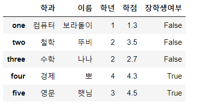


#### 추가

**broadcasting**

`to_numpy()` : 2차원 array로 만들어준다.

```python
data = {'이름':['보라돌이','뚜비','나나','뽀','햇님'],
      '학과':['컴퓨터','철학','수학','경제','영문'],
      '학년':[1, 2, 2, 4, 3],
      '학점':[1.3, 3.5, 2.7, 4.3, 4.5]}

df = pd.DataFrame(data,
                  columns=['학과','이름','학년','학점'],
                  index=['one','two','three','four','five'])

df['등급'] = 'A' #열 생성과 동시에 브로드캐스팅을한다.

df['등급'] =[1,2,3,4,5]

df['등급'] = np.array(['A','C','B','A','C'])

df['등급'] = np.array(['A','C','B','A'])#부족할땐 Error

df['등급'] = ['A','C','B','A',np.nan] #NaN의미 = 값이 없다! 공백과 다름!

display(df)
display(df.to_numpy())
```

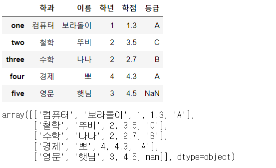


- Series로는 추가가 불가능하다!
- why=>series인덱스는 숫자 밖에 없다! df는 지금 one,two, three,..로 인덱스가 따로 생성되어있다. 인덱스가 맞지 않아서 값을 받지 못함!이럴 때에는 Series에서 index값을 준다.

```python
df['평점'] = np.arange(1,10,2)  #5개의 값을 이용. 행의 갯수 맞추기


ex).df['나이'] = pd.Series([15,20,25,30,35])=>NaN으로 출력된다.

df['나이'] = pd.Series([15,20,25,30,35],
                    index=['one','two','three','four','five'])#성공! index기반 처리

#index를 기반으로 처리되기 때문에 아래와 같은 경우도 허용한다.

df['나이'] = pd.Series([15,30,35],
                  index=['one','three','four'])#해당하는 index에만 값이 들어감!
display(df)
```

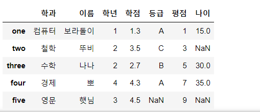


#### 삭제

`drop()` : 행(0,row,record) 또는 열(1,column)을 지울 수 있음

`inplace 속성 ` : 원본에서 삭제하는 경우(True)

 원본은 보존하고 삭제처리된 복사본이 생성(False) - default

> 열을 제거할 때

```python
data = {'이름':['보라돌이','뚜비','나나','뽀','햇님'],
      '학과':['컴퓨터','철학','수학','경제','영문'],
      '학년':[1, 2, 2, 4, 3],
      '학점':[1.3, 3.5, 2.7, 4.3, 4.5]}

df = pd.DataFrame(data,
                  columns=['학과','이름','학년','학점'],
                  index=['one','two','three','four','five'])
display(df)

new_df = df.drop('학년',axis=1,inplace=False)
display(new_df)#False일때는 복사해서 사용 - 원본영향X

```


### Row 다루기

#### indexing(slicing)

- 단일 index불가. 
- Fancy indexing 불가
- slicing가능

```python
data = {'이름':['보라돌이','뚜비','나나','뽀','햇님'],
      '학과':['컴퓨터','철학','수학','경제','영문'],
      '학년':[1, 2, 2, 4, 3],
      '학점':[1.3, 3.5, 2.7, 4.3, 4.5]}

df = pd.DataFrame(data,
                  columns=['학과','이름','학년','학점'],
                  index=['one','two','three','four','five'])
display(df)

#display(df[1])#Error!!! 단일 indexing 안됨
display(df[1:3])#OK! slicing은 됨!!
display(df[0:1])#slicing 가능! => View로 나온다!!
display(df[1:])#slicing 
#display(df[[1,3]]) #Fancy indexing! Error!!!
```

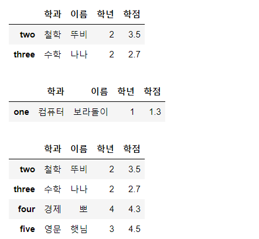


- index를 이용한 row slicing가능

- index와 일반 index혼용 불가.

```python
#print(df['one'])#column 인덱싱 표현
display(df['two':'four'])#OK! index를 이용한 row slicing가능!
#display(df['two':-1]) #Error! 숫자 index와 일반 index를 혼용해서 사용불가
#display(df[['one','three']])	#Error! 컬럼에 대한 fancy indexing표현 

```

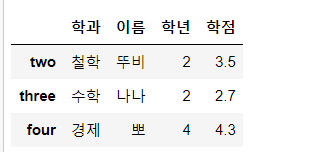


#### LOC

- row는 별도의 표기법을 따로 이용한다!

- loc[]를 이용해서 row indexing!! 무조건 row에만 사용!! column은 사용불가!!
- loc는 숫자 인덱스를 사용불가능. 인덱스 값이 따로 지정되지 않아도 불가능!!
- loc를 이용하면 fancy indexing도 가능하다!

```python
data = {'이름':['보라돌이','뚜비','나나','뽀','햇님'],
      '학과':['컴퓨터','철학','수학','경제','영문'],
      '학년':[1, 2, 2, 4, 3],
      '학점':[1.3, 3.5, 2.7, 4.3, 4.5]}

df = pd.DataFrame(data,
                  columns=['학과','이름','학년','학점'],
                  index=['one','two','three','four','five'])
display(df)

display(df.loc['two']) 
#단일 row, Series로 리턴
#column이 인덱스로 들어간다. row값은 이름으로 들어간다.

display(df.loc['two':'three']) 
#OK!! 결과는 DataFrame

#loc를 이용하면 fancy indexing도 가능!
display(df.loc[['two','four']])
```

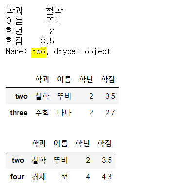


- (,)컴마를 기준으로 행, 열 구분해서 출력이 가능하다.

```python
display(df.loc['one':'three']) #OK! row indexing
display(df.loc['one':'three','이름'])#row3개 하나의 컬럼 => Series로 나옴
display(df.loc['one':'three','이름':'학년'])#앞 뒤 slicing 가능해짐!
display(df.loc[['one','three'],['이름','학점']])#column-fancy indexing 가능해짐!

```

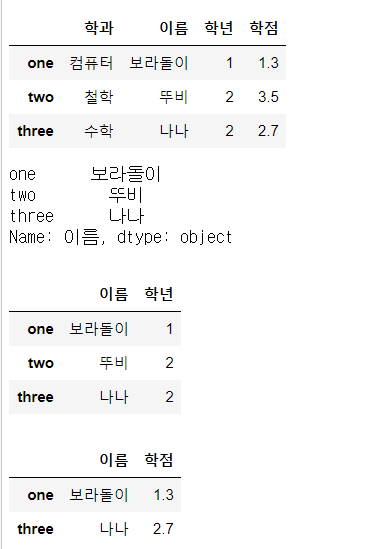


#### iloc

- loc는 숫자 index를 사용하지 못한다.

- 숫자 index를 사용하려면 iloc[]를 이용하면 된다!
- fancy indexing도 가능하다.

```python
data = {'이름':['보라돌이','뚜비','나나','뽀','햇님'],
      '학과':['컴퓨터','철학','수학','경제','영문'],
      '학년':[1, 2, 2, 4, 3],
      '학점':[1.3, 3.5, 2.7, 4.3, 4.5]}

df = pd.DataFrame(data,
                  columns=['학과','이름','학년','학점'],
                  index=['one','two','three','four','five'])
display(df)

display(df.iloc[1]) 
#단일 row, Series로 리턴
#column이 인덱스로 들어간다. row값은 이름으로 들어간다.

display(df.iloc[1:3]) #OK!! 결과는 DataFrame
display(df.iloc[[1,4]])#OK!! loc를 이용하면 fancy indexing도 가능!
```

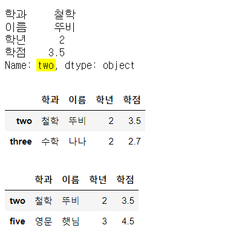


#### 삭제

>열을 제거할 때

```python
data = {'이름':['보라돌이','뚜비','나나','뽀','햇님'],
      '학과':['컴퓨터','철학','수학','경제','영문'],
      '학년':[1, 2, 2, 4, 3],
      '학점':[1.3, 3.5, 2.7, 4.3, 4.5]}

df = pd.DataFrame(data,
                  columns=['학과','이름','학년','학점'],
                  index=['one','two','three','four','five'])
display(df)
```

