# DataFrame 조작

## NaN

결치, 값이없다. 실수로 표현.

NaN은 골칫거리. 값을 지우거나 평균값을 넣어야한다.

```python
import numpy as np
import pandas as pd

#random값을 도출해서 DataFrame을 생성 => np.random.randint()
#6행 4열짜리 DataFrame을 만들어요!

np.random.seed(1)

df=pd.DataFrame(np.random.randint(0,10,(6,4)))
#df.index=pd.date_range('202001001','periods=6)
df.index=pd.date_range('20200101','20200106')#끝나는 지점을 알고있으면 쓰기!
df.columns=['A','B','C','D']

df['E']=[7,np.nan,4,np.nan,2,np.nan]
display(df)
```


>기본값

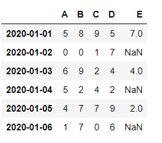


### NaN 지우기

`df.dropna(how=?)` : NaN을 지우는 함수. how에 들어가는 속성값에 따라 행동이 다르다. 

how='any'일땐 NaN이 하나라도 해당 행에 존재하면 행을 삭제

how='all' 모든 컬럼의 값이 NaN인 경우 행을 삭제

inplace = False로 default 설정 (데이터프레임 원본 변경을 안한다. 복사본 리턴)

```python
new_df=df.dropna(how='any')
display(new_df)
```

> 결과값

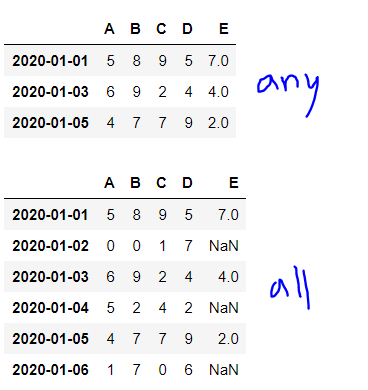


### NaN 채우기

`df.fillna(value=?)` : value에 지정한 값으로 NaN을 채운다.

inplace=False : 원본변경X

```python
new_df=df.fillna(value=0)
display(new_df)
```

>결과값

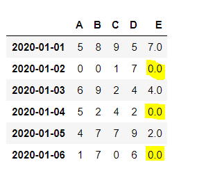


### NaN체크

`df.isnull()` : True/False로 떨어진다.

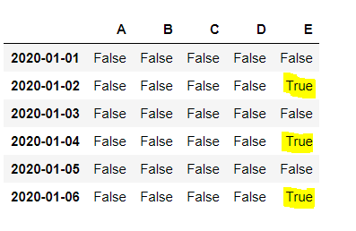


> 퀴즈

'E' column의 값이 NaN인 행들을 찾아 해당 행의 모든 column값을 출력해라!

```python
#답
display(df.loc[df['E'].isnull(),:])
#df.loc[] => row indexing을 이용한다.
```

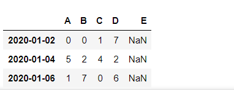


## 중복행 제어

`df.duplicated()` : 행을 대상으로 중복행 체크

`df.drop_duplicates()` : 중복을 제거하고 남은것만 출력

```python
import numpy as np
import pandas as pd

my_dict={
    'k1':['one']*3 + ['two']*4,
    'k2':[1,1,2,3,3,4,4]
    #list를 3번 더하기 ['one']+['one']+['one'] = ['one','one','one']
}
df=pd.DataFrame(my_dict)
display(df)
```

> 기본값

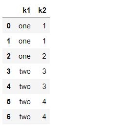

```python
display(df.loc[df.duplicated(),:])#중복된 것 행만 보이기
```

> 결과값

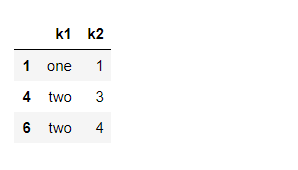


```python
display(df.drop_duplicates())#중복을 제거하고 남은것만
```

>결과값

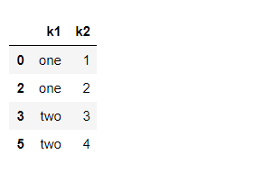


```python
df['k3']=np.arange(7)
display(df)

#display(df.drop_duplicates())#중복행이 없어서 지워지는게 없다!

#특정 column을 기준으로 중복제거
display(df.drop_duplicates(['k1']))#k1을 기준으로 중복행을 지운다
display(df.drop_duplicates(['k1','k2']))#둘의 기준으로 중복행을 지움
```

>기본값

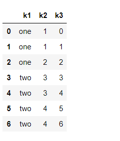


>결과값

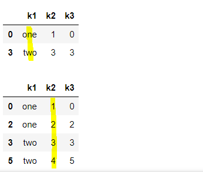


## 대체하기(replace)

`df.replace(a,b)` : a를 b로 바꾼다

속성 : inplace=True ( 원본을 바꾼다 ) 

```python
import numpy as np
import pandas as pd

np.random.seed(1)
#random값을 도출해서 DataFrame을 생성 => np.random.randint()
#6행 4열짜리 DataFrame을 만들어요!
df=pd.DataFrame(np.random.randint(0,10,(6,4)))
#df.index=pd.date_range('202001001','periods=6)
df.index=pd.date_range('20200101','20200106')#끝나는 지점을 알고있으면 쓰기!
df.columns=['A','B','C','D']

df['E']=[7,np.nan,4,np.nan,2,np.nan]#nan은 결치지만 실수로 인식되기 때문에 다른 수도 실수로 표현된다.
display(df)
```

> 기본값

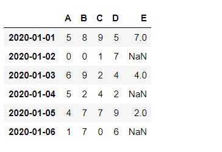


```python
display(df.replace(5,-100)) #5를 -100으로 바꾸기
df.replace(np.nan,-100,inplace=True)
display(df)
```

>결과값

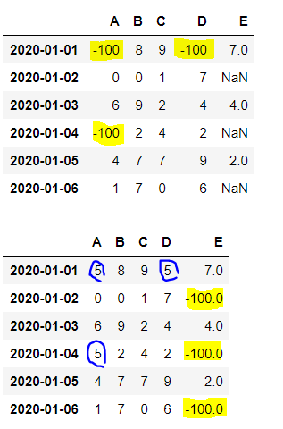


## Grouping(그루핑)

그루핑을 하면 객체형태로 출력된다! eriesGroupBy 또는 DataFrameGroupBy 

`get_group('index')` : 그룹 안에 있는 데이터를 확인하고 싶은 경우에 쓰는 함수

```python
import numpy as np
import pandas as pd

my_dict={
    '학과' : ['컴퓨터','경영학과','컴퓨터','경영학과','컴퓨터'],
    '학년' : [1,2,3,2,3],
    '이름' : ['홍길동','신사임당','김연아','아이유','강감찬'],
    '학점' : [1.5,4.4,3.7,4.5,4.2]
}
df=pd.DataFrame(my_dict)
display(df)
```

> 기본값

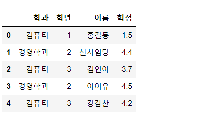


```python
#학과를 기준으로 grouping
score=df['학점'].groupby(df['학과'])#컴퓨터학과의 학점과 경영학과의 학점으로 나누어짐

score=df[['학점','이름']].groupby(df['학과'])#컴퓨터학과의 학점과 이름 경영학과의 학점, 이름으로 나누어짐
print(score)#객체형태로 출력된다 #SeriesGroupBy /DataFrameGroupBy 

#그룹안에 데이터를 확인하고 싶은 경우에는 get_group()
print(score.get_group('경영학과'))
```

> 결과

```bash
1    4.4
3    4.5
Name: 학점, dtype: float64

	학점    이름
1  4.4  신사임당
3  4.5   아이유
```


- 각 그룹안에 몇개의 데이터가 들어있는가

```python
print(score.size()) #Series형태로 return
print(score.mean())
```

> 결과

```bash
경영학과    2
컴퓨터     3
Name: 학점, dtype: int64

학과
경영학과    4.450000
컴퓨터     3.133333
Name: 학점, dtype: float64
```


```python
score=df.groupby(df['학과'])#모든 컬럼에 대해서 학과를 기준으로 group by
print(score) #DataFrameGroupBy
print(df.columns)
print(score.get_group('경영학과'))
print(score.size())
#이름 학과는 평균값을 구할 수 없지만 학년같이 숫자는 평균값으로 출력됨
print(score.mean())
```

> 결과값

```bash
<pandas.core.groupby.generic.DataFrameGroupBy object at 0x000001C87C2E44C8> #하나에 대한것이 아닌 모두를 가져왔기에 DataFrame으로 출력됨!!

Index(['학과', '학년', '이름', '학점'], dtype='object')

     학과  학년    이름   학점
1  경영학과   2  신사임당  4.4
3  경영학과   2   아이유  4.5

학과
경영학과    2
컴퓨터     3
dtype: int64

            학년        학점
학과                      
경영학과  2.000000  4.450000
컴퓨터   2.333333  3.133333
#이름과 학과는 생략됨!
```


grouping의 결과를 반복하기

```python
import numpy as np
import pandas as pd

my_dict={
    '학과' : ['컴퓨터','경영학과','컴퓨터','경영학과','컴퓨터'],
    '학년' : [1,2,3,2,3],
    '이름' : ['홍길동','신사임당','김연아','아이유','강감찬'],
    '학점' : [1.5,4.4,3.7,4.5,4.2]
}
df=pd.DataFrame(my_dict)
display(df)

for dept,group in df.groupby(df['학과']):#group에는 학과로 묶인 데이터프레임이 들어온다
    print(dept)
    display(group)

#for (dept,group) << 원래는 튜플로 표현됨

```

> 결과

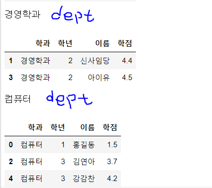


### 2단계 그루핑

```python
#학과,학년를 기준으로 학점을 grouping
score=df['학점'].groupby([df['학과'],df['학년']])#fancy indexing 형태로 넣어준다
print(score.mean())
```

> 결과값

```bash
학과    학년
경영학과  2     4.45
컴퓨터   1     1.50
      3     3.95
Name: 학점, dtype: float64
#학과에 학년마다 평균을 출력
#Series는 한값만 갖는데 index가 여러개다?! 
#multi index로 표현되어져서 그랭!

```


`unstack()` : 최하위 index를 column으로 바꾸어준다

```python
display(score.mean().unstack())
```

> 결과값

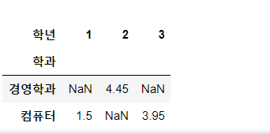


