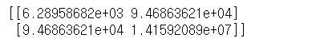

# DataFrame

- DataFrame이 갖고있는 함수에 대해서 알아봅시다!
- sum(), min() 같은 기본적인 함수는 제공한다.

기댓값: 어떤 확률을 가진 사건을 무한히 반복했을 때 얻을 수 있는 값의 평균으로 기대할 수 있는 값, 즉 평균.


```python
import numpy as np
result=np.random.randint(1,7,(100000,)) #정수난수 발생함수(시작,끝 미만, shape)
print(result.mean()) #3.49636 랜덤이므로 그때그때 다름
```

- 1 1 2 2 3 3 1 1 2 3 4 5 1000000 이런 데이터가 있다면 평균치가 왜곡된다.
- `편차` : 확률변수 X와 평균값의 차이. 데이터의 흩어짐 정도를 나타낼 수 있는 값. 편차의 합계는 결국 0이 되기 때문에 데이터의 흩어진 정도를 수치화하기가 힘들다.

- 이러한 오류때문에 우리가 사용하는것!!!
- 분산(variance) (편차의 제곱의 평균)
- 표준편차:분산의 제곱근


>numpy 기준

```python

arr=np.array([4,6,1,3,8,8],dtype=np.int32)
print(arr)			#[4 6 1 3 8 8]
print(arr.sum())	#30
print(arr.mean())	#5.0
print(arr.var())	#6.666666666666667
print(arr.std())	#2.581988897471611
```


## DataFrame으로 공분산 계산하기

`공분산(covariance)` : 두 개의 확률변수의 관계를 보여주는 값. 두 확률변수 편차의 곱에 대한 평균으로 계산.

`pandas_datareader` : 금융쪽 데이터를 가져다 사용할 수 있는 모듈.

anaconder를 이용해 pandas_datareader  설치.

conda가 제공해주지 않으므로 pip을 사용해서 설치.

```bash
pip install pandas_datareader
```


```python
import numpy as np
import pandas as pd
import pandas_datareader.data as pdr #금융쪽데이터를 가져다 사용할수있는 모듈
from datetime import datetime

start=datetime(2019,1,1) #2019-01-01 날짜 객체 생성
end=datetime(2019,12,31) #2019-12-31 날짜 객체 생성

#yahoo 에서 제공하는 kospi 지수
df_KOSPI=pdr.DataReader('^KS11','yahoo',start,end)#KOSPI지수에 해당하는 코드
#display(df_KOSPI['Close'].values) #Series값 중 값만 가져오고싶을때!
df_SE=pdr.DataReader('005930.KS','yahoo',start,end)#삼성전자 지수에 해당하는 코드
#display(df_SE['Close'].values)

#numpy가 제공하는 함수를 이용해서 공분산을 계산
print(np.cov(df_KOSPI['Close'].values,df_SE['Close'].values))

```

> 결과값



0행 0열 : KOSPI에 대한 공분산(KOSPI&KOSPI)
0행 1열 : KOSPI와 삼성전자의 공분산(1,0과 같은 값)
1행 0열 : 삼성전자와 KOSPI의 공분산(0,1과 같은 값)
1행 1열 : 삼성전자의 공분산 (삼성전자 & 삼성전자)
sum((xi-x평균)(yi-y평균))/n-1 => 공분산구하는법. 


## 상관관계!

`상관관계(correlation)` : 두 대상이 서로 연관성이 있다고 추측되는 관계
ex. 성적과 자존감, 온라인 게임과 폭력성

`상관계수(correlation coefficient)` : -1과 1사이의 실수.(피어슨 상관계수) 

하나의 변수가 변할 때 다른 변수가 변화하는 정도. 

양수값이 나오면 정적상관관계, 음수값이 나오면 부적상관관계. 0에 가까울 수록 관련성이 적다. 절대값이 1에 가까울후록 관련성이 높다!

- 상관관계를 얘기할때 조심해야 할 점 : 인과관계로는 설명할 수 없다!


> 예시

```python
import numpy as np
import pandas as pd
import pandas_datareader.data as pdr #금융쪽데이터를 가져다 사용할수있는 모듈
from datetime import datetime

start=datetime(2018,1,1) #2018-01-01 날짜 객체 생성
end=datetime(2018,12,31) #2018-12-31 날짜 객체 생성

#yahoo 에서 제공하는 kospi 지수
df_KOSPI=pdr.DataReader('^KS11','yahoo',start,end)#KOSPI
df_SE=pdr.DataReader('005930.KS','yahoo',start,end)#삼성전자
df_PUSAN=pdr.DataReader('011390.KS','yahoo',start,end)#부산산업(남북경협)
df_LIG=pdr.DataReader('079550.KS','yahoo',start,end)#LIG넥스원(방위)
#KOSPI와 SE는 같이 움직임. PUSAN과 LIG는 역의 관계

my_dict={
    'KOSPI' : df_KOSPI['Close'],
    '삼성전자' : df_SE['Close'],
    '부산산업': df_PUSAN['Close'],
    'LIG넥스원' : df_LIG['Close']
}
df=pd.DataFrame(my_dict)
display(df)

display(df.corr()) #DataFrame이 가지고 있는 상관계수를 구하는 함수를 이용

```

- KOSPI와 SE는 같이 움직임. PUSAN과 LIG는 역의 관계
- `corr()` : DataFrame이 가지고 있는 상관계수를 구하는 함수를 이용!


## 분석용 함수

```python
import numpy as np
import pandas as pd

data=[[2,np.nan],
     [7,-3],
     [np.nan,np.nan],
     [1,-2]]

#NaN:결치, 값이 없다! 하지만 실수타입! 그래서 해당 컬럼들도 실수형태로 나옴! Series는 같은 타입으로 있어야하기 때문!!!

df=pd.DataFrame(data,
                columns=['one','two'],
                index=['a','b','c','d'])

display(df)
```

> 기본결과값


`sum()` : axis를 줘서 행(0), 열(1) 방향으로 값을 더한다. Series값으로 나옴.

`mean()` : 평균값

`fillna(value=df.mean())` : NaN을 평균값으로 채워라. return값을 준다.

- 속성 

  skipna=True(기본값) : NaN(실수) 제외하라는 의미. 

```python
display(df.sum())
display(df.sum(axis=1))

print(df['two'].sum())	#-5.0
print(df.iloc[1].sum())	#4.0 index 1의 합
print(df.mean(axis=0,skipna=False)) #=> NaN값으로 추출됨
print(df.mean(axis=0,skipna=True))	#=> NaN을 배제한 평균값

```

> 결과값

```
one    10.0
two    -5.0
dtype: float64

a    2.0
b    4.0
c    0.0
d   -1.0
dtype: float64


one   NaN
two   NaN
dtype: float64

one    3.333333
two   -2.500000
dtype: float64
```


```python
df['one']=df['one'].fillna(value=df['one'].mean())#fillna():NaN값을 one의 값의 평균값으로 채운다!

df['two']=df['two'].fillna(value=df['two'].mean())#fillna():NaN값을 two의 값의 평균값으로 채운다!

df=df.fillna(value=df.mean())#dataframe의 모든 값을 채운다! return값을 주기 때문에 원본을 바꾸려면 result를 생성해준다다

display(df)
```

> 결과값


### sort() : 정렬

- 행방향, 열방향 등 기준을 정해서 정렬이 되어진다.
- 정렬은 기본적으로 axis를 기준으로 오름차순 정렬.

`pd.date_range('날짜', periods=?)` : 시작날짜와 기간을 입력하면 날짜 범위를 지정해준다. 

```python
import numpy as np
import pandas as pd

np.random.seed(1)
df = pd.DataFrame(np.random.randint(0,10,(6,4)))
display(df)

df.columns = ['A','B','C','D']
df.index = pd.date_range('20200101',periods=6)
display(df)
```

> 결과물


`sort_index()` : axis와 ascending을 지정해서 정렬. 결과를 return한다.

axis=0 (행, 세로index), axis=1 (열,가로 index)

```python
#행정렬(날짜순:세로index)
display(df2.sort_index(axis=0,ascending=True))

#열정렬(알파벳순:가로index)
display(df2.sort_index(axis=1,ascending=True))
```

> 결과물


```python
df3=df2.sort_index(axis=1,ascending=True)
display(df3.sort_index(axis=0,ascending=True))
#행과 열을 한꺼번에 정리! 날짜순, 알파벳순으로 정렬되어 하나가 출력된다!
```


`sort_values()` : 특정 column값으로 행을 정렬

```python
display(df2.sort_values(by=['B','A'])) 
#B의 인자값을 순서대로 정렬하나 같은 값이 있으면 A기준으로 정렬
#B만 적으면 B의 내용만 정렬된다.
```


### shuffle()

shuffle()의 특징은 원본을 바꾼다!

index랑 연결되는 행을 섞는다!

=> Error!! index는 셔플 안의 값을 바꿀 수 없다!

```python
arr=np.array([1,2,3,4])
np.random.shuffle(arr)#array가능
print(arr)		#[1 3 4 2]
```


`permutation()` : 원본은 바뀌지 않고 순서가 바뀐 복사본을 리턴한다!

`reindex()` : 우리가 말하는 index 또는 column의 순서 또한 바꿀 수 있음. 원본은 바뀌지 않음!

```python
new_index=np.random.permutation(df.index) 
df2=df.reindex(index=new_index,columns=['B','A','D','C'])
display(df2)
```

> 결과물


## 기타함수

```python
import numpy as np
import pandas as pd

np.random.seed(1)
df=pd.DataFrame(np.random.randint(0,10,(6,4)))
df.columns=['A','B','C','D']
df.index=pd.date_range('20200101',periods=6)
df['E'] = ['AA','BB','CC','CC','AA','CC']
display(df)
```

>기본결과값


`unique()` : 중복값 제거. 고유한 값만 출력. np.array()로 출력.

`value_counts()` : 각 value값들의 개수를 series로 리턴

`isin()` : 안에 해당 요소가 있는가- True/False로 출력함

```python
#unique() : 중복값 제거. 고유한 값만 출력
print(df['E'].unique()) #np.array() 값으로 출력된다

#value_counts() : 각 value값들의 개수를 series로 리턴
print(df['E'].value_counts()) 

#inin() : 안에 있는가 - True/False로 출력됨
print(df['E'].isin(['AA','BB'])) #조건을 검색할 때 많이 이용하는 방법 중 하나
```

> 결과값

```python
['AA' 'BB' 'CC']

CC    3
AA    2
BB    1
Name: E, dtype: int64

2020-01-01     True
2020-01-02     True
2020-01-03    False
2020-01-04    False
2020-01-05     True
2020-01-06    False
Freq: D, Name: E, dtype: bool
```