# WEB💻

🚩`HTTP protocol`로 통신하는 클라이언트/서버 프로그램을 개발할거다!

`Django`를 사용할 예정.(서버)

클라이언트부터 배워갈것입니다~~~


- `protocol(프로토콜)` : 데이터 통신을 주고받기 위해서 지켜야하는 약속 혹은 규약.

- 2개의 프로세스가 통신을 주고 받으려면 약속이 필요하다. 이러한 약속(프로토콜)이 많다! web에서 사용되는 대표적인 프로토콜은 `HTTP protocol`.

- 웹 클라이언트/서버 프로그램 : 따로 개발할 수도 있고 함께 개발도 가능


## WEB program

CS구조로 되어있다.

=> 클라이언트(C) - 서버(S)

클라이언트 : 능동적으로 서비스를 요청.

서버 : 클라이언트 요청에 대해 서비스를 제공.

웹 프로그래밍 : WAS 안에 프로그램들을 미리 만들어 두어서 클라이언트가 요청할 때마다 실행(서버 기준)


`WEB client `: 웹 서버에 접속하는 클라이언트 프로그램!!

ex. Browser(chrome, IE, safari, firefox 등)

`WEB server` : 웹 클라이언트의 요청을 받아 스비스를 제공하는 프로그램!!

ex. Apache web server

**둘 다 컴퓨터가 아니라 프로그램이다!**


클라이언트와 서버를 만드는 것이 아니라 어플리케이션을 만드는 것!!

web client application : 클라이언트에서 동작하는 응용프로그램. (HTML,CSS,javascript)

web server application : 서버에서 동작하는 응용프로그램.(Django-python, Servlet-java)


## Protocol/Port

`protocol(프로토콜)` : 데이터 통신을 주고받기 위해서 지켜야하는 약속 혹은 규약. (ex. HTTP)

`port(포트)` : 0~65535 사이에 있는 하나의 숫자. 하나의 프로세스(프로그램)을 지칭하는 숫자. **unique**하다!

0~1024 : reserved(예약, 지정된 값)

1025~65535 : 사용자가 사용가능한 범위.

80번포트가 default값으로 지정되어있다.


## IP/MAC address

컴퓨터 외부에서 내부에 있는 프로그램이랑 연결을 하려한다! 그 때 필요한 것은 `IP address (인터넷 주소)`

`IP 주소` : Network에 연결되어있는 각종 기기에 부여되는 논리적인 주소. 4자리. (ex. 192.168.34.2)

`MAC 주소` : Network에 연결되어있는 물리적인 주소. 변경불가!! 6자리. (ex.34.37.128.34.2.76)

프로그램할땐 IP 주소를 사용한다. 컴퓨터는 통신하기 위해선 물리적인 주소인 MAC주소를 쫓으므로 내부적으로 IP→MAC주소로 변경해주는 프로토콜도 존재한다.


> Protocol, port, IP주소가 기본적인 네트워크 통신 재료!!

```bash
HTTP://192.168.0.34:4000
```

HTTP:// : protocol,이 규칙(HTTP)을 가지고 주소를 찾아갈 것!

192.168.0.34 : IP

4000 : port


## HTTP protocol

> HyperText Transfer Protocol

- 웹 서버와 웹 클라이언트가 서로 데이터를 주고 받기 위해 사용하는 통신규약. TCP/IP Protocol stack위에서 등장하는 protocol. => IP address를 기반으로 통신.

- Text뿐만아니라 컴퓨터 내에서 사용하는 여러가지 포맷들 (이미지, 동영상, PDF 등)을 주고 받을 수 있는 프로토콜.

  즉, 여러 종류의 Data를 주고 받을 수 있다!


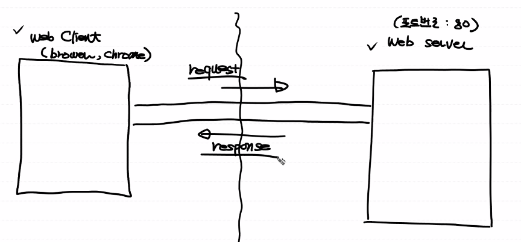

> 순서

- web client 에서 web server로 요청(HTTP request)를 보낸다.

- 논리적인 데이터 통로가 연결되게 된다! (request를 보낼 때 만들어짐)

- web server는 응답(HTTP response)을 보낸다.

- 계속 연결되어있지 않고 사용이 끝나면 _연결을 끊는다._


_연결을 끊는 이유?!_

why=> 서버는 한정 되어있기 때문에! 클라이언트 수를 조절 할 필요가 있기 때문이다.

**But**, 서버가 클라이언트를 구별할 수 없는 문제가 발생한다! IP주소로는 구분하지 않는다. 논리적 주소이기 때문에 변경이 됨. => **stateless**

서버가 클라이언트의 상태를 알 수가 없다. 그래서 http protocol를 `stateless protocol`이라고 부르기도 한다.


### 📢잠깐 CHECK

- web client(web client program) : 우리가 작성할 수 있고. 브라우저로 이용가능 ex. Browser

- web server(seb server program) : performance가 중요하기 때문에 우리가 작성하지 않는다. 프로그램을 받아서 사용한다. ex. Apache, IIS, Oracle Web server

- protocol : 여러가지 규칙이 존재한다. 

  ex. HTTP(WEB전용 프로토콜), FTP(file전송전용 프로토콜), SMTP(simple message transfer protocol, e-mail 관련 프로토콜)

- IP, Port → URL(주소체계 통칭)을 만들 수 있다.

- 클라이언트와 서버가 주고 받는 Request, Response 


### 📢잠깐 실습

1. jupyter notebook 파일을 보관하고 있는 python_ML에 다가 파일을 만들어봅시다~ webclient_test.py로 파이썬 파일 생성!
2. 파일 내용을 채우고 Anaconda Prompt를 이용해서 실행시켜본다.

```python
import urllib.request #고수준의 API
#####client를 만들것#####
#접속
url_obj = urllib.request.urlopen('http://www.example.com:80')
#http://192.168.0.33 이렇게 ip주소를 써야하지만 도메인 주소를 써도 urlopen()이 알아서 처리해줌

print(url_obj)
```

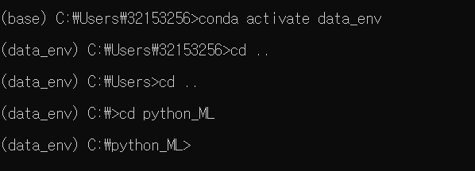


3. 돌아온 응답(HTTPResponse)을 객체로 가져온 것!

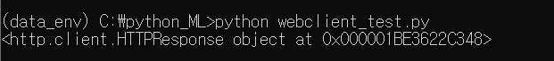


4. 객체를 읽어보자!

```python
print(url_obj.read())#응답에 대한 내용을 갖고오게 된다.
```

바이너리 데이터를 가져오게 된다.

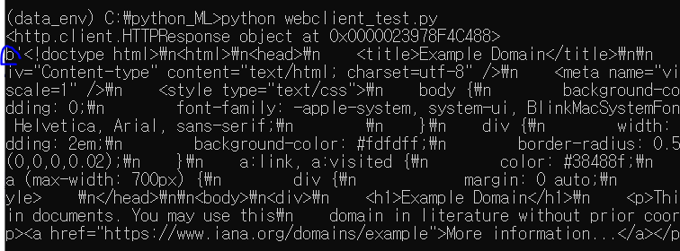


4-1. 가져온 객체를 보기 편하게 해보자! 

```python
print(url_obj.read().decode('utf-8'))
#decode()함수를 이용!
```

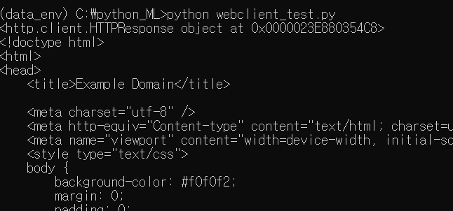


### Request / Response

```bash
GET /book/romance HTTP://~~ 

Host : www.example.com

빈줄

body
```

위와 같이 왔을 때 GET 위치에 요청방식 4가지 존재

> HTTP Request message 양식

- GET : 서버에게 resource를 보내달라고 요청한다. 갖고오는것. 서버의 리소스는 전달만 될 뿐 변경되지 않습니다.

- POST : 요청을 보낼 때 새로운 데이터를 서버 쪽에 생성할 때 ex. 게시판에 글쓰기.

- PUT : 서버에게 리소스를 업데이트하거나 새로운 리소스를 생성하라고 요청. ex. 회원정보 수정

- Delete : 서버 쪽에 있는 데이터를 삭제할 때.


### GET/POST

두 가지 방식으로도 모든 CRUD작업이 가능하다.

- GET : 내가 전달한 데이터를 Query String 형식으로 URL뒤에 붙여서 보낸다. 

  ex. 우리가 실습으로 했었던 영화 open api 가져올때 url 뒤에 데이터를 요청을 보냈었다!

  장점 : 사용하기 쉽다.

  단점 : data가 url에 그대로 붙어서 감으로 보안성이 없다. 길이 제한이 있다.

- POST : request message body 부분에 데이터를 포함해서 전송한다.

  장점 : 보안성이 있고 보내려는 데이터의 길이 제한이 없다!


## WAS

Web server vs WAS(Web Application Server)

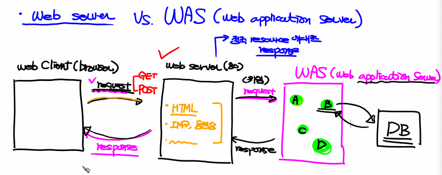


1. request를 보낼 때 GET방식인가 POST방식인가
2. web server는 정적 리소스에 대한 response만 전달해줄 수 있다. => html, 이미지, 동영상 등
3. 특정 프로그램을 호출해달라는 request를 주면!!! web server는 불가능하다. 

=> 그래서 web server는 request를 Web Application Server(프로그램)에 전달하게 된다. 프로그램을 실행할 수 있는 능력을 갖고있다. 프로그램 처리 작업!


`Django`를 이용해서 위의 복잡한 절차를 쉽게 처리하도록 하는 것!


> Static Web

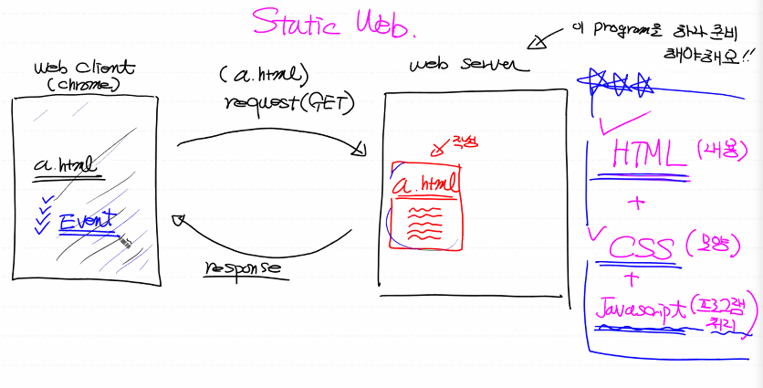

WAS를 거치지 않고 웹서버에서 클라이언트로 html를 보낸다. 클라이언트에서는 랜더링! 해서 html을 띄운다.

​	📌우리는 static Web부터 시작할 것! 

​	Javascript를 중심으로 (ajax설명을 위해서) 사용할거예용!

​	`WEB Storm`이라는 IDE를 사용할거예요~	


### WebStorm 설치

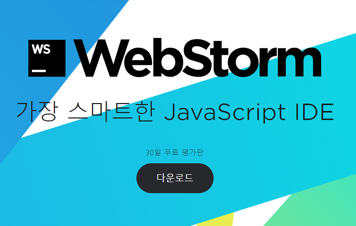

30일마다 지워서 받거나(재설치에 대한 비용추가는 X) 학교 이메일을 통해 student license를 이용해서 1년 무료사용도 가능.

=> 난 걍 30일 무료로 받았음! 인줄알았는데 동생아이디로 연결된듯

1.필수는 아니지만 체크 후 설치!

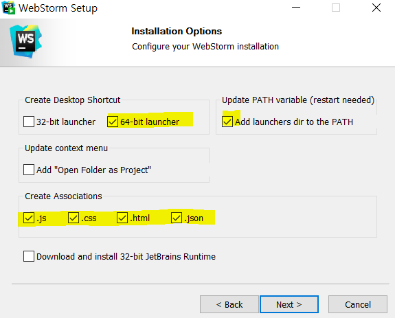

2. 설치 후에 실행하면 현재 처음 만듬으로 아래 체크 후에 생성!

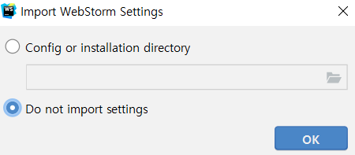

3. 설치 끝~


### WebStorm 시작

1. 프로젝트 생성

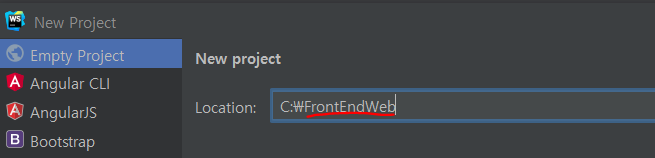

Empty Project로 선택FrontEndWeb 폴더를 만들어서 해당 폴더에서 생성!

2. a.html생성

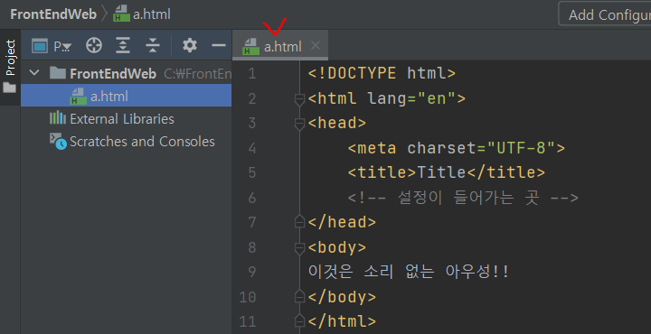

3. 동작을 하기 위해선 웹 서버 프로그램이 필요!!

   - WebStorm안에 내장 웹 서버가 존재한다!

   - 웹 서버가 우리 project를 인식해야 나중에 client가 요청했을 때 서비스를 제공할 수 있다. => 위와 같은 것을`configure` 라고 부른다.

   - 웹에서 사용할 수 있도록 전개를 한다.=>`deploy` : 사용할 수 있도록 활성화 시킨다. 
   - client(browser)에 실행 URL입력(request)
   - a.html을 랜더링한다!

4. Run을 누르면 실행이 된다!

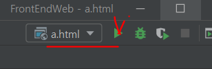

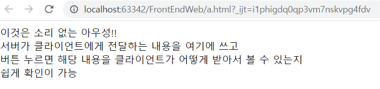


웹 스톰 서버가 우리 프로젝트의 내용을 다 들고 있는 것이 아님! 프로젝트를 인식하고 있을 뿐. 그걸 웹에서 사용 할 수 있도록 deploy를 시켜준 것. 