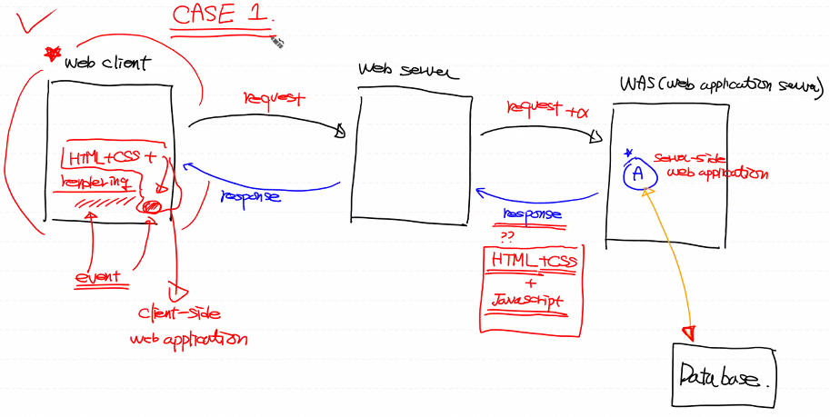
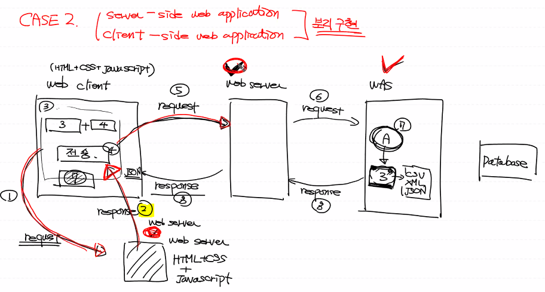
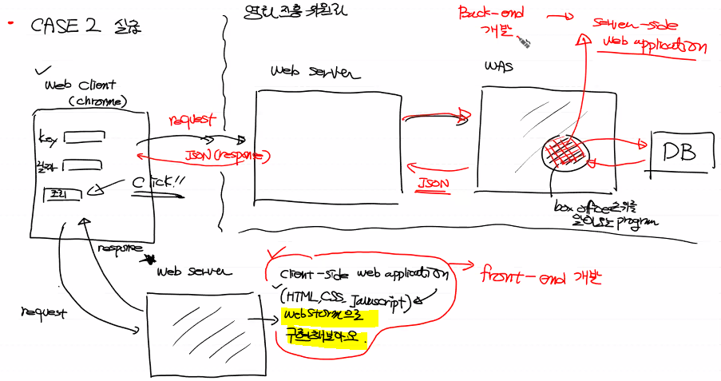

# 리뷰
## 네트워크


- 네트워크 : 컴퓨터간의 데이터 통신망

- 인터넷 : 네트워크로 구성된 네트워크. 전세계의 통신망. 네트워크를 네트워크로 만든 물리적인 Framework.

- 사람들은 인터넷 위에서 동작하는 서비스를 만들려고 노력함. ex. HTTP Web Service, SMTP(Email), FTP

  ❌인터넷이 안돼요~ => ⭕네트워크가 안돼요~


## WEB

하나의 프로그램에 WAS와 webserver가 같이 구동되도록 하는 프로그램들이 많다. 하지만 우리는 개념파악을 위해 따로 공부!

- Web client(web client program) 

  → browser(chrome)

  → 따로 구현할 수 있다.

- Web server(web server program) 

  → Apache,IIS,oracle web server

  → 따로 구현하지 않는다. 

  → 정적인 클라이언트를 서비스한다.(web server가 처리)

  → 동적인 컨텐츠를 만들어서 서비스하지 않는다.(서버에서 별도의 `Web program=Server Side Web Application`을 실행시켜서 나온 결과)

  ☞ 자신이 할 수 없으니 `WAS(Web Application Server)` 에게 위임

- WAS

  별도의 결과를 서버로 돌려줘서 클라이언트에게 보여줄 수 있다!


## library vs Framework vs platform

library : 특정기능을 수행하는 코드묶음. 로직을 포함하지는 않는다. ex. 파이썬에서의 module

Framework : 라이브러리의 개념을 확장시킨 것. 시스템이 어떻게 돌아가지는지 이미 만들어져있음. 구축되어있는 시스템. 우리는 만들어져있는 것에서 수정하면 된다! ex. Django 

platform : 다른 프로그램을 실행시켜주는 프로그램! ex. OS계열들(windows, Linux 등)


# 프로그램 구성법

> case1. Round Trip 방식



A : 웹상에서 돌아가는 프로그램 을 우리는 Django로 만들예정!!

WAS→Web server로 이동하는 response는 여러가지 형태로 보내질 수 있다. (ex. HTML,동영상, 이미지, JSON 등)

HTML 형태로 보내지는게 가장 BEST!!

서버사이드 웹 어플리케이션에서 html+css+javascript로 만들어지고 클라이언트에 렌더링된다. => event발생

서버에서 클라이언트 단을 만들게 된다.


> case2. 

클라이언트와 서버를 분리해서 구현하자!

case1과 구성은 같다.



1. 다른 웹 서버에게 클라이언트가 request를 보낸다.
2. HTML+CSS+javascript 로 구성된 request를 받는다.
3. 웹 화면이 렌더링 되게 된다.
4. 클라이언트에서 전송버튼을 누른다.
5. (5~6)웹 서버에 request를 보낸다.
6. (7) A프로그램을 만든다.
7. (8~9)웹 클라이언트로 JSON을 보낸다.


장점: WAS가 혼자서 다 수행했던것을 갖고가지 않아도 된다. 처리된 결과만 보내면 된다. 서버 쪽에 대한 부하를 줄일 수 있다. 

Q. 예전엔 왜 이 방식 안썼나요  기술적 이유가 있나요

A. 과거에는 서버 쪽에서 한꺼번에 처리하면 되는데 굳이?<<라는 인식이 강했기 때문. 이전의 인터넷은 무료였다. 데이터는 기다리면 돼. 하지만 현재는 네트워크 데이터 사용량이 곧 돈이기 때문에 서버와 클라이언트가 주고 받는 데이터 양을 줄여줘야한다.


로드 밸런싱때문에 다른 서버로부터 response를 받아오게 되는 것 (2번 부분) => 효율성, 부하를 줄이기 위해! 캐싱 덕에 오고가는 데이터양이 줄어든다.


## 실습(case2 : front-end)

> case2를 Web Storm으로 구현해보자!



1. 프로젝트명 boxoffice_webclient 프로젝트 생성

2. 파일명 boxoffice.html (html5)로 파일 생성
3. web client program을 만들어보자!

해당 프로젝트에서 3개의 html과 3개의 js를 생성했음!

boxoffice_webclient.html / javascript_exec.html/ jQuery_exec.html

my_scirpt.js /javascript_exec.js /jQuery_exec.js


### jQuery

jQuery : javascript 라이브러리.

- 쉽다! 

- 유지보수성이 떨어진다. 요즘은 디자인 패턴을 따르는 추세.

  ex. Angular(google), React(facebook), Vue.js 와 같은 프론트엔드 프레임워크가 나오게 되었다.


> jQuery 가져오기

라이브러리를 받아서 jQuery를 이용하자!

**CDN**방식으로 import 하면 jQuery를 가져올 수 있다!

`CDN` (contents delivery network) : 네트워크가 가능하다는 가정 하에 사용가능! 지리,물리적으로 떨어져 있는 사용자에게 컨텐츠를 더 빠르게 제공할 수 있는 기술.


https://code.jquery.com/

jQuery 2.x 버전 에서 minified를 사용할 거당!!

```javascript
<script src="https://code.jquery.com/jquery-2.2.4.min.js" integrity="sha256-BbhdlvQf/xTY9gja0Dq3HiwQF8LaCRTXxZKRutelT44=" crossorigin="anonymous"></script>
```


> javascript 내에서 jQuery사용하기

jQuery는 `$` 로 표현한다.

```javascript
function hello(){
    alert('버튼이 클릭되었어요!!')

    user_key = $('#userKey').val()
    //e44bc4e4ab8b74158359604fc98cc83b
    user_date = $('#userDate').val()
    open_api='http://www.kobis.or.kr/kobisopenapi/webservice/rest/boxoffice/searchDailyBoxOfficeList.json'
    my_url=open_api+'?key='+user_key+'&targetDt='+user_date
    location.href=my_url
    //현재 위치하는 곳이 location. 해당 링크로 이동
}
```


id는 고유한 값(unique), class는 unique하지 않다. 

사용방법

id : $('#id이름') / class : $('.class이름') 


> 사용법

selector부터 알아보자!
selector는 HTML엘리먼트를 지칭하는 특수한 표기법을 의미
jQuery는 $로 시작한다.
형식 : $(selector).method()
모든 jQuery구문은 여기서 크게 벗어나지 않는다.


```javascript
1. 전체 선택자 : *
$('*') => jQuery안에 있는 모든 요소 다 찾아라

2.태그 선택자 : 태그명을 가지고 선택
$('span').remove()

3.아이디 선택자 : ID속성을 이용해ㅓㅅ 선택
$('#inchon').text('소리없는 아우성!!)

4.클래스 선택자 : class 속성을 이용해서 선택
$('.region').css('color','blue')

5.구조 선택자 : 부모, 자식,형제 관계를 이용해서 선택
$('ol>li').css('color','cyan')
```


### JavaScript

화면처리와 밀접한 연관을 갖고있음

1. 변수선언

```javascript
//1. 변수선언(파이썬이랑 거의 비슷)
//var, let 변수타입 사용가능
my_variable=100;
let tmp1='sample';   //string
let tmp2=3.14;      //number
let tmp3=true;      //boolean
let tmp4=[1,2,3,4]  //array
```


2. 출력

브라우저 상에서 실행되게 된다. 출력하기가 애매함.

대체로 alert() 함수를 사용해서 값을 확인하긴한다.

=>올바른사용법은 아님. blocking method : 코드의 수행이 멈추게 하기도 한다. 

또는 console.log()를 사용한다.

```javascript
alert(tmp1) 
//blocking method:여기에서 코드의 수행이 일시 중지
console.log('변수의 값 : '+tmp1)
//브라우저 내에서 F12를 누르고 console창을 확인한다.
```


3. javascript 객체

python의 dict와 같은 구조=> 데이터 표현방식으로는 JSON

```javascript
let obj ={ name : '홍길동',
            age : 25 }
console.log(obj.name) //홍길동
```


4. 함수

function키워드 사용.

```javascript
function add(x,y){
    return x+y
}
alert(add(10,20))
```


### Ajax

single server page

비동기적인 웹 애플리케이션의 제작을 위해 아래와 같은 조합을 이용하는 웹 개발 기법


### HTML

몇가지 태그를 알아보자

```html
<h1></h1> : block level, 헤드라인
<ul>
    <li></li>
</ul>
:순서없는 리스트

<ol>
    <li></li>
</ol>
:순서있는 리스트

<div>:block level
    <span></span>:line level
</div>

 : 이미지 태그, 끝나는 태그가 없다!

<input type="button" value="클릭" onclick="함수명()">
```

element :  HTML 구성 요소

tag : <>로 구성되는 HTML요소

이러한 태그들을 사용하기 위해 jQuery를 써보자!


