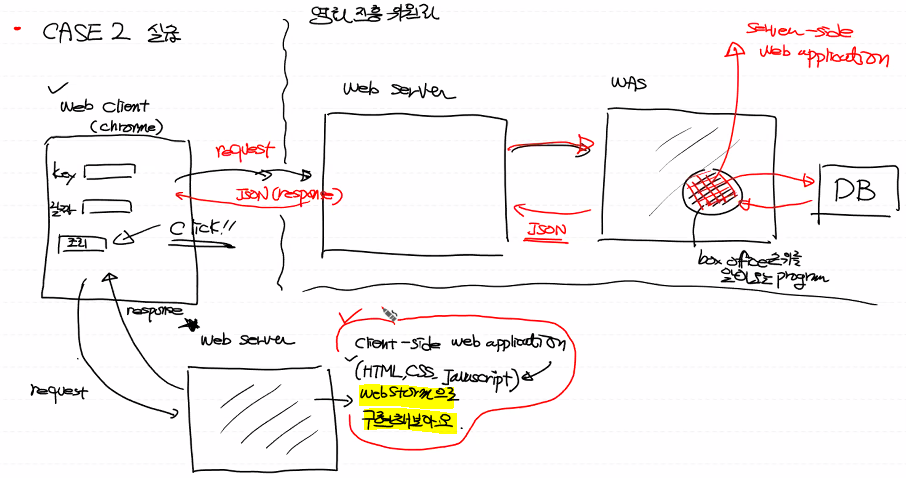

# 리뷰
## 네트워크


- 네트워크 : 컴퓨터간의 데이터 통신망

- 인터넷 : 네트워크로 구성된 네트워크. 전세계의 통신망. 네트워크를 네트워크로 만든 물리적인 Framework.

- 사람들은 인터넷 위에서 동작하는 서비스를 만들려고 노력함. ex. HTTP Web Service, SMTP(Email), FTP

  ❌인터넷이 안돼요~ => ⭕네트워크가 안돼요~


## WEB

하나의 프로그램에 WAS와 webserver가 같이 구동되도록 하는 프로그램들이 많다. 하지만 우리는 개념파악을 위해 따로 공부!

- Web client(web client program) 

  → browser(chrome)

  → 따로 구현할 수 있다.

- Web server(web server program) 

  → Apache,IIS,oracle web server

  → 따로 구현하지 않는다. 

  → 정적인 클라이언트를 서비스한다.(web server가 처리)

  → 동적인 컨텐츠를 만들어서 서비스하지 않는다.(서버에서 별도의 `Web program=Server Side Web Application`을 실행시켜서 나온 결과)

  ☞ 자신이 할 수 없으니 `WAS(Web Application Server)` 에게 위임

- WAS

  별도의 결과를 서버로 돌려줘서 클라이언트에게 보여줄 수 있다!


## library vs Framework vs platform

library : 특정기능을 수행하는 코드묶음. 로직을 포함하지는 않는다. ex. 파이썬에서의 module

Framework : 라이브러리의 개념을 확장시킨 것. 시스템이 어떻게 돌아가지는지 이미 만들어져있음. 구축되어있는 시스템. 우리는 만들어져있는 것에서 수정하면 된다! ex. Django 

platform : 다른 프로그램을 실행시켜주는 프로그램! ex. OS계열들(windows, Linux 등)


# 프로그램 구성법

> case1. Round Trip 방식


A : 웹상에서 돌아가는 프로그램 을 우리는 Django로 만들예정!!

WAS→Web server로 이동하는 response는 여러가지 형태로 보내질 수 있다. (ex. HTML,동영상, 이미지, JSON 등)

HTML 형태로 보내지는게 가장 BEST!!

서버사이드 웹 어플리케이션에서 html+css+javascript로 만들어지고 클라이언트에 렌더링된다. => event발생

서버에서 클라이언트 단을 만들게 된다.


> case2. 

클라이언트와 서버를 분리해서 구현하자!

case1과 구성은 같다.


1. 다른 웹 서버에게 클라이언트가 request를 보낸다.
2. HTML+CSS+javascript 로 구성된 request를 받는다.
3. 웹 화면이 렌더링 되게 된다.
4. 클라이언트에서 전송버튼을 누른다.
5. (5~6)웹 서버에 request를 보낸다.
6. (7) A프로그램을 만든다.
7. (8~9)웹 클라이언트로 JSON을 보낸다.


장점: WAS가 혼자서 다 수행했던것을 갖고가지 않아도 된다. 처리된 결과만 보내면 된다. 서버 쪽에 대한 부하를 줄일 수 있다. 

Q. 예전엔 왜 이 방식 안썼나요  기술적 이유가 있나요

A. 과거에는 서버 쪽에서 한꺼번에 처리하면 되는데 굳이?<<라는 인식이 강했기 때문. 이전의 인터넷은 무료였다. 데이터는 기다리면 돼. 하지만 현재는 네트워크 데이터 사용량이 곧 돈이기 때문에 서버와 클라이언트가 주고 받는 데이터 양을 줄여줘야한다.


로드 밸런싱때문에 다른 서버로부터 response를 받아오게 되는 것 (2번 부분) => 효율성, 부하를 줄이기 위해! 캐싱 덕에 오고가는 데이터양이 줄어든다.


## 실습

> case2를 Web Storm으로 구현해보자!



1. 프로젝트명 boxoffice_webclient 프로젝트 생성

2. 파일명 boxoffice.html (html5)로 파일 생성
3. web client program을 만들어보자!


> jQuery 사용하기

라이브러리를 받아서 jQuery를 이용하자!

CDN방식으로 import 하면 jQuery를 가져올 수 있다!

`CDN`(contents delivery network) : 네트워크가 가능하다는 가정 하에 사용가능! 지리,물리적으로 떨어져 있는 사용자에게 컨텐츠를 더 빠르게 제공할 수 있는 기술.

jQuery : javascript 라이브러리.

https://code.jquery.com/

jQuery 2.x 버전 에서 minified를 사용할 거당!!

```javascript
<script src="https://code.jquery.com/jquery-2.2.4.min.js" integrity="sha256-BbhdlvQf/xTY9gja0Dq3HiwQF8LaCRTXxZKRutelT44=" crossorigin="anonymous"></script>
```


> javascript 내에서 jQuery사용하기

jQuery는 `$` 로 표현한다.

```javascript
function hello(){
    alert('버튼이 클릭되었어요!!')

    user_key = $('#userKey').val()
    //e44bc4e4ab8b74158359604fc98cc83b
    user_date = $('#userDate').val()
    open_api='http://www.kobis.or.kr/kobisopenapi/webservice/rest/boxoffice/searchDailyBoxOfficeList.json'
    my_url=open_api+'?key='+user_key+'&targetDt='+user_date
    location.href=my_url
    //현재 위치하는 곳이 location. 해당 링크로 이동
}
```

