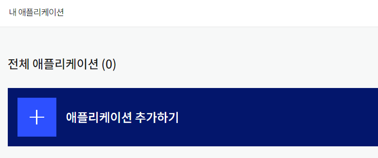
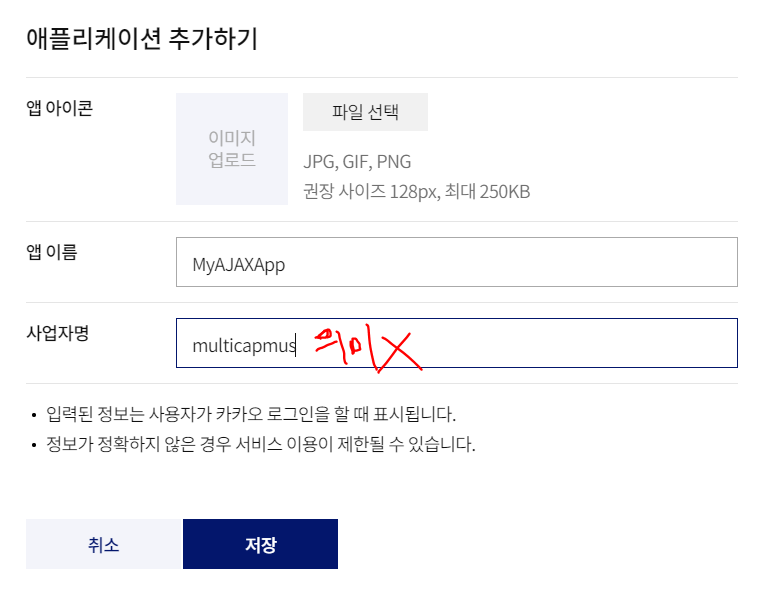
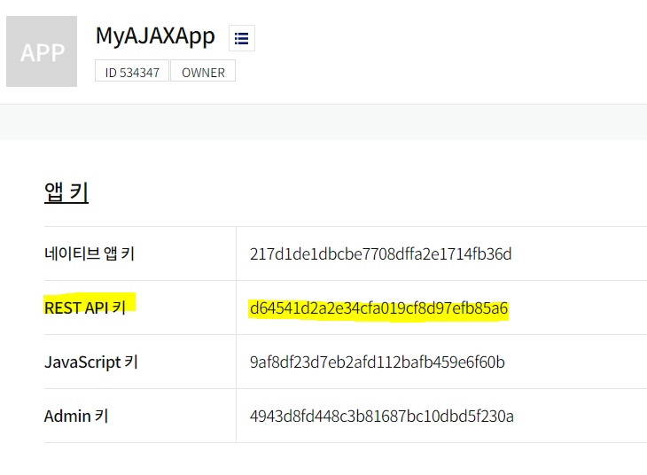
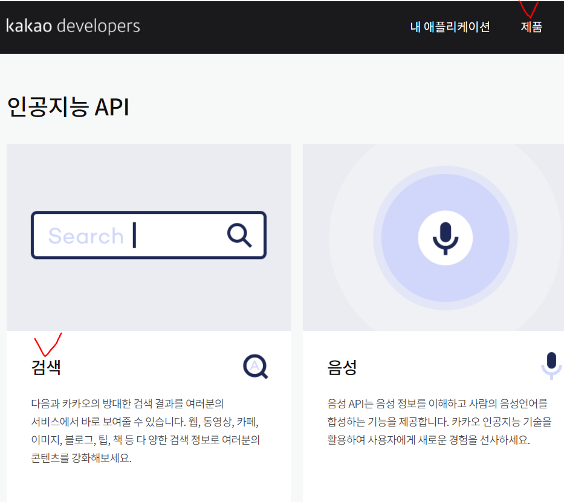
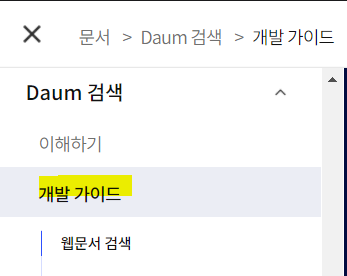
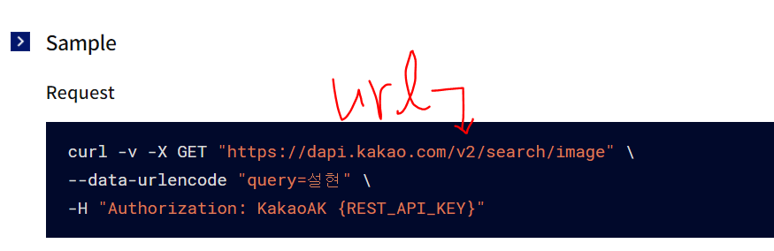
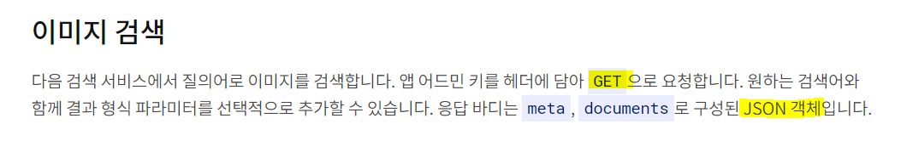
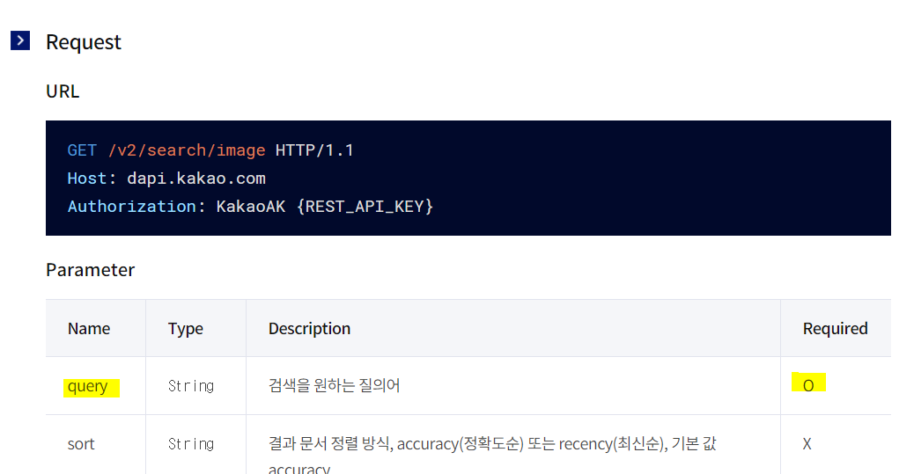
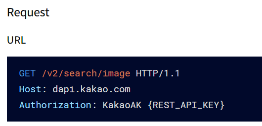

# jQuery

## event

`on()` : 특정 요소에 어떤 이벤트가 일어날때~ 포함된 함수처리

jQuery_sample03.html / jQuery_sample03.js

```javascript
function add_event(){
    //H1을 찾아서 해당 element에 event처리 능력을 부여..(jQuery를 이용)
    $('h1').on('click',function (event){
        alert('h1클릭')
    })//h1에 대해서 ~할때
}
```


javascript 내에서 아래와 같이 코드만 쓰면 실행이 되지않는다!

```javascript
$('h1').on('click',function (event){
    alert('클릭')
})
```


> 올바른 코드

$(document).on() 을 사용한다!

객체가 여러개 일때 어떤 객체에서 진행되는지 파악하기 위해 **this**를 이용해서 파악할 수 있다.

```javascript
$(document).on('ready',function (event){

    $('h1').on('click',function (event){
        //alert('h1클릭')
        //이벤트가 발생했을 때 어떤 element에서 event가 발생했는지 파악
        alert($(this).text())

    })//h1에 대해서 ~할때
})
```

- 위의 on('ready' function(event){}) 와 같은 의미

```javascript
$(document).ready(function (){
    //위의 on('ready' function(event){}) 와 같은 의미
})
```


## jQuery_sample04

> dailBoxOfficeSearch에서 포스터를 넣기 전 연습한 파일


### kakao API 받아오기

1. 내 어플리케이션 화면으로 들어간다



2. 애플리케이션 추가하기(key를 받기위해)



3. 생성한 애플리케이션으로 들어가면 키가 4개 있다! REST API키를 복사해둔다!



4. 현재 우리가 필요한 것은 다음 검색엔진!! 해당 엔진을 찾아보자!! 제품 탭 - 인공지능 API에서 검색 클릭



5. 해당 탭에서 rest api 에 관련된 지식을 얻을 수 있다.




6. url과 필요한 타입들을 확인한다.






6-1. 필요로 하는 data를 확인한다




```javascript
$.ajax({
        url : 'https://dapi.kakao.com/v2/search/image',
        type : 'GET',
        dataType : "json",
        data : {
            query:keyword
        }
    })
```


7. 그런데 맨 처음 받았던 key값은 어디다 쓰는거지???

**카카오의 인증키는 헤더라인에 들어가게 된다.** 지금까지와는 다르게 `headers` 라는 값을 사용해야한다. {REST_API_KEY}에 다가 개인 key값을 넣는다

>참고



```javascript
$.ajax({
        url : 'https://dapi.kakao.com/v2/search/image',
        type : 'GET',
        dataType : "json",
        data : {
            query:keyword
        },
        headers:{
            Authorization:'KakaoAK d64541d2a2e34cfa019cf8d97efb85a6'
        },
    	success:function (){

        },
        error:function (){

        }
    
    })
```

