# WEB server

인터넷을 통해서 client의 request가 전달되었을 때 이 요청을 처리하는 hardware & software => 정적 resource 서비스


## CGI

**Commen Gateway Interface**

webserver에서 application을 수행시키기 위한 규약, 규칙. 

정적인 web server에 동적인 program을 구현시키기 위한 기준을 부여. (C언어,parl로 구성)

클라이언트 request → 웹서버(Apache,Nginx:엔핀엑스)→프로그램 실행

단점 : 웹 서버가 너무 많은 일을 한다. 많은 양의 request를 수행하기 힘들다.

=> WAS등장!!


## WAS

Web Application Server

일반적으로 웹서버와 web application을 동작시킬 수 있는 containner를 분리

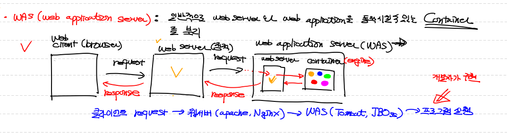

WAS안에 container안에는 우리가 작성한 프로그램이 들어있다(engine)

Web Server를 제외하고 바로 WAS로 두고해도 되는데, 그러면 WAS가 되게 바쁘겠지!!

클라이언트 request → 웹서버(Apache,Nginx:엔핀엑스) → WAS(Tomcat,JBoss) → 프로그램 실행(개발자가 구현)


## WSGI

**Web Server Gate Interface**

python에 종속된 개념(즉, 파이썬에만 있는 개념!)

python의 python script가 web server와 통신하기 위한 규약.

클라이언트 request → 웹서버(Apache,NginX) → WSGI Server(middleware) → WSGI 규약을 준수하는 web application을 실행


앞에 단(웹 서버단) 아파치를 쓰는데 현재 쓰지 않는다! 쓸려면 연동한것을 이어줘야함. 그 때 사용하는 파일. **외부 웹서버와 연동하기 위한 파일이 wsgi파일!**

우리는 쉽게 가기 위해 중간 아파치 서버단계를 넘기고 WAS안에 있는 미들웨어로 바로 갈것이다!


# Django

## 특징

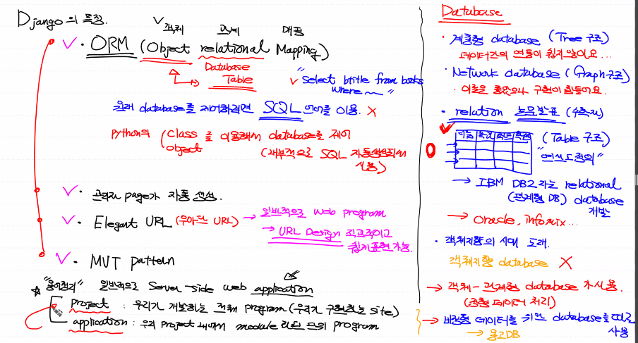

- 전체 프로그램을 프로젝트라고 표현!

- 모듈화된 단위 프로그램 = 하나의 기능을 갖고있는 모듈.

  ex. 회원관리, 회원등록, 회원적으로 관련된 것, 우리사이트 내에서 도서에 관련된 것, 

- 개개인의 어플리케이션들이 프로젝트를 만드는 것. (다른 곳에서는 어플리케이션을 하나의 모듈로 보기도하기 때문에 용어 혼동조심!!)

- 프로젝트는 어플리케이션들의 모음


## 설치

1. anaconda prompt에다가 설치한다

   base상태에서 설치하자!

```bash
conda install django	#설치
```

​	1-1. django설치확인

```bash
python -m django --version
# 2.2.5 로 나온다
```


2. python-Django폴더를 생성해서 장고와 관련된 파일은 이 폴더에 서 진행하자!

```bash
(base) C:\Users\32153256>cd ..

(base) C:\Users>cd ..

(base) C:\>mkdir python-Django

(base) C:\>cd python-Django

(base) C:\python-Django>  
```


3. django-admin이라는 코드를 사용할 수 있다. 프로젝트 뼈대를 만들기 위한 것! 샘플 프로젝트를 만들겠다는 것!

   startproject 뒤에는 프로젝트의 이름을 지정해서 넣어준다

```bash
(base) C:\python-Django>django-admin startproject mysite
```

​	3-1. 탐색기를 열어서 현재 상태를 파악해보자!

​	현재 진행하려는 프로젝트의 최상위 폴더가 생성되었다!

​	내 프로젝트를 관리하는 목적의 관리 프로젝트이기 때문에 이름을 꼭 mysite로 진행하지 않아도 된다! **MyFirstWeb**으로 바꿔서 진행하자!=>안에 mysite폴더가 또 있기 때문에 헷갈림을 방지하고자!  

​	내부의 mysite폴더 : 내 프로젝트에서 사용하는 설정들의 모음.(이름변경X)

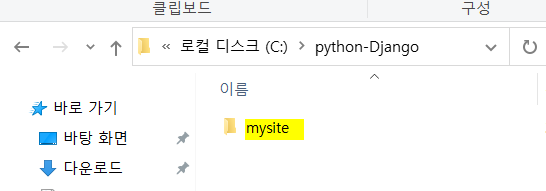

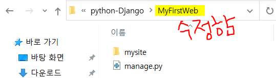


4. **anaconda prompt에서 위에서 만든 폴더로 이동한 다음에 startapp으로 polls라는 이름의 어플리케이션을 프로젝트내에 manage.py를 이용해서 만든다라는 의미**

```bash
(base) C:\python-Django\MyFirstWeb>python manage.py startapp polls
```

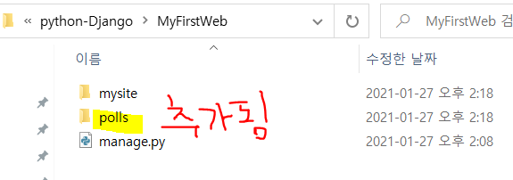


### ☝파일구조 확인

현재까지 진행한 project의 폴더 구조

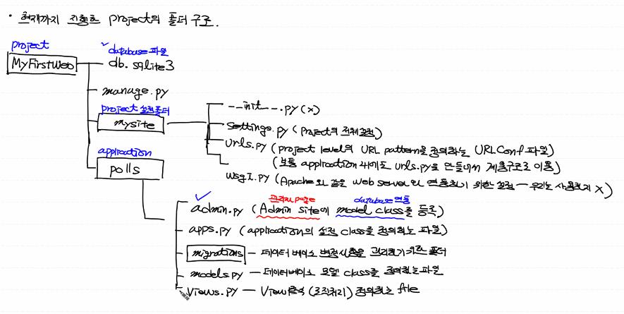

>설명

- MyFirstWeb(project)

  ​	db.sqlite3(database 파일) - **아직 생성안함!**

  ​	manage.py

  ​	mysite폴더(프로젝트에 대한 설정을 갖고있는 폴더) 

  ​	polls폴더(application) - 내가 생성한 어플리케이션

  

- mysite폴더

  `__init__.py` : 3버전와선 거의 사용X, 의미 X

  `settings.py` : **프로젝트의 전체설정**

  `urls.py` : project level의 url pattern을 정의하는 **URL conf파일.** (MVT패턴에서 사용되는 URLconfig와 관련)

  보통 application 내에도 urls.py를 만들어서 계층 구조로 이용

  `wsgi.py` : 웹 서버 게이트웨이 인터페이스. Apache와 같은 웹서버와 연동하기 위한 설정. (현재, 우리는 사용하지 않는다! 이유는 위 WSGI파트에서 서술)

  

- polls폴더

  `admin.py` : Admin site(관리자 페이지)에 model class를 등록. 우리는 OMR을 쓰니까 모델이 데이터베이스랑 연동된다. sql code가 아니라 데이터베이스를 제어하는 내용을 관리자 페이지에 설정 및 처리를 한다.

  장고는 자동적으로 관리자 페이지가 만들어지게 된다.

  ex) 내가 파이썬에서 모델 클래스를 하나 만들면 database에 테이블이 만들어진다. 어떤 데이터베이스가 사용이 되는지 관리자페이지에서 확인을 해야한다. 

  `apps.py` : application 설정클래스를 정의하는 파일

  `migrations 폴더` : database변경사항을 관리하는 폴더. DB에 대한 CRUD가 발생하면 관련된 파일들이 들어가게 된다. 

  `models.py` : 데이터베이스 테이블과 연관된 모든 클래스를정리하는 파일. => 클래스를 만들게 되면 데이터베이스에 테이블이 만들어지게 되는 것.

   `views.py` : View함수를 정의하는 파일. **로직처리**하는 함수가 View.


### 파이참 설치

1. professional 버전으로 설치!

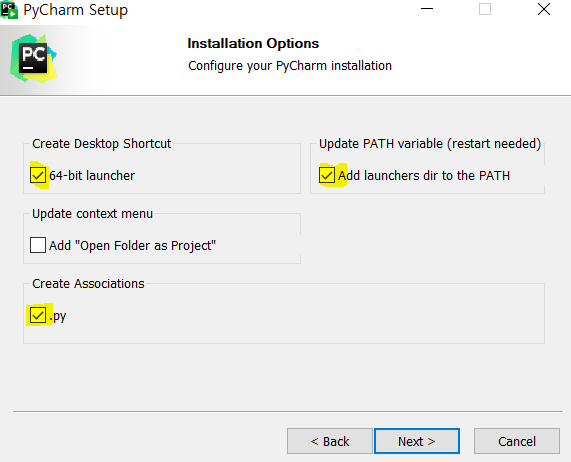

이대로 install~ 바탕화면에 설치 된 것을 사용!

난 현재 학생용으로 구비해뒀기때문에 문제 없음!


2. open 해서 우리가 만든 python-Django 에서 위에서 만든 최상위 폴더인 MyFirstWeb폴더로 들어간다

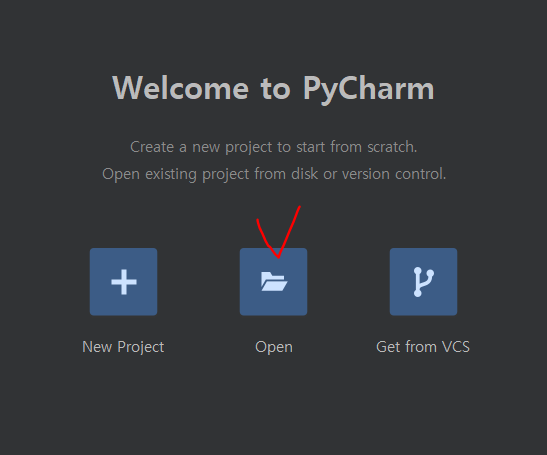

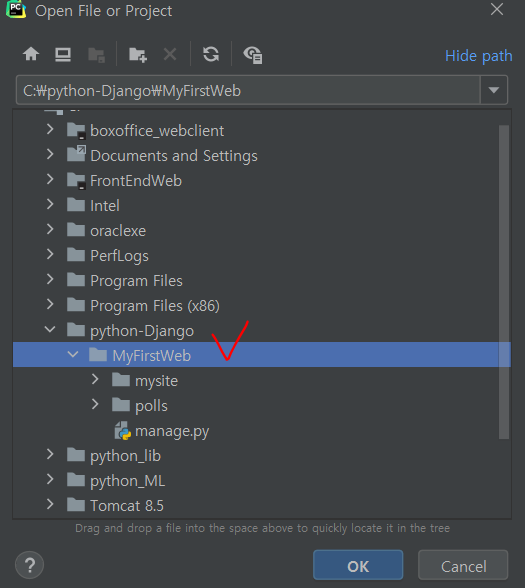


3. File- settings - Project:MyFirstWeb에서 Pythonn Interpreter로 들어가면 아나콘다로 설정이 되어있는 것을 확인할 수 있다. django를 찾으면 버전도 확인가능

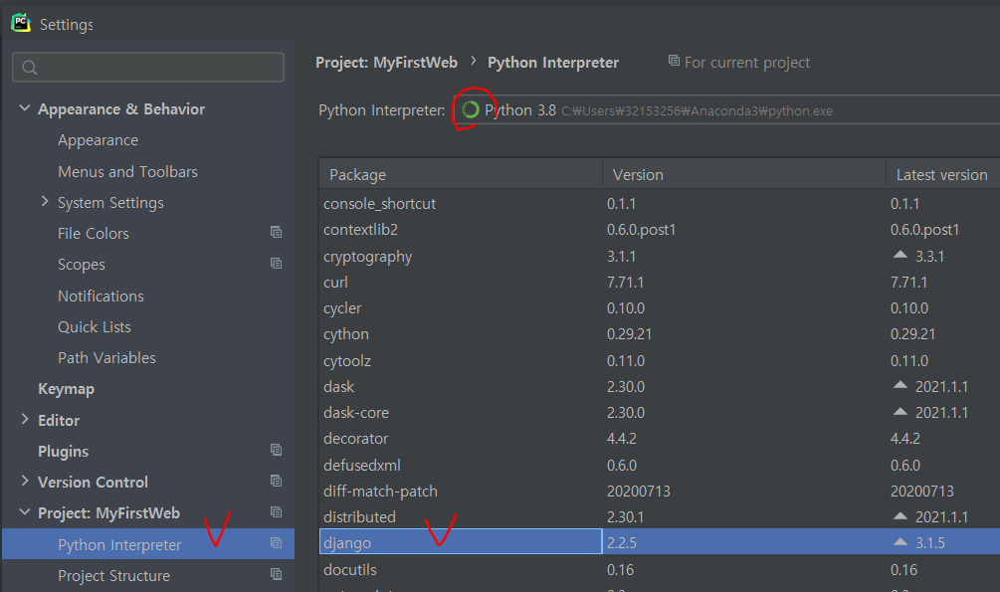


  ### settings.py에 대해서

해당 파일을 찾아가봅쉬다~~

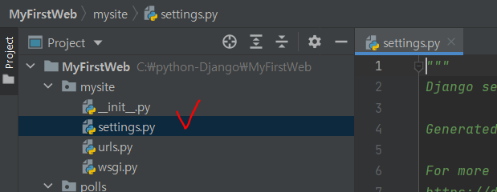


> 코드 변수를 하나씩 알아가보자

**BASE_DIR** 라는 변수는 현재 MyFirstWeb폴더, 프로젝트 root디렉토리를 가르키게 된다!

```python
BASE_DIR = os.path.dirname(os.path.dirname(os.path.abspath(__file__)))
```


**DEBUG** = True => 개발모드/ False => 운영모드

log찍히는게 달라지고 내부, 설정 같은 것들이 달라지게 된다.


**ALLOWED_HOSTS**

개발모드일때는 IPAddress, 운영모드일때는 real IP를 적어준다.

현재 우리는 개발모드, 로컬호스트를 넣어준다.

```python
DEBUG = True
ALLOWED_HOSTS = ['localhost', '127.0.0.1']
#,다음에 빈칸이 없으면 밑줄이 뜬다!
```

> Tip. ,(컴마)다음에 빈칸이 없으면 밑줄이 뜬다! 권장하는 코딩스타일을 따르라!


**INSTALLED_APPS**

polls라는 어플리케이션에 대한 설정은 **apps.py**에다가한다

**해당 파일에 들어가면 상속을 받은 PollsConfig함수가 존재한다!! 이 이야기를 settings.py파일 INSTALLED_APPS안에 넣어줘야 애플리케이션이 인식을 한다!!**

```python
INSTALLED_APPS = [
    'django.contrib.admin',
    'django.contrib.auth',
    'django.contrib.contenttypes',
    'django.contrib.sessions',
    'django.contrib.messages',
    'django.contrib.staticfiles',
    'polls.apps.PollsConfig'#<<<<추가해줌
]
```


MIDDLEWARE가 어떤것인가에 대한 소스. 있는거 그대로 사용하므로 건드릴 필요 없음! 별도의 또다른 미들웨어를 사용한다면 추가를 한다!

```python
#건들필요없음!
MIDDLEWARE = [
    'django.middleware.security.SecurityMiddleware',
    'django.contrib.sessions.middleware.SessionMiddleware',
    'django.middleware.common.CommonMiddleware',
    'django.middleware.csrf.CsrfViewMiddleware',
    'django.contrib.auth.middleware.AuthenticationMiddleware',
    'django.contrib.messages.middleware.MessageMiddleware',
    'django.middleware.clickjacking.XFrameOptionsMiddleware',
]
```


**ROOT_URLCONF**

최상위의 URL 매핑기 Configration

=> baseDIR은 MyFirstWeb인데 그것을 기준으로 mysite.usl.py에 대한 내용을 가지고 클라이언트의 request를 처리한다

```python
ROOT_URLCONF = 'mysite.urls'
```


**TEMPLATE** 파일들이 어디있는가에 대한 이야기. 아직 템플릿을 건들지 않았으므로 현재는 이 코드를 건들지 않을 것!


**WSGI_APPLICATION** 현재는 설정 건들이지않고 그대로 쓸 것.


**DATABASES**

마리아DB나 mysql 등 바꾸게 된다면 ENGNIE의 내용을 바꿔준다.

NAME부분에 써진 이름대로 데이터베이스 파일이 만들어지게된다. 현재 db.sqlite3이라고 써있다. 이 파일은 지금 없어서 직접만들어줘야한다!사용자 테이블을 기본적으로 갖춰두고 진행해야한다.


**TIME_ZONE**

UTC = 표준시간, 아시아 서울로 맞춰둔다

```python
TIME_ZONE = 'Asia/Seoul'
```


### 데이터베이스만들기

파이참에서 터미널을 눌러서 데이터베이스를 만들어보자!

migrate : database파일을 변경시키라는 의미

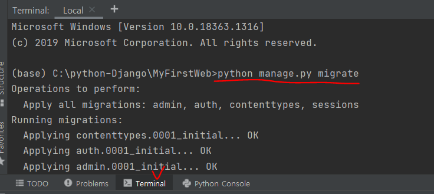

```bash
(base) C:\python-Django\MyFirstWeb>python manage.py migrate
```

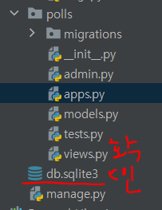


### 웹 서버를 시행시켜보자!

```bash
(base) C:\python-Django\MyFirstWeb>python manage.py runserver
```

시작하면 서버가 돌아가게 된다!!

http://127.0.0.1:8000/ 또는 http://localhost:8000/ 를 검색하면 서버가 돌아간다!


# MVT pattern(Model기능 View함수 Template )

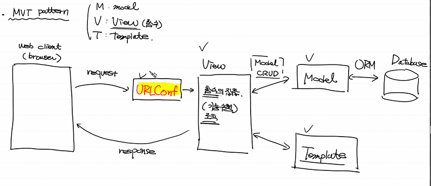

웹 클라이언트에서 request를 보내면 제일 먼저 서버에서 URLConf를 거쳐서 View로 들어간다. View는 함수의 집합으로 볼 수 도 있고 class의 메소드.

View에서는 기능을 수행하는 로직을 갖고 있고, Model한테 CRUD를 시킬 수 있다. ORM을 통해서 Database와 연결.

​	ORM : python class를 이용해서 Database를 사용하는 것

나온 결과로 Template을 통해 View를 거쳐 response를 클라이언트에게 전달해준다.


# 🚩프로젝트!!

책에 있는 내용을 차용해서 쓸 예정(폴 프로젝트?) 

실수나 오류를 방지하기 위해서.... 우리가 받은 책에 있을 거당!!

## 설계

> Poll project(설문조사 웹 프로그램)

ex)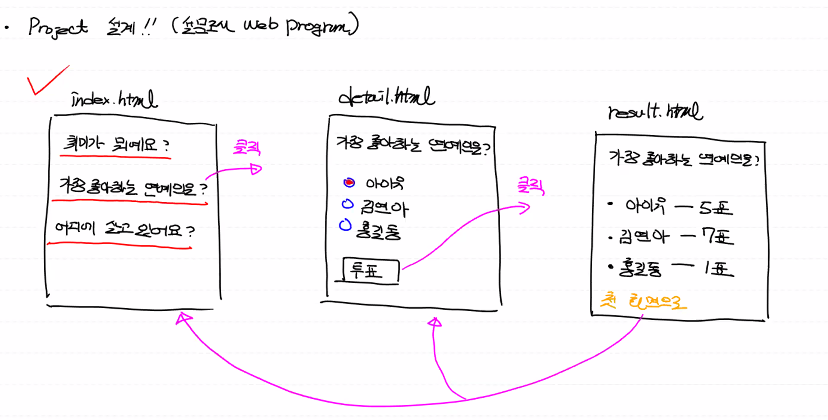


> Database Table 설계


테이블은 몇개 필요할까? 

DataFrame처럼 2차원 배열을 생각해봅시다!

1. Question table

   column 3개(id, question-text,pub-date)

- id : 숫자, 자동생성(시퀀스), primary key, not null

- question-text: 문자열, not null

- pub-date: 날짜, 언제 설문을 만들었는가


2. choice table

각 질문당 보기가 있어야한다! detail.html

column 4개(id, choice-text, votes, question_id)

- id : index로 생각
- choice-text : 문자열, 항목들이 저장됨
- votes: 숫자, 각 항목들이 몇번 선택됐는지. 투표횟수.
- question_id : 각 항목은 어떤 질문에 대한 항목인가. **Question table의 id와 같다** 외래키.(Foreign key)


## 실행


