# 🚩프로젝트!!

책에 있는 내용을 차용해서 쓸 예정(폴 프로젝트?) 

실수나 오류를 방지하기 위해서.... 자세한 내용은 우리가 받은 책에 있을거당!!

## 설계

**Poll project(설문조사 웹 프로그램)**

> 화면 설계

ex)


> Database Table 설계


테이블은 몇개 필요할까? 

DataFrame처럼 2차원 배열을 생각해봅시다!

1. Question table

   column 3개(id, question-text,pub-date)

- id : 숫자, 자동생성(시퀀스), primary key(unique), not null

- question-text: 문자열, not null, 설문내용

- pub-date: 날짜, 언제 설문을 만들었는가


2. Choice table

각 질문당 보기가 있어야한다! 위 그림에서 detail.html에 해당

column 4개(id, choice-text, votes, question_id)

- id : index로 생각
- choice-text : 문자열, 항목들이 저장됨
- votes: 숫자, 각 항목들이 몇번 선택됐는지. 투표횟수.
- question_id : 각 항목은 어떤 질문에 대한 항목인가. **Question table의 id와 같다** 외래키.(Foreign key)


## 실행

1. 위에서 만들었던 MyFirstWeb프로젝트를 Close project하고 지운다!

   python-Django폴더에서도 지운다!

2. anaconda prompt를 띄우고 python-Django로 위치를 옮긴다.

3. 장고 어드민을 이용해서 프로젝트를 만든다. (프로젝트 명:mysite)

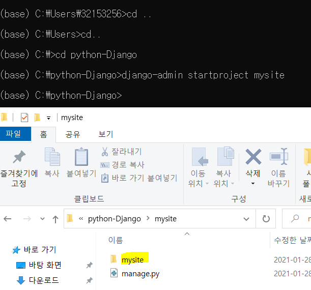(생성확인)

root폴더랑 mysite폴더의 이름이 겹치므로 최상위 폴더 이름을 MyFirstWeb으로 바꾼다.


4. WEB04 Django파트에서 프로젝트 만들었던 것처럼 똑같이 polls라는 어플리케이션을 만든다.

```bash
C:\python-Django\MyFirstWeb>python manage.py startapp polls
```

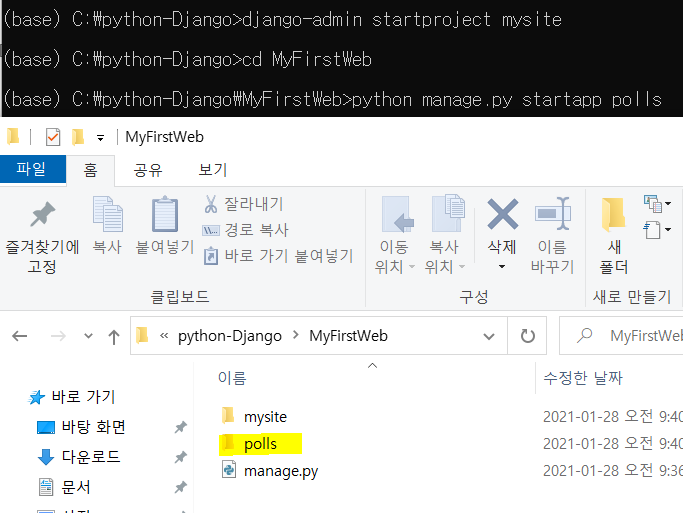


5. 파이참으로 돌아가서 생성된 MyFirstWeb으로 들어간다.

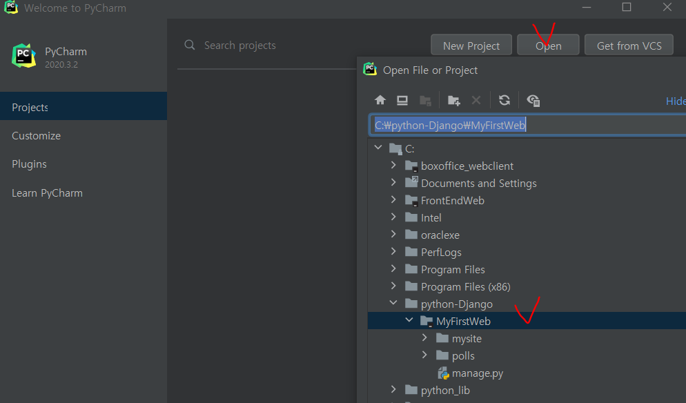


6. settings.py를 수정한다!

   WEB04에서 설명한대로 수정!!!!

   

7. 데이터베이스를 만들고 웹서버를 실행시킨다.

```bash
(base) C:\python-Django\MyFirstWeb>python manage.py migrate #database설정
(base) C:\python-Django\MyFirstWeb>python manage.py runserver #서버생성
```


## admin 실행

8. 자동으로 만들어진 admin페이지 들어가보자!(서버는 띄워둔 상태)

> 주소에 localhost:8000/admin 입력

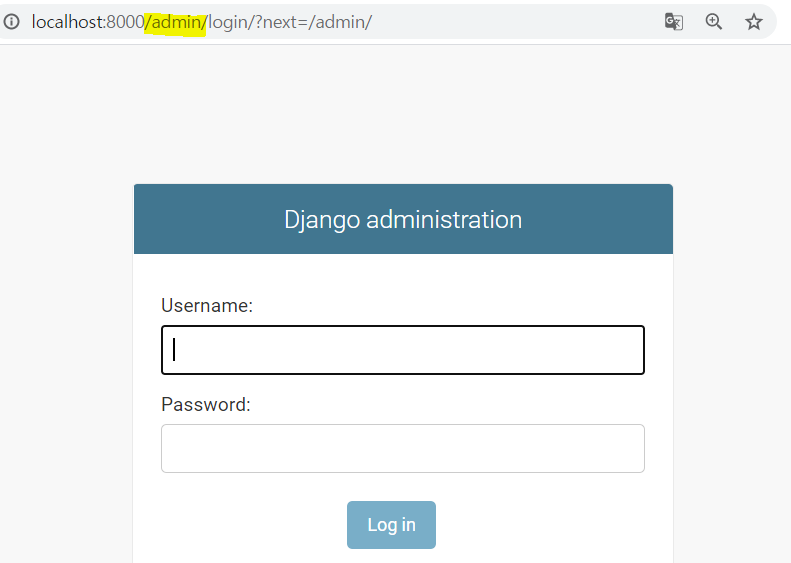

계정은 **anaconda prompt**에서 만든다.


9. 관리자계정만들기


```bash
(base) C:\python-Django\MyFirstWeb>python manage.py createsuperuser
Username (leave blank to use '32153256'): ssong #계정명 지정
Email address: sing2song@naver.com #이메일넣기
Password:#ssong
Password (again):#ssong
The password is too similar to the username.
This password is too short. It must contain at least 8 characters.
Bypass password validation and create user anyway? [y/N]: y
Superuser created successfully.
#너무 짧다고 안내한것ㅋㅋㅋㅋ걍 y하고 생성했다.
```


10. 어드민 페이지에서 방금 만든 아이디와 비밀번호로 들어간다! 

    비밀번호 까먹으면 알아낼 방법이 없으니 주의!!

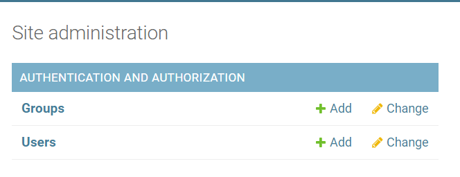


11. 우리는 두 개의 database table이 더 필요하다. => 모델을 만들자! 


# MVT 만들기

## 모델

모델을 만들자! 일반적인 순서는 없지만 모델부터 작업하는 것이 편리하다.

**모델을 만드는 것은 database에 table을 만드는 것과 같다.**

모델은 class로 구현된다.

우리는 polls라는 어플리케이션을 만들었으니까 해당 폴더 아래에 생성한다.

polls/models.py => model 정의하는 파일

이 안에서 우리는 Question / Choice 클래스를 만든다! (필요한 데이터테이블 이름)


> models.py

class를 상속받아서 model을 만들어줘야한다.

table의 column은 속성으로 표현한다.

속성과 쓰는 방법이 따로 정해져있다.

id는 클래스를 만들 때 자동으로 생성이 된다.

`def __str__(self)` : 객체의 주소가 아닌 텍스트 내용이 출력되도록 str 함수를 설정해준다.

```python
from django.db import models

# Create your models here.
class Question(models.Model):
    # 이렇게 정의되는 class가 database table과 매핑이 된다.
    # Table의 column은 어떻게 정의해야하는가. => 속성으로 표현
    question_text = models.CharField(max_length=200)
    # 200자 이상은 불가능
    pub_date=models.DateTimeField('date published')
    # ''=>해당컬럼이 어떤 컬럼인지를 나타내기 위한 속성. 없어도된다.
    
    def __str__(self):
        return self.question_text
  
```


**외래키 설정시에 _id라고 칭해지는 명은 후에 자동으로 설정되므로 question으로만 정의해준다!!!**

- Foreign key의 제약사항 (constraint)

  이 키와 연결되어있는 다른테이블의 내용도 함께 지워야하는 제약사항이 걸린다.

  `CASCADE` : 연관된 것이 지워지면 같이 지워라!

```python
class Choice(models.Model):
    choice_text = models.CharField(max_length=200)
    votes = models.IntegerField(default=0)
    question = models.ForeignKey(Question, on_delete=models.CASCADE)

    #객체의 주소가 아닌 텍스트 내용이 출력되도록 str 함수를 설정해준다.
    def __str__(self):
        return self.choice_text
```


> admin.py

1. 여기다 모델을 등록하면 어드민 사이트에 뜨게 된다!

```python
from django.contrib import admin
# 우리파일에서 사용할 수 있도록 클래스들을 import한다
from polls.models import Question,Choice

# Register your models here.
admin.site.register(Question)
admin.site.register(Choice)
```


2. 새로운 터미널창을 띄운다! (터미널 옆에 + 표시 누르기)

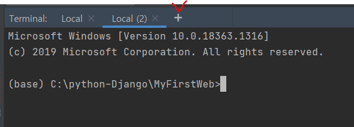


3. 위에서 정의된 모델을 실제 데이터베이스에 등록을 해야한다.

   데이터베이스 변경사항을 만들어라!! 라는 뜻

   `makemigrations` : 변경파일을 만들어라라는 뜻.

```bash
(base) C:\python-Django\MyFirstWeb>python manage.py makemigrations
```

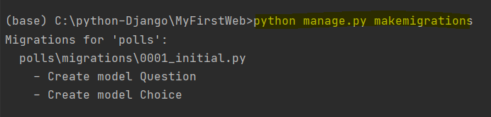

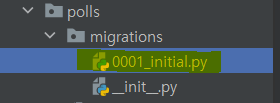

새로운 파일이 생성된 것을 알 수 있다.


4. `migrate` : 변경사항을 가지고 실제 데이터베이스를 만들어라.

```bash
(base) C:\python-Django\MyFirstWeb>python manage.py migrate
```

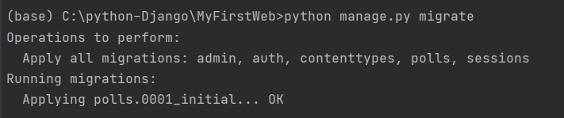


5. admin 사이트에 들어가면 생성된 테이블들을 확인할 수 있다!!

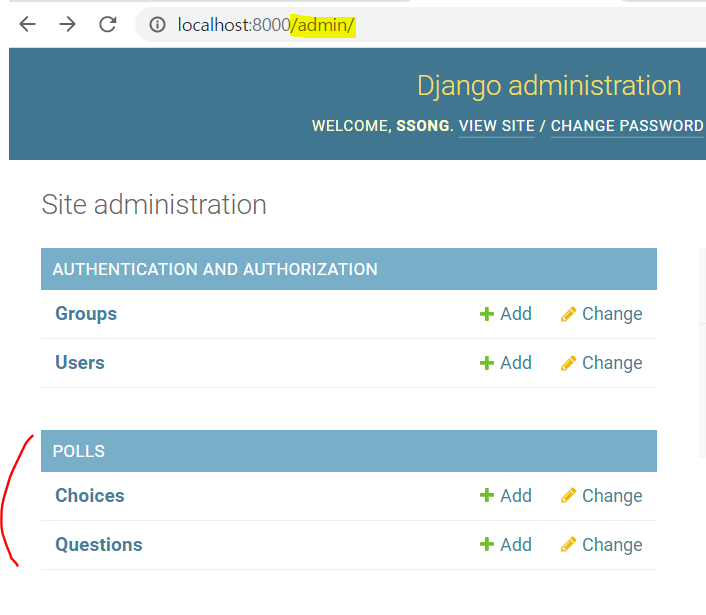

### 데이터베이스 확인

sqlite browser로 검색하면 나오는 사이트

https://sqlitebrowser.org/ 여기로 들어가서 TOOL을 다운받는다!


인스톨하지 않고 압축을 받아서 사용할거다.

아래의 링크 눌러서 다운받고 압축풀기

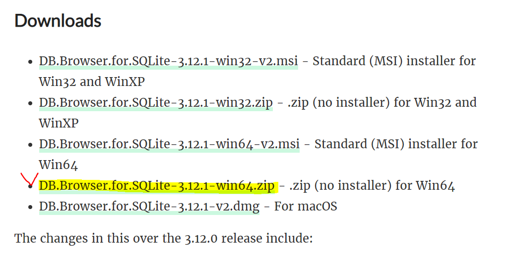


압축풀고 폴더에 들어가면 아래의 실행파일 실행

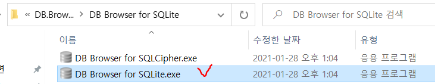


뜨는 인터페이스에서 데이터베이스를 연다

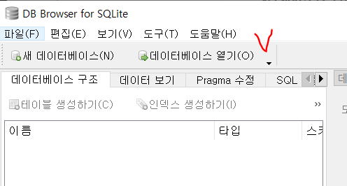

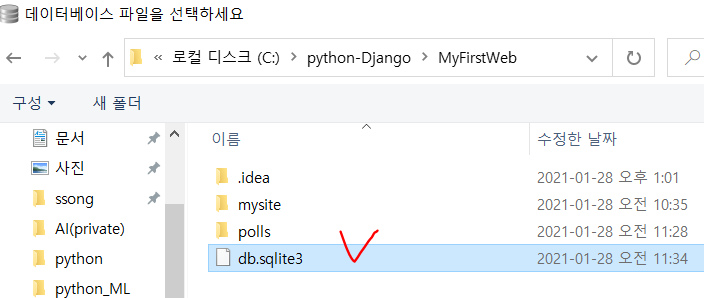


위에서 생성했던 테이블들을 확인할 수 있다.

polls클래스로부터 만든 question, choice라는 테이블이라는 뜻.

id와 question_id<<붙어서나오는 것을 확인할 수 있음!!!

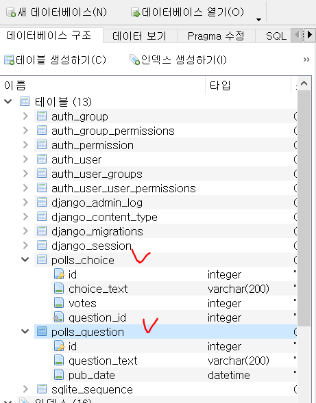