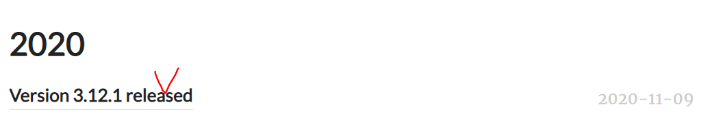
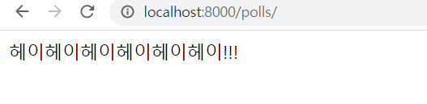

# 🚩프로젝트!!

책에 있는 내용을 차용해서 쓸 예정(폴 프로젝트?) 

실수나 오류를 방지하기 위해서.... 자세한 내용은 우리가 받은 책에 있을거당!!

## 설계

**Poll project(설문조사 웹 프로그램)**

> 화면 설계

ex)


> Database Table 설계


테이블은 몇개 필요할까? 

DataFrame처럼 2차원 배열을 생각해봅시다!

1. Question table

   column 3개(id, question-text,pub-date)

- id : 숫자, 자동생성(시퀀스), primary key(unique), not null

- question-text: 문자열, not null, 설문내용

- pub-date: 날짜, 언제 설문을 만들었는가


2. Choice table

각 질문당 보기가 있어야한다! 위 그림에서 detail.html에 해당

column 4개(id, choice-text, votes, question_id)

- id : index로 생각
- choice-text : 문자열, 항목들이 저장됨
- votes: 숫자, 각 항목들이 몇번 선택됐는지. 투표횟수.
- question_id : 각 항목은 어떤 질문에 대한 항목인가. **Question table의 id와 같다** 외래키.(Foreign key)


## 실행

1. 위에서 만들었던 MyFirstWeb프로젝트를 Close project하고 지운다!

   python-Django폴더에서도 지운다!

2. anaconda prompt를 띄우고 python-Django로 위치를 옮긴다.

3. 장고 어드민을 이용해서 프로젝트를 만든다. (프로젝트 명:mysite)

(생성확인)

root폴더랑 mysite폴더의 이름이 겹치므로 최상위 폴더 이름을 MyFirstWeb으로 바꾼다.


4. WEB04 Django파트에서 프로젝트 만들었던 것처럼 똑같이 polls라는 어플리케이션을 만든다.

```bash
C:\python-Django\MyFirstWeb>python manage.py startapp polls
```


5. 파이참으로 돌아가서 생성된 MyFirstWeb으로 들어간다.


6. settings.py를 수정한다!

   WEB04에서 설명한대로 수정!!!!

   

7. 데이터베이스를 만들고 웹서버를 실행시킨다.

```bash
(base) C:\python-Django\MyFirstWeb>python manage.py migrate #database설정
(base) C:\python-Django\MyFirstWeb>python manage.py runserver #서버생성
```


## admin 실행

8. 자동으로 만들어진 admin페이지 들어가보자!(서버는 띄워둔 상태)

> 주소에 localhost:8000/admin 입력


계정은 **anaconda prompt**에서 만든다.


9. 관리자계정만들기


```bash
(base) C:\python-Django\MyFirstWeb>python manage.py createsuperuser
Username (leave blank to use '32153256'): ssong #계정명 지정
Email address: sing2song@naver.com #이메일넣기
Password:#ssong
Password (again):#ssong
The password is too similar to the username.
This password is too short. It must contain at least 8 characters.
Bypass password validation and create user anyway? [y/N]: y
Superuser created successfully.
#너무 짧다고 안내한것ㅋㅋㅋㅋ걍 y하고 생성했다.
```


10. 어드민 페이지에서 방금 만든 아이디와 비밀번호로 들어간다! 

    비밀번호 까먹으면 알아낼 방법이 없으니 주의!!


11. 우리는 두 개의 database table이 더 필요하다. => 모델을 만들자! 


# MVT 만들기

## 모델

모델을 만들자! 일반적인 순서는 없지만 모델부터 작업하는 것이 편리하다.

**모델을 만드는 것은 database에 table을 만드는 것과 같다.**

모델은 class로 구현된다.

우리는 polls라는 어플리케이션을 만들었으니까 해당 폴더 아래에 생성한다.

polls/models.py => model 정의하는 파일

이 안에서 우리는 Question / Choice 클래스를 만든다! (필요한 데이터테이블 이름)


> models.py

class를 상속받아서 model을 만들어줘야한다.

table의 column은 속성으로 표현한다.

속성과 쓰는 방법이 따로 정해져있다.

id는 클래스를 만들 때 자동으로 생성이 된다.

`def __str__(self)` : 객체의 주소가 아닌 텍스트 내용이 출력되도록 str 함수를 설정해준다.

```python
from django.db import models

# Create your models here.
class Question(models.Model):
    # 이렇게 정의되는 class가 database table과 매핑이 된다.
    # Table의 column은 어떻게 정의해야하는가. => 속성으로 표현
    question_text = models.CharField(max_length=200)
    # 200자 이상은 불가능
    pub_date=models.DateTimeField('date published')
    # ''=>해당컬럼이 어떤 컬럼인지를 나타내기 위한 속성. 없어도된다.
    
    def __str__(self):
        return self.question_text
  
```


**외래키 설정시에 _id라고 칭해지는 명은 후에 자동으로 설정되므로 question으로만 정의해준다!!!**

- Foreign key의 제약사항 (constraint)

  이 키와 연결되어있는 다른테이블의 내용도 함께 지워야하는 제약사항이 걸린다.

  `CASCADE` : 연관된 것이 지워지면 같이 지워라!

```python
class Choice(models.Model):
    choice_text = models.CharField(max_length=200)
    votes = models.IntegerField(default=0)
    question = models.ForeignKey(Question, on_delete=models.CASCADE)

    #객체의 주소가 아닌 텍스트 내용이 출력되도록 str 함수를 설정해준다.
    def __str__(self):
        return self.choice_text
```


> admin.py

1. 여기다 모델을 등록하면 어드민 사이트에 뜨게 된다!

```python
from django.contrib import admin
# 우리파일에서 사용할 수 있도록 클래스들을 import한다
from polls.models import Question,Choice

# Register your models here.
admin.site.register(Question)
admin.site.register(Choice)
```


2. 새로운 터미널창을 띄운다! (터미널 옆에 + 표시 누르기)


3. 위에서 정의된 모델을 실제 데이터베이스에 등록을 해야한다.

   데이터베이스 변경사항을 만들어라!! 라는 뜻

   `makemigrations` : 변경파일을 만들어라라는 뜻.

```bash
(base) C:\python-Django\MyFirstWeb>python manage.py makemigrations
```


새로운 파일이 생성된 것을 알 수 있다.


4. `migrate` : 변경사항을 가지고 실제 데이터베이스를 만들어라.

```bash
(base) C:\python-Django\MyFirstWeb>python manage.py migrate
```


5. admin 사이트에 들어가면 생성된 테이블들을 확인할 수 있다!!


### 데이터베이스 확인

sqlite browser로 검색하면 나오는 사이트

https://sqlitebrowser.org/ 여기로 들어가서 TOOL을 다운받는다!



인스톨하지 않고 압축을 받아서 사용할거다.

아래의 링크 눌러서 다운받고 압축풀기


압축풀고 폴더에 들어가면 아래의 실행파일 실행


뜨는 인터페이스에서 데이터베이스를 연다


위에서 생성했던 테이블들을 확인할 수 있다.

polls클래스로부터 만든 question, choice라는 테이블이라는 뜻.

id와 question_id<<붙어서나오는 것을 확인할 수 있음!!!


## 뷰

클라이언트의 request = URL

조직 = View

화면 = Template


1. http://localhost:8000/polls/ 라는 url(request)을 view에 줄것. request 정보를 한꺼번에 모아서 객체로 보내는거다! view함수의 인자를 자동으로 모아서 보낼려면??

   1-1. views.py 안에 만들어둘 index()함수에는 request가 전달되므로 사용될 모든 정보를 인자로 받아야한다!

2. view 안에 index() < (우리가 만들어야할 함수) : model을 이용해서 질문내용을 가져온다.
3. template에 기본적구성만 갖고있던 index.html에 View에서 모델을 얹어 데이터를 건네준다. 즉, 클라이언트에게 보여줄 완성된 형태를 보여주게 된다. request, Model data, index.html을 보내주는 것! rend함수로 이 3개를 합쳐서 보내주게 된다. => HttpResponse가 만들어짐
4. index.html에서 투표를하면 다시 View를 거쳐 URL에게 response를 건네준다.

위 내용을 코드로 표현한 것이 아래 코드

```python
#views.py
from polls.models import Question

# Create your views here.
def index(request):
    # 데이터베이스를 뒤져서 설문목록을 가져온다.
    # 테이블명 : polls_Question, 클래스명 : Question
    question_list = Question.objects.all().order_by('pub_date')
    # 객체를 모두 들고와라! => 테이블 안에 있는 모든 record를 들고오게 된다.
    # order_by('컬럼명') : 어떤 컬럼으로 정렬해서 가져와라. 기본이 오름차순. '-컬럼명' : 내림차순
    # 슬라이싱도 가능 ex) order_by('pub_date')[:5]

    #데이터 전달용 dictionary를 만든다.
    context={ 'q_list' : question_list}
    return render(request, 'index.html', context)
```


**!!! URL에서 VIEW로 넘겨줄때 URLConf를 거쳐야한다!**

```python
#settings.py
ROOT_URLCONF = 'mysite.urls'
```

> URLCONF 는 urls.py를 확인해라!라는 뜻


```python
#urls.py
from django.contrib import admin
from django.urls import path
from polls import views

#http://localhost:8080/admin/
#http://localhost:8080/polls/
urlpatterns = [
    path('admin/', admin.site.urls),
    path('polls/', views.index, name='index')
]
```

polls/ 로 들어오는 url은 컴마 뒤의 함수를 호출해주라는 뜻.

index는 현재 우리가 만들어야하는 함수다!!

`name `: 링크 연결에 대한 논리적인 이름을 부여하는것. 일반적으론 함수이름을 따른다.


## 템플릿

> index.html을 만들어보자


templates 폴더를 new directory로 생성한 뒤 index.html을 만들어준다.

클라이언트한테 보여주는 화면이 index.html이 된다.

index.html안에 아무글이나 일단 적어보자!!


현재 로컬서버도 돌아가고 있는 중이므로(django가 켜져있음)

urls.py에다가 polls/로 들어오면 함수가 출력되도록 위과정을 모두 걸쳐 수행을 해놨으므로 http://localhost:8000/polls로 들어가본다



성공>.<)99


### admin

> admin 사이트로 들어가서 질문을 등록하자


> Question테이블에서 질문만들기


이와 같이 우리가 만들기로한 질문들을 만들어 넣는다!


데이터베이스 확인하기 위해서 SQLite에서 해당 테이블 우클릭 테이블 보기 클릭! 또는 데이터보기 탭에서 해당 테이블 누르면 확인가능하다!


> Choice 테이블에서 질문만들기

외래키를 갖고있으므로 아래처럼 질문이 같이 온다.


Question테이블에 값을 넣었던것처럼 값을 넣어준다.


### index.html

index.html에 context가 전달된것. 현재 context={'q_list' : question_list}로 views.py 에 들어가있다. 즉 index.html안에서 q_list로 사용이 가능하다.

JSP에서 데이터 로직을 표현하는 방식과 같다!

for문 if문 등을 사용할 수 있게 됨!! 대신 python로직으로 넣을 수 있다!

 : python 로직을 넣는다.

{{문자열로 표현되는 값}} : 문자열 값.

빈 리스트는 False로 간주. 요소가 있으면 True.

```html

```

